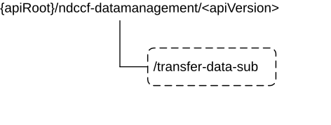

# 5.1.4 Custom Operations without associated resources

## 5.1.4.1 Overview

The structure of the custom operation URIs of the Ndccf_DataManagement service is shown in Figure 5.1.4.1-1.

Figure 5.1.4.1-1: Custom operation URI structure of the Ndccf_DataManagement API

Table 5.1.4.1-1 provides an overview of the custom operations and applicable HTTP methods.

Table 5.1.4.1-1: Custom operations without associated resources

| Custom operation URI                                            | Mapped HTTP method | Description                                                                                                              |
|-----------------------------------------------------------------|--------------------|--------------------------------------------------------------------------------------------------------------------------|
| {apiRoot}/ndccf-datamanagement/\<apiVersion\>/transfer-data-sub | POST               | Request the DCCF to transfer a subscription for data collection from the NF Service Consumer to the NF Service Producer. |

## 5.1.4.2 Operation: transfer-data-sub

### 5.1.4.2.1 Description

The operation is used by the NF service consumer to request the DCCF to transfer a data subscription from the NF Service Consumer to the NF Service Producer.

### 5.1.4.2.2 Operation Definition

This operation shall support the request data structures shown in Table 5.1.4.2.2-1 and the response data structures and error codes specified in Tables 5.1.4.2.2-2.

Table 5.1.4.2.2-1: Data structures supported by the POST Request Body on this resource

| Data type             | P   | Cardinality | Description                                                              |
|-----------------------|-----|-------------|--------------------------------------------------------------------------|
| NdccfDataSubscription | M   | 1           | Information about data subscription that is requested to be transferred. |

Table 5.1.4.2.2-2: Data structures supported by the POST Response Body on this resource

<table style="width:100%;">
<colgroup>
<col style="width: 16%" />
<col style="width: 4%" />
<col style="width: 12%" />
<col style="width: 11%" />
<col style="width: 54%" />
</colgroup>
<thead>
<tr class="header">
<th>Data type</th>
<th>P</th>
<th>Cardinality</th>
<th>
Response

codes
</th>
<th>Description</th>
</tr>
</thead>
<tbody>
<tr class="odd">
<td>DataTransferResp</td>
<td>M</td>
<td>1</td>
<td>200 OK</td>
<td>Successful transfer of a data subscription from the NF Service Consumer to the NF Service Producer.</td>
</tr>
<tr class="even">
<td colspan="5">NOTE: The mandatory HTTP error status code for the POST method listed in Table 5.1.7.1-1 of 3GPP TS 29.500 [4] also apply.</td>
</tr>
</tbody>
</table>
