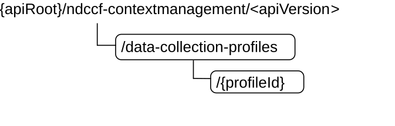

# 5.2 Ndccf_ContextManagement Service API

## 5.2.1 Introduction

The Ndccf_ContextManagement shall use the Ndccf_ContextManagement API.

The API URI of the Ndccf_ContextManagement API shall be:

**{apiRoot}/\<apiName\>/\<apiVersion\>**

The request URIs used in HTTP requests from the NF service consumer towards the NF service producer shall have the Resource URI structure defined in clause 4.4.1 of 3GPP TS 29.501 \[5\], i.e.:

**{apiRoot}/\<apiName\>/\<apiVersion\>/\<apiSpecificResourceUriPart\>**

with the following components:

\- The {apiRoot} shall be set as described in 3GPP TS 29.501 \[5\].

\- The \<apiName\> shall be "ndccf-contextmanagement".

\- The \<apiVersion\> shall be "v1".

\- The \<apiSpecificResourceUriPart\> shall be set as described in clause 5.2.3.

## 5.2.2 Usage of HTTP

### 5.2.2.1 General

HTTP/2, IETF RFC 9113 \[11\], shall be used as specified in clause 5 of 3GPP TS 29.500 \[4\].

HTTP/2 shall be transported as specified in clause 5.3 of 3GPP TS 29.500 \[4\].

The OpenAPI \[6\] specification of HTTP messages and content bodies for the Ndccf_ContextManagement API is contained in Annex A.

### 5.2.2.2 HTTP standard headers

#### 5.2.2.2.1 General

See clause 5.2.2 of 3GPP TS 29.500 \[4\] for the usage of HTTP standard headers.

#### 5.2.2.2.2 Content type

JSON, IETF RFC 8259 \[12\], shall be used as content type of the HTTP bodies specified in the present specification as specified in clause 5.4 of 3GPP TS 29.500 \[4\]. The use of the JSON format shall be signalled by the content type "application/json".

"Problem Details" JSON object shall be used to indicate additional details of the error in a HTTP response body and shall be signalled by the content type "application/problem+json", as defined in IETF RFC 9457 \[13\].

### 5.2.2.3 HTTP custom headers

The mandatory HTTP custom header fields specified in clause 5.2.3.2 of 3GPP TS 29.500 \[4\] shall be supported, and the optional HTTP custom header fields specified in clause 5.2.3.3 of 3GPP TS 29.500 \[4\] may be supported.

## 5.2.3 Resources

### 5.2.3.1 Overview

This clause describes the structure for the Resource URIs and the resources and methods used for the service.

Figure 5.2.3.1-1 depicts the resource URIs structure for the Ndccf_ContextManagement API.

Figure 5.2.3.1-1: Resource URI structure of the Ndccf_ContextManagement API

Table 5.2.3.1-1 provides an overview of the resources and applicable HTTP methods.

Table 5.2.3.1-1: Resources and methods overview

| Resource name                           | Resource URI                          | HTTP method or custom operation | Description                                                                   |
|-----------------------------------------|---------------------------------------|---------------------------------|-------------------------------------------------------------------------------|
| DCCF Data Collection Profiles           | /data-collection-profiles             | POST                            | Creates a new Individual DCCF Data Collection Profile resource.               |
| Individual DCCF Data Collection Profile | /data-collection-profiles/{profileId} | PUT                             | Modifies an existing Individual DCCF Data Collection Profile resource.        |
|                                         |                                       | DELETE                          | Deletes an Individual DCCF Data Collection Profile identified by {profileId}. |

### 5.2.3.2 Resource: DCCF Data Collection Profiles

#### 5.2.3.2.1 Description

The DCCF Data Collection Profiles resource represents all data collection profiles that exist in the Ndccf_ContextManagement service at a given DCCF.

#### 5.2.3.2.2 Resource Definition

Resource URI: **{apiRoot}/ndccf-contextmanagement/v\<apiVersion\>/data-collection-profiles**

This resource shall support the resource URI variables defined in table 5.2.3.2.2-1.

Table 5.2.3.2.2-1: Resource URI variables for this resource

| Name    | Data type | Definition       |
|---------|-----------|------------------|
| apiRoot | string    | See clause 5.2.1 |

#### 5.2.3.2.3 Resource Standard Methods

##### 5.2.3.2.3.1 POST

This method shall support the URI query parameters specified in table 5.2.3.2.3.1-1.

Table 5.2.3.2.3.1-1: URI query parameters supported by the POST method on this resource

|      |           |     |             |             |               |
|------|-----------|-----|-------------|-------------|---------------|
| Name | Data type | P   | Cardinality | Description | Applicability |
| n/a  |           |     |             |             |               |

This method shall support the request data structures specified in table 5.2.3.2.3.1-2 and the response data structures and response codes specified in table 5.2.3.2.3.1-3.

Table 5.2.3.2.3.1-2: Data structures supported by the POST Request Body on this resource

|                            |     |             |                                                                    |
|----------------------------|-----|-------------|--------------------------------------------------------------------|
| Data type                  | P   | Cardinality | Description                                                        |
| NdccfDataCollectionProfile | M   | 1           | New Individual DCCF Data Collection Profile resource to be created |

Table 5.2.3.2.3.1-3: Data structures supported by the POST Response Body on this resource

<table>
<colgroup>
<col style="width: 16%" />
<col style="width: 4%" />
<col style="width: 12%" />
<col style="width: 11%" />
<col style="width: 54%" />
</colgroup>
<tbody>
<tr class="odd">
<td>Data type</td>
<td>P</td>
<td>Cardinality</td>
<td>
Response

codes
</td>
<td>Description</td>
</tr>
<tr class="even">
<td>NdccfDataCollectionProfile</td>
<td>M</td>
<td>1</td>
<td>201 Created</td>
<td>The creation of an Individual DCCF Data Collection Profile resource is confirmed and a representation of that resource is returned.</td>
</tr>
<tr class="odd">
<td colspan="5">NOTE: The mandatory HTTP error status code for the POST method listed in Table 5.2.7.1-1 of 3GPP TS 29.500 [4] also apply.</td>
</tr>
</tbody>
</table>

Table 5.2.3.2.3.1-4: Headers supported by the 201 response code on this resource

|          |           |     |             |                                                                                                                                                                   |
|----------|-----------|-----|-------------|-------------------------------------------------------------------------------------------------------------------------------------------------------------------|
| Name     | Data type | P   | Cardinality | Description                                                                                                                                                       |
| Location | string    | M   | 1           | Contains the URI of the newly created resource, according to the structure: {apiRoot}/ndccf-contextmanagement/\<apiVersion\>/data-collection-profiles/{profileId} |

#### 5.2.3.2.4 Resource Custom Operations

None in this release of the specification.

### 5.2.3.3 Resource: Individual DCCF Data Collection Profile

#### 5.2.3.3.1 Description

The Individual DCCF Data Collection Profile resource represents a single data collection profile to the Ndccf_ContextManagement service at a given DCCF.

#### 5.2.3.3.2 Resource Definition

Resource URI: **{apiRoot}/ndccf-contextmanagement/\<apiVersion\>/data-collection-profiles/{profileId}**

This resource shall support the resource URI variables defined in table 5.2.3.3.2-1.

Table 5.2.3.3.2-1: Resource URI variables for this resource

| Name      | Data type | Definition                                                                  |
|-----------|-----------|-----------------------------------------------------------------------------|
| apiRoot   | string    | See clause 5.1.1                                                            |
| profileId | string    | Identifies a data collection profile to the Ndccf_ContextManagement Service |

#### 5.2.3.3.3 Resource Standard Methods

##### 5.2.3.3.3.1 PUT

This method shall support the URI query parameters specified in table 5.2.3.3.3.1-1.

Table 5.2.3.3.3.1-1: URI query parameters supported by the PUT method on this resource

|      |           |     |             |             |               |
|------|-----------|-----|-------------|-------------|---------------|
| Name | Data type | P   | Cardinality | Description | Applicability |
| n/a  |           |     |             |             |               |

This method shall support the request data structures specified in table 5.2.3.3.3.1-2 and the response data structures and response codes specified in table 5.2.3.3.3.1-3.

Table 5.2.3.3.3.1-2: Data structures supported by the PUT Request Body on this resource

| Data type                  | P   | Cardinality | Description                                                             |
|----------------------------|-----|-------------|-------------------------------------------------------------------------|
| NdccfDataCollectionProfile | M   | 1           | Parameters to replace Individual DCCF Data Collection Profile resource. |

Table 5.2.3.3.3.1-3: Data structures supported by the PUT Response Body on this resource

<table>
<colgroup>
<col style="width: 16%" />
<col style="width: 4%" />
<col style="width: 12%" />
<col style="width: 11%" />
<col style="width: 54%" />
</colgroup>
<tbody>
<tr class="odd">
<td>Data type</td>
<td>P</td>
<td>Cardinality</td>
<td>
Response

codes
</td>
<td>Description</td>
</tr>
<tr class="even">
<td>NdccfDataCollectionProfile</td>
<td>M</td>
<td>1</td>
<td>200 OK</td>
<td>The Individual DCCF Data Collection Profile resource was modified successfully, and a representation of that resource is returned.</td>
</tr>
<tr class="odd">
<td>n/a</td>
<td></td>
<td></td>
<td>204 No Content</td>
<td>The Individual DCCF Data Collection Profile resource was modified successfully.</td>
</tr>
<tr class="even">
<td>RedirectResponse</td>
<td>O</td>
<td>0..1</td>
<td>307 Temporary Redirect</td>
<td>
Temporary redirection, during Individual DCCF Data Collection Profile modification.

(NOTE 2)
</td>
</tr>
<tr class="odd">
<td>RedirectResponse</td>
<td>O</td>
<td>0..1</td>
<td>308 Permanent Redirect</td>
<td>
Permanent redirection, during Individual DCCF Data Collection Profile modification.

(NOTE 2)
</td>
</tr>
<tr class="even">
<td colspan="5">
NOTE 1: The mandatory HTTP error status code for the PUT method listed in Table 5.2.7.1-1 of 3GPP TS 29.500 [4] also apply.

NOTE 2: The RedirectResponse data structure may be provided by an SCP (cf. clause 6.10.9.1 of 3GPP TS 29.500 [4]).
</td>
</tr>
</tbody>
</table>

Table 5.2.3.3.3.1-4: Headers supported by the 307 Response Code on this resource

<table>
<colgroup>
<col style="width: 16%" />
<col style="width: 14%" />
<col style="width: 4%" />
<col style="width: 11%" />
<col style="width: 52%" />
</colgroup>
<tbody>
<tr class="odd">
<td>Name</td>
<td>Data type</td>
<td>P</td>
<td>Cardinality</td>
<td>Description</td>
</tr>
<tr class="even">
<td>Location</td>
<td>string</td>
<td>M</td>
<td>1</td>
<td>
Contains an alternative URI of the resource located in an alternative DCCF (service) instance towards which the request is redirected.

For the case where the request is redirected to the same target via a different SCP, refer to clause 6.10.9.1 of 3GPP TS 29.500 [4].
</td>
</tr>
<tr class="odd">
<td>3gpp-Sbi-Target-Nf-Id</td>
<td>string</td>
<td>O</td>
<td>0..1</td>
<td>Identifier of the target DCCF (service) instance towards which the request is redirected.</td>
</tr>
</tbody>
</table>

Table 5.2.3.3.3.1-5: Headers supported by the 308 Response Code on this resource

<table>
<colgroup>
<col style="width: 16%" />
<col style="width: 14%" />
<col style="width: 4%" />
<col style="width: 11%" />
<col style="width: 52%" />
</colgroup>
<tbody>
<tr class="odd">
<td>Name</td>
<td>Data type</td>
<td>P</td>
<td>Cardinality</td>
<td>Description</td>
</tr>
<tr class="even">
<td>Location</td>
<td>string</td>
<td>M</td>
<td>1</td>
<td>
Contains an alternative URI of the resource located in an alternative DCCF (service) instance towards which the request is redirected.

For the case where the request is redirected to the same target via a different SCP, refer to clause 6.10.9.1 of 3GPP TS 29.500 [4].
</td>
</tr>
<tr class="odd">
<td>3gpp-Sbi-Target-Nf-Id</td>
<td>string</td>
<td>O</td>
<td>0..1</td>
<td>Identifier of the target DCCF (service) instance towards which the request is redirected.</td>
</tr>
</tbody>
</table>

##### 5.2.3.3.3.2 DELETE

This method shall support the URI query parameters specified in table 5.2.3.3.3.2-1.

Table 5.2.3.3.3.2-1: URI query parameters supported by the DELETE method on this resource

|      |           |     |             |             |               |
|------|-----------|-----|-------------|-------------|---------------|
| Name | Data type | P   | Cardinality | Description | Applicability |
| n/a  |           |     |             |             |               |

This method shall support the request data structures specified in table 5.2.3.3.3.2-2 and the response data structures and response codes specified in table 5.2.3.3.3.2-3.

Table 5.2.3.3.3.2-2: Data structures supported by the DELETE Request Body on this resource

| Data type | P   | Cardinality | Description |
|-----------|-----|-------------|-------------|
| n/a       |     |             |             |

Table 5.2.3.3.3.2-3: Data structures supported by the DELETE Response Body on this resource

<table>
<colgroup>
<col style="width: 16%" />
<col style="width: 4%" />
<col style="width: 12%" />
<col style="width: 11%" />
<col style="width: 54%" />
</colgroup>
<tbody>
<tr class="odd">
<td>Data type</td>
<td>P</td>
<td>Cardinality</td>
<td>
Response

codes
</td>
<td>Description</td>
</tr>
<tr class="even">
<td>n/a</td>
<td></td>
<td></td>
<td>204 No Content</td>
<td>The Individual DCCF Data Collection Profile resource was deleted successfully.</td>
</tr>
<tr class="odd">
<td>RedirectResponse</td>
<td>O</td>
<td>0..1</td>
<td>307 Temporary Redirect</td>
<td>
Temporary redirection, during Individual DCCF Data Collection Profile deletion.

(NOTE 2)
</td>
</tr>
<tr class="even">
<td>RedirectResponse</td>
<td>O</td>
<td>0..1</td>
<td>308 Permanent Redirect</td>
<td>
Permanent redirection, during Individual DCCF Data Collection Profile deletion.

(NOTE 2)
</td>
</tr>
<tr class="odd">
<td colspan="5">
NOTE 1: The mandatory HTTP error status code for the DELETE method listed in Table 5.2.7.1-1 of 3GPP TS 29.500 [4] also apply.

NOTE 2: The RedirectResponse data structure may be provided by an SCP (cf. clause 6.10.9.1 of 3GPP TS 29.500 [4]).
</td>
</tr>
</tbody>
</table>

Table 5.2.3.3.3.2-4: Headers supported by the 307 Response Code on this resource

<table>
<colgroup>
<col style="width: 16%" />
<col style="width: 14%" />
<col style="width: 4%" />
<col style="width: 11%" />
<col style="width: 52%" />
</colgroup>
<tbody>
<tr class="odd">
<td>Name</td>
<td>Data type</td>
<td>P</td>
<td>Cardinality</td>
<td>Description</td>
</tr>
<tr class="even">
<td>Location</td>
<td>string</td>
<td>M</td>
<td>1</td>
<td>
Contains an alternative URI of the resource located in an alternative DCCF (service) instance towards which the request is redirected.

For the case where the request is redirected to the same target via a different SCP, refer to clause 6.10.9.1 of 3GPP TS 29.500 [4].
</td>
</tr>
<tr class="odd">
<td>3gpp-Sbi-Target-Nf-Id</td>
<td>string</td>
<td>O</td>
<td>0..1</td>
<td>Identifier of the target DCCF (service) instance towards which the request is redirected.</td>
</tr>
</tbody>
</table>

Table 5.2.3.3.3.2-5: Headers supported by the 308 Response Code on this resource

<table>
<colgroup>
<col style="width: 16%" />
<col style="width: 14%" />
<col style="width: 4%" />
<col style="width: 11%" />
<col style="width: 52%" />
</colgroup>
<tbody>
<tr class="odd">
<td>Name</td>
<td>Data type</td>
<td>P</td>
<td>Cardinality</td>
<td>Description</td>
</tr>
<tr class="even">
<td>Location</td>
<td>string</td>
<td>M</td>
<td>1</td>
<td>
Contains an alternative URI of the resource located in an alternative DCCF (service) instance towards which the request is redirected.

For the case where the request is redirected to the same target via a different SCP, refer to clause 6.10.9.1 of 3GPP TS 29.500 [4].
</td>
</tr>
<tr class="odd">
<td>3gpp-Sbi-Target-Nf-Id</td>
<td>string</td>
<td>O</td>
<td>0..1</td>
<td>Identifier of the target DCCF (service) instance towards which the request is redirected.</td>
</tr>
</tbody>
</table>

#### 5.2.3.3.4 Resource Custom Operations

None in this release of the specification.

## 5.2.4 Custom Operations without associated resources

None in this release of the specification.

## 5.2.5 Notifications

None in this release of the specification.

## 5.2.6 Data Model

### 5.2.6.1 General

This clause specifies the application data model supported by the Ndccf_ContextManagement API.

Table 5.2.6.1-1 specifies the data types defined for the Ndccf_ContextManagement service based interface protocol.

Table 5.2.6.1-1: Ndccf_ContextManagement specific Data Types

| Data type                  | Clause defined | Description                                                     | Applicability |
|----------------------------|----------------|-----------------------------------------------------------------|---------------|
| NdccfDataCollectionProfile | 5.2.6.2.2      | Represents an Individual DCCF Data Collection Profile resource. |               |

Table 5.2.6.1-2 specifies data types re-used by the Ndccf_ContextManagement service based interface protocol from other specifications, including a reference to their respective specifications and when needed, a short description of their use within the Ndccf_ContextManagement service based interface.

Table 5.2.6.1-2: Ndccf_ContextManagement re-used Data Types

| Data type                | Reference             | Comments                                                                               | Applicability |
|--------------------------|-----------------------|----------------------------------------------------------------------------------------|---------------|
| DataSubscription         | 3GPP TS 29.575 \[25\] | Represents a data subscription to one of various possible data sources.                |               |
| NfInstanceId             | 3GPP TS 29.571 \[17\] | NF instance identifier.                                                                |               |
| NfSetId                  | 3GPP TS 29.571 \[17\] | NF Set identifier.                                                                     |               |
| NnwdafEventsSubscription | 3GPP TS 29.520 \[15\] | Represents an NWDAF analytics subscription.                                            |               |
| SupportedFeatures        | 3GPP TS 29.571 \[17\] | Used to negotiate the applicability of the optional features defined in table 5.2.8-1. |               |

### 5.2.6.2 Structured data types

#### 5.2.6.2.1 Introduction

This clause defines the structures to be used in resource representations.

#### 5.2.6.2.2 Type: NdccfDataCollectionProfile

Table 5.2.6.2.2-1: Definition of type NdccfDataCollectionProfile

<table>
<colgroup>
<col style="width: 17%" />
<col style="width: 15%" />
<col style="width: 4%" />
<col style="width: 11%" />
<col style="width: 25%" />
<col style="width: 25%" />
</colgroup>
<thead>
<tr class="header">
<th>Attribute name</th>
<th>Data type</th>
<th>P</th>
<th>Cardinality</th>
<th>Description</th>
<th>Applicability</th>
</tr>
</thead>
<tbody>
<tr class="odd">
<td>anaSub</td>
<td>NnwdafEventsSubscription</td>
<td>C</td>
<td>0..1</td>
<td>
Representation of the analytics events subscription that is used to collect analytics.

(NOTE 1)
</td>
<td></td>
</tr>
<tr class="even">
<td>dataSub</td>
<td>DataSubscription</td>
<td>C</td>
<td>0..1</td>
<td>
Representation of the data subscription that is used to collect data.

(NOTE 1)
</td>
<td></td>
</tr>
<tr class="odd">
<td>nwdafId</td>
<td>NfInstanceId</td>
<td>C</td>
<td>0..1</td>
<td>NF instance identifier of the NWDAF that this data collection profile belongs to. (NOTE 2)</td>
<td></td>
</tr>
<tr class="even">
<td>adrfId</td>
<td>NfInstanceId</td>
<td>C</td>
<td>0..1</td>
<td>NF instance identifier of the ADRF that this data collection profile belongs to. (NOTE 2)</td>
<td></td>
</tr>
<tr class="odd">
<td>nwdafSetId</td>
<td>NfSetId</td>
<td>C</td>
<td>0..1</td>
<td>Identifier of the set of the NWDAF that this data collection profile belongs to. (NOTE 2)</td>
<td></td>
</tr>
<tr class="even">
<td>adrfSetId</td>
<td>NfSetId</td>
<td>C</td>
<td>0..1</td>
<td>Identifier of the set of the ADRF that this data collection profile belongs to. (NOTE 2)</td>
<td></td>
</tr>
<tr class="odd">
<td>suppFeat</td>
<td>SupportedFeatures</td>
<td>C</td>
<td>0..1</td>
<td>
This attribute represents a list of Supported features as described in clause 5.2.8.

It shall be present in the POST request if at least one feature defined in clause 5.2.8 is supported, and it shall be present in the POST response if the NF service consumer included the"suppFeat" attribute in the POST request.
</td>
<td></td>
</tr>
<tr class="even">
<td colspan="6">
NOTE 1: Only one of these attributes shall be provided.

NOTE 2: Only one of these attributes shall be provided.
</td>
</tr>
</tbody>
</table>

### 5.2.6.3 Simple data types and enumerations

#### 5.2.6.3.1 Introduction

This clause defines simple data types and enumerations that can be referenced from data structures defined in the previous clauses.

#### 5.2.6.3.2 Simple data types

The simple data types defined in table 5.2.6.3.2-1 shall be supported.

Table 5.2.6.3.2-1: Simple data types

|           |                 |             |               |
|-----------|-----------------|-------------|---------------|
| Type Name | Type Definition | Description | Applicability |
|           |                 |             |               |

### 5.2.6.4 Data types describing alternative data types or combinations of data types

None in this release of the specification.

### 5.2.6.5 Binary data

None in this release of the specification.

## 5.2.7 Error Handling

### 5.2.7.1 General

For the Ndccf_ContextManagement API, HTTP error responses shall be supported as specified in clause 4.8 of 3GPP TS 29.501 \[5\]. Protocol errors and application errors specified in table 5.2.7.2-1 of 3GPP TS 29.500 \[4\] shall be supported for an HTTP method if the corresponding HTTP status codes are specified as mandatory for that HTTP method in table 5.2.7.1-1 of 3GPP TS 29.500 \[4\].

In addition, the requirements in the following clauses are applicable for the Ndccf_ContextManagement API.

### 5.2.7.2 Protocol Errors

No specific procedures for the Ndccf_ContextManagement service are specified.

### 5.2.7.3 Application Errors

The application errors defined for the Ndccf_ContextManagement service are listed in Table 5.2.7.3-1.

Table 5.2.7.3-1: Application errors

| Application Error | HTTP status code | Description |
|-------------------|------------------|-------------|
|                   |                  |             |

## 5.2.8 Feature negotiation

The optional features in table 5.2.8-1 are defined for the Ndccf_ContextManagement API. They shall be negotiated using the extensibility mechanism defined in clause 6.6 of 3GPP TS 29.500 \[4\].

Table 5.2.8-1: Supported Features

| Feature number | Feature Name | Description |
|----------------|--------------|-------------|
|                |              |             |

## 5.2.9 Security

As indicated in 3GPP TS 33.501 \[8\] and 3GPP TS 29.500 \[4\], the access to the Ndccf_ContextManagement API may be authorized by means of the OAuth2 protocol (see IETF RFC 6749 \[9\]), based on local configuration, using the "Client Credentials" authorization grant, where the NRF (see 3GPP TS 29.510 \[10\]) plays the role of the authorization server.

If OAuth2 is used, an NF Service Consumer, prior to consuming services offered by the Ndccf_ContextManagement API, shall obtain a "token" from the authorization server, by invoking the Access Token Request service, as described in 3GPP TS 29.510 \[10\], clause 5.4.2.2.

NOTE: When multiple NRFs are deployed in a network, the NRF used as authorization server is the same NRF that the NF Service Consumer used for discovering the Ndccf_ContextManagement service.

The Ndccf_ContextManagement API defines a single scope "ndccf-contextmanagement" for the entire service, and it does not define any additional scopes at resource or operation level.
