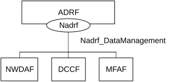
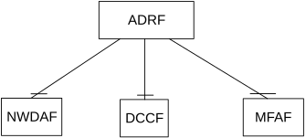

# 4.2.1 Service Description

## 4.2.1.1 Overview

The Nadrf_DataManagement service as defined in 3GPP TS 23.288 \[14\], is provided by the Analytics Data Repository Function (ADRF).

This service:

> \- allows NF service consumers to store data or analytics in the ADRF, and request/receive notifications about data or analytics that are about to be deleted;

\- allows NF service consumers to retrieve data or analytics from an ADRF; and

\- allows NF service consumers to delete data or analytics from an ADRF.

## 4.2.1.2 Service Architecture

The 5G System Architecture is defined in 3GPP TS 23.501 \[2\]. The Network Data Analytics Exposure architecture is defined in 3GPP TS 23.288 \[14\].

The Nadrf_DataManagement service is part of the Nadrf service-based interface exhibited by the Analytics Data Repository Function (ADRF).

Known consumers of the Nadrf_DataManagement service are:

\- Data Collection Coordination Function (DCCF)

\- Network Data Analytics Function (NWDAF)

\- Messaging Framework Adaptor Function (MFAF)

The Nadrf_DataManagement service is provided by the ADRF and consumed by the NF service consumers as shown in figure 4.2.1.2-1 for the SBI representation model and in figure 4.2.1.2-2 for the reference point representation model.

Figure 4.2.1.2-1: Reference Architecture for the Nadrf_DataManagement Service; SBI representation

Figure 4.2.1.2-2: Nadrf_DataManagement service architecture, reference point representation

## 4.2.1.3 Network Functions

### 4.2.1.3.1 Analytics Data Repository Function (ADRF)

The Analytics Data Repository Function (ADRF) provides the functionality to allow NF service consumers to store, retrieve, and remove data or analytics from the ADRF, and request/receive notifications about data or analytics that are about to be deleted.

### 4.2.1.3.2 NF Service Consumers

The NWDAF and DCCF:

> \- supports storing data or analytics in the ADRF, and requesting/receiving notifications about data or analytics that are about to be deleted;

\- supports retrieving data or analytics from an ADRF; and

\- supports deletion data or analytics from an ADRF.

The MFAF:

\- supports storing data or analytics in the ADRF.
