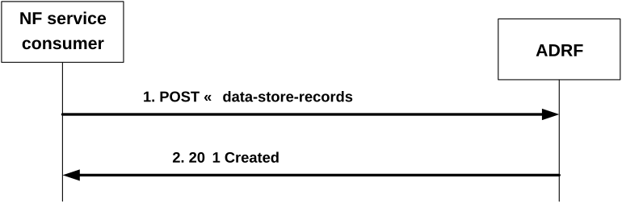

# 4.2.2.2 Nadrf_DataManagement_StorageRequest service operation

## 4.2.2.2.1 General

The Nadrf_DataManagement_StorageRequest service operation is used by an NF service consumer to store data or analytics.

## 4.2.2.2.2 Request Storage of data or analytics

Figure 4.2.2.2.2-1 shows a scenario where the NF service consumer sends a request to the ADRF to store data or analytics.

Figure 4.2.2.2.2-1: NF service consumer requesting to store data or analytics

The NF service consumer shall invoke the Nadrf_DataManagement_StorageRequest service operation to store data or analytics. The NF service consumer shall send an HTTP POST request with "{apiRoot}/nadrf-datamanagement/\<apiVersion\>/data-store-records" as Resource URI representing the "ADRF Data Store Records" resource, as shown in figure 4.2.2.2.2-1, step 1, to create an "Individual ADRF Data Store Record" according to the information in the message body. The NadrfDataStoreRecord data structure provided in the request body shall include:

\- one of the following:

\- analytics subscription notification(s) within the "anaNotifications" attribute together with the corresponding subscription information within the "anaSub" attribute;

\- data subscription notification within the "dataNotif" attribute together with the corresponding subscription information within the " dataSub" attribute.

and may include:

\- storage handling information within the "storeHandl" attribute, if the "EnhDataMgmt" feature is supported.

\- a data set tag within the "dataSetTag" attribute, if the "EnhDataMgmt" feature is supported;

> \- data synthesis and compression information within the "dsc" attribute, if the "EnhDataMgmt" feature is supported.

NOTE: The data synthesis and compression information can include an indication that the data have been generated using a data synthesis tool, an indication that the data have been generated using a data compression tool, and information about the data synthesis and/or compression technique.

Upon the reception of an HTTP POST request with "{apiRoot}/nadrf-datamanagement/\<apiVersion\>/data-store-records" as Resource URI and NadrfDataStoreRecord data structure as request body, the ADRF shall:

\- create a new data store record;

\- assign a storeTransId;

\- store the data or analytics.

> NOTE 1: If the data and/or analytics is already stored or being stored in the ADRF, the ADRF will still create a new "Individual ADRF Data Store Record" resource and assign a new storeTransId if the ADRF intends to not really store the data again in the memory again based on the implementation.

If the ADRF created an "Individual ADRF Data Store Record" resource, the ADRF shall respond with "201 Created" with the message body containing a representation of the created record, as shown in figure 4.2.2.2.2-1, step 2. The ADRF shall include a Location HTTP header field. The Location header field shall contain the URI of the created record i.e. "{apiRoot}/nadrf-datamanagement/\<apiVersion\>/data-store-records/{storeTransId}".

If the ADRF receives storage handling information in the request but determines (e.g. based on local policy) that a different storage approach shall be followed, it indicates the determined storage approach to the consumer by setting accordingly the "storeHandl" attribute (e.g. providing a different lifetime, or omitting the deletion notification URI to indicate that no deletion alerts will be sent) in the message body of the response. When more than one consumer has requested storage lifetime for the same data or analytics, the storage approach should be based on the longest requested storage lifetime.

NOTE 2: The default operator policy for how long data or analytics are to be stored can be longer or shorter than the lifetime requested by the consumer. A default operator policy can for example accept only consumer requested lifetimes that are shorter or longer than the default policy.

If an error occurs when processing the HTTP POST request, the ADRF shall send an HTTP error response as specified in clause 5.1.7.
