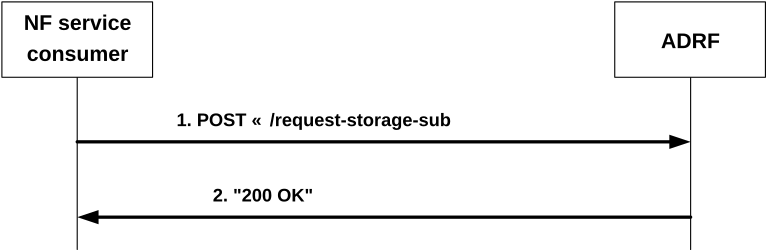

# 4.2.2.3 Nadrf_DataManagement_StorageSubscriptionRequest service operation

## 4.2.2.3.1 General

The Nadrf_DataManagement_StorageSubscriptionRequest service operation is used by an NF service consumer to request that the ADRF creates a subscription to data or analytics and subsequently stores notified data or analytics in the ADRF.

## 4.2.2.3.2 Requesting subscription and storage of data or analytics

Figure 4.2.2.3.2-1 shows a scenario where the NF service consumer sends a request to the ADRF to subscribe for data or analytics to be stored in the ADRF.

Figure 4.2.2.3.2-1: NF service consumer requesting that the ADRF subscribes to and subsequently stores data or analytics

The NF service consumer shall invoke the Nadrf_DataManagement_StorageSubscriptionRequest service operation to request the ADRF to subscribe to data or analytics. The NF service consumer shall send an HTTP POST request with "{apiRoot}/nadrf-datamanagement/\<apiVersion\>/request-storage-sub" as URI, as shown in figure 4.2.2.3.2-1, step 1. The NadrfDataStoreSubscription data structure provided in the request body shall include:

\- one of the following subscription attributes:

\- analytics subscription information within the "anaSub" attribute;

\- data subscription information within the "dataSub" attribute;

\- one of the following target identifiers:

\- DCCF or NWDAF instance identifier within the "targetNfId" attribute;

\- DCCF or NWDAF NF set identifier within the "targetNfSetId" attribute;

and may include:

\- formatting instructions within the "formatInstruct" attribute;

\- processing instructions within the "procInstruct" attribute or the "multiProcInstructs" attribute if the "MultiProcessingInstruction" feature is supported.

> NOTE 1: The parameters provided by the NF service consumer, including Formatting and Processing Instructions (if provided) are used by the ADRF when subscribing to a DCCF or NWDAF for Data or Analytics to be stored.

\- storage handling information within the "storeHandl" attribute, if the "EnhDataMgmt" feature is supported.

> \- a data set tag to be associated with this subscription and with the data or analytics collected based on this subscription within the "dataSetTag" attribute, if the "EnhDataMgmt" feature is supported.

Upon the reception of an HTTP POST request with "{apiRoot}/nadrf-datamanagement/\<apiVersion\>/request-storage-sub" as URI and NadrfDataStoreSubscription data structure as request body, the ADRF shall assign a transaction reference identifier to this request and, if the request is successfully processed and accepted, the ADRF shall respond with "200 OK" as shown in figure 4.2.2.3.2-1 step 2, with the message body containing an NadrfDataStoreSubscriptionRef data structure, which shall include the assigned transaction reference identifier as "transRefId" attribute.

> NOTE 2: If the data and/or analytics is already stored or being stored in the ADRF, the ADRF will still assign a new transaction reference identifier if the ADRF intends to not really store the data again in the memory again based on the implementation.

If an error occurs when processing the HTTP POST request, the ADRF shall send an HTTP error response as specified in clause 5.1.7.

If the ADRF receives storage handling information in the request but determines (e.g. based on local policy) that a different storage approach shall be followed, it indicates the determined storage approach to the consumer by setting accordingly the "storeHandl" attribute (e.g. providing a different lifetime, or omitting the deletion notification URI to indicate that no deletion alerts will be sent) in the message body of the response. When more than one consumer has requested storage lifetime for the same data or analytics, the storage approach should be based on the longest requested storage lifetime.

NOTE 3: The default operator policy for how long data or analytics are to be stored can be longer or shorter than the lifetime requested by the consumer. A default operator policy can for example accept only consumer requested lifetimes that are shorter or longer than the default policy.

In the case of a successful response, the ADRF may subsequently create a data or analytics subscription (according to inputs that had been received in the NadrfDataStoreSubscription data structure; this is not performed if the ADRF determines that the data is already being stored based on an existing subscription) with a DCCF as described in 3GPP TS 29.574 \[23\] or with an NWDAF as described in 3GPP TS 29.520 \[15\], and create a mapping between the previously assigned and returned transaction reference identifier and the subscription that is used to serve the transaction.
