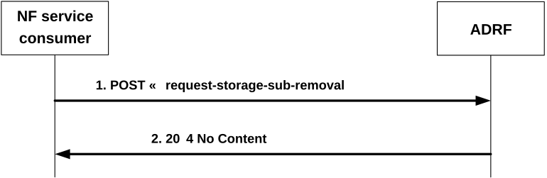

# 4.2.2.4 Nadrf_DataManagement_StorageSubscriptionRemoval service operation

## 4.2.2.4.1 General

The Nadrf_DataManagement_StorageSubscriptionRemoval service operation is used by an NF service consumer to request the ADRF to remove a subscription for data or analytics.

## 4.2.2.4.2 Requesting removal of subscription of data or analytics

Figure 4.2.2.4.2-1 shows a scenario where the NF service consumer sends a request to the ADRF to unsubscribe for storage of data or analytics.

Figure 4.2.2.4.2-1: NF service consumer requesting the removal of subscription(s) to storage of data or analytics

The NF service consumer shall invoke the Nadrf_DataManagement_StorageSubscriptionRemoval service operation to request the ADRF to remove subscription(s) to data or analytics that are stored in the ADRF. The NF service consumer shall send an HTTP POST request with "{apiRoot}/nadrf-datamanagement/\<apiVersion\>/request-storage-sub-removal" as URI, as shown in figure 4.2.2.4.2-1, step 1. The POST request body shall contain an NadrfDataStoreSubscriptionRef data structure, which shall include a transaction reference identifier as "transRefId" attribute or, if the "EnhDataMgmt" feature is supported, a data set identifier as "dataSetId" attribute.

Upon the reception of an HTTP POST request with "{apiRoot}/nadrf-datamanagement/\<apiVersion\>/request-storage-sub-removal" as URI, if the ADRF successfully processed and accepted the received HTTP POST request, the ADRF shall respond with HTTP "204 No Content" status. Subsequently, the ADRF shall remove the (DCCF or NWDAF) subscription that had been created and mapped to the received transaction reference identifier or the (DCCF or NWDAF) subscription(s) associated to the received data set identifier as described in clause 4.2.2.3, unless this subscription is mapped to further transaction reference identifier(s) (of transactions that are still active) or associated with further data set identifier(s).

If errors occur when processing the HTTP POST request, the ADRF shall send an HTTP error response as specified in clause 5.1.7.
