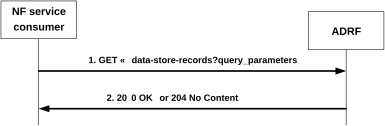

# 4.2.2.5 Nadrf_DataManagement_RetrievalRequest service operation

## 4.2.2.5.1 General

The Nadrf_DataManagement_RetrievalRequest service operation is used by an NF service consumer to retrieve stored data or analytics.

NOTE: If the data is to be collected for a user, i.e. SUPI or GPSI, the consumer needs to check the user consent by retrieving the user consent information from the UDM as described in clause 5.5 of 3GPP TS 29.552 \[28\] before invoking this service operation.

## 4.2.2.5.2 Request and get stored data or analytics from ADRF Data Store

Figure 4.2.2.5.2-1 shows a scenario where the NF service consumer sends a request to the ADRF to retrieve stored data or analytics.

Figure 4.2.2.5.2-1: NF service consumer requesting to retrieve stored data or analytics

The NF service consumer shall invoke the Nadrf_DataManagement_RetrievalRequest service operation to retrieve stored data or analytics. The NF service consumer shall send an HTTP GET request with "{apiRoot}/nadrf-datamanagement/\<apiVersion\>/data-store-records" as Resource URI representing the "ADRF Data Store Records" resource, as shown in figure 4.2.2.5.2-1, step 1, to request ADRF data store records according to the query parameter value of the store transaction identifier within the "store-trans-id" attribute, the query parameter value of the fetch correlation identifier(s) within the "fetch-correlation-ids" attribute, or, if the "EnhDataMgmt" feature is supported, the query parameter value of the data set identifier within the "data-set-id" attribute.

Upon the reception of the HTTP GET request, the ADRF shall:

\- find the data or analytics according to the requested parameters.

If the requested data or analytics is found, the ADRF shall respond with "200 OK" status code with the message body containing the NadrfDataStoreRecord data structure. The NadrfDataStoreRecord data structure in the response body shall include:

\- one of the following:

\- information about network analytics function events that occurred in the "anaNotifications" attribute together with the corresponding subscription information within the "anaSub" attribute;

\- information about data event within the "dataNotif" attribute together with the corresponding subscription information within the "dataSub" attribute.

and may include:

\- a data set tag within the "dataSetTag" attribute, if the "EnhDataMgmt" feature is supported.

> \- data synthesis and compression information within the "dsc" attribute, if the "EnhDataMgmt" feature is supported.

NOTE: The data synthesis and compression information can include an indication that the data have been generated using a data synthesis tool, an indication that the data have been generated using a data compression tool, and information about the data synthesis and/or compression technique.

If the requested analytics or data does not exist, the ADRF shall respond with "204 No Content". If an error occurs when processing the HTTP GET request, the ADRF shall send an HTTP error response as specified in clause 5.1.7.
