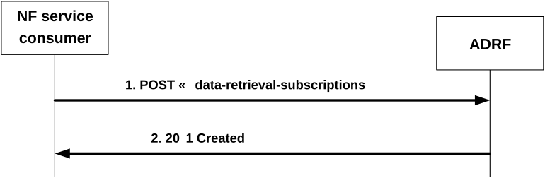

# 4.2.2.6 Nadrf_DataManagement_RetrievalSubscribe service operation

## 4.2.2.6.1 General

The Nadrf_DataManagement_RetrievalSubscribe service operation is used by an NF service consumer to subscribe to the ADRF to retrieve via notifications data or analytics that is stored in the ADRF and to receive future notifications with data or analytics when they are received by the ADRF.

NOTE: If the data is to be collected for a user, i.e. SUPI or GPSI, the consumer needs to check the user consent by retrieving the user consent information from the UDM as described in clause 5.5 of 3GPP TS 29.552 \[28\] before invoking this service operation.

## 4.2.2.6.2 Requesting retrieval and subscription of data or analytics

Figure 4.2.2.6.2-1 shows a scenario where the NF service consumer sends a request to the ADRF to retrieve and subscribe to data or analytics.

Figure 4.2.2.6.2-1: NF service consumer requesting to retrieve and subscribe to data or analytics

The NF service consumer shall invoke the Nadrf_DataManagement_RetrievalSubscribe service operation to retrieve and subscribe to data or analytics. The NF service consumer shall send an HTTP POST request with "{apiRoot}/nadrf-datamanagement/\<apiVersion\>/data-retrieval-subscriptions" as Resource URI representing the "ADRF Data Retrieval Subscriptions" resource, as shown in figure 4.2.2.6.2-1, step 1, to create an "Individual ADRF Data Retrieval Subscription" according to the information in the message body. The NadrfDataRetrievalSubscription data structure provided in the request body shall include:

\- notification correlation identfier within the "notifCorrId" attribute;

\- one of the following:

\- analytics subscription information within the "anaSub" attribute;

\- data subscription information within the "dataSub" attribute;

\- data set identifier within the "dataSetId" attribute, if the "EnhDataMgmt" feature is supported;

\- a notification target address within the "notificationURI" attribute;

\- a time window for the data retrieval and subscription within the "timePeriod" attribute;

and may include:

\- a Consumer triggered Notification indication within the "consTrigNotif" attribute.

Upon the reception of an HTTP POST request with "{apiRoot}/nadrf-datamanagement/\<apiVersion\>/data-retrieval-subscriptions" as Resource URI and NadrfDataRetrievalSubscription data structure as request body, the ADRF shall:

\- create a new subscription;

\- assign a subscriptionId;

\- store the subscription.

If the ADRF created an "Individual ADRF Data Retrieval Subscription" resource, the ADRF shall respond with "201 Created" with the message body containing a representation of the created subscription, as shown in figure 4.2.2.6.2-1, step 2. The ADRF shall include a Location HTTP header field. The Location header field shall contain the URI of the created record i.e. "{apiRoot}/nadrf-datamanagement/\<apiVersion\>/data-retrieval-subscriptions/{subscriptionId}".

If an error occurs when processing the HTTP POST request, the ADRF shall send an HTTP error response as specified in clause 5.1.7.
