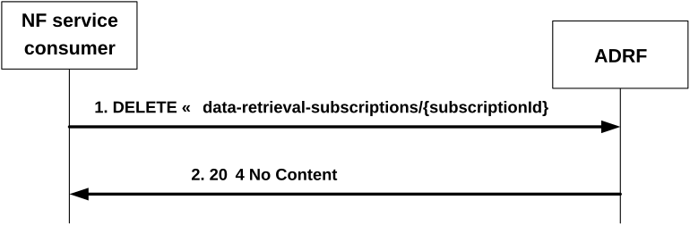

# 4.2.2.7 Nadrf_DataManagement_RetrievalUnsubscribe service operation

## 4.2.2.7.1 General

The Nadrf_DataManagement_RetrievalUnsubscribe service operation is used by an NF service consumer to remove a retrieval subscription to data or analytics.

## 4.2.2.7.2 Requesting removal of retrieval subscription for data or analytics

Figure 4.2.2.7.2-1 shows a scenario where the NF service consumer sends a request to the ADRF to remove a retrieval subscription for data or analytics.

Figure 4.2.2.7.2-1: NF service consumer requesting to remove retrieval subscription for data or analytics

The NF service consumer shall invoke the Nadrf_DataManagement_RetrievalUnsubscribe service operation to remove a retrieval subscription for data or analytics. The NF service consumer shall send an HTTP DELETE request with "{apiRoot}/nadrf-datamanagement/\<apiVersion\>/data-retrieval-subscriptions/{subscriptionId}" as Resource URI representing an "Individual ADRF Data Retrieval Subscription" resource, as shown in figure 4.2.2.7.2-1, step 1, where "{subscriptionId}" is the identifier of the existing data retrieval subscription that is to be deleted.

Upon the reception of an HTTP DELETE request with "{apiRoot}/nadrf-datamanagement/\<apiVersion\>/data-retrieval-subscriptions/{subscriptionId}" as Resource URI, if the ADRF successfully processed and accepted the received HTTP DELETE request, the ADRF shall:

\- remove the corresponding subscription;

\- respond with HTTP "204 No Content" status.

If errors occur when processing the HTTP DELETE request, the ADRF shall send an HTTP error response as specified in clause 5.1.7.

If the ADRF determines the received HTTP DELETE request needs to be redirected, the ADRF shall send an HTTP redirect response as specified in clause 6.10.9 of 3GPP TS 29.500 \[4\].
