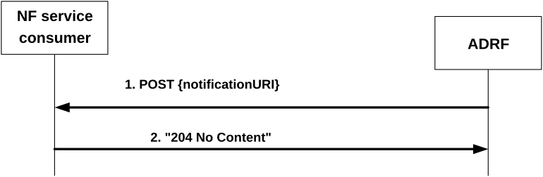
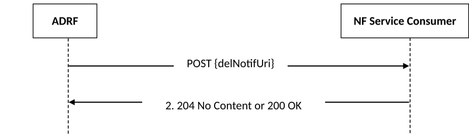

# 4.2.2.8 Nadrf_DataManagement_RetrievalNotify service operation

## 4.2.2.8.1 General

The Nadrf_DataManagement_RetrievalNotify service operation is used by ADRF to notify NF service consumers about subscribed events related to data or analytics and about data or analytics that are about to be deleted.

## 4.2.2.8.2 Notification about subscribed data or analytics

Figure 4.2.2.8.2-1 shows a scenario where the ADRF sends a request to the NF service consumer to notify it about data or analytics events.

Figure 4.2.2.8.2-1: ADRF notifies the NF service consumer about subscribed data or analytics

The ADRF shall invoke the Nadrf_DataManagement_RetrievalNotify service operation to notify about subscribed data or analytics events. The ADRF shall send an HTTP POST request to the "{notificationURI}" received in the subscription (see clause 5.1.5 for the definition of this notificationURI), as shown in figure 4.2.2.8.2-1, step 1. The NadrfDataRetrievalNotification data structure provided in the request body shall include:

\- notification correlation Id within the "notifCorrId" attribute;

\- the time stamp which represents the time when ADRF completes preparation of the requested data or analytics within the "timeStamp" attribute;

\- one of the following:

\- information about network data analytics function events that occurred in the "anaNotifications" attribute;

\- data collected from data sources (e.g. SMF, NEF) in the "dataNotif" attribute;

\- information for fetching the data or analytics in the "fetchInstruct" attribute.

NOTE: The fetch correlation identifiers included in the fetch instructions of the "fetchInstruct" attribute can be used to fetch data or analytics using the Nadrf_DataManagement_RetrievalRequest service operation as described in clause 4.2.2.5.2. The (mandatory) fetch URI included in the fetch instructions of the "fetchInstruct" attribute is expected to be in line with the standard resource URI defined for the Nadrf_DataManagement_RetrievalRequest service operation, i.e. {apiRoot}/nadrf-datamanagement/\<apiVersion\>/data-store-records, but it can be anything because it is actually not needed by the NF service consumer in this case.

The NadrfDataRetrievalNotification data structure provided in the request body may include:

\- a termination request provided by the ADRF within the "terminationReq" attribute.

> \- data synthesis and compression information within the "dsc" attribute, if the "EnhDataMgmt" feature is supported.

NOTE: The data synthesis and compression information can include an indication that the data have been generated using a data synthesis tool, an indication that the data have been generated using a data compression tool, and information about the data synthesis and/or compression technique.

Upon the reception of an HTTP POST request with "{notificationURI}" as Resource URI and NadrfDataRetrievalNotification data structure as request body, if the NF service consumer successfully processed and accepted the received HTTP POST request, the NF Service Consumer shall:

\- store the notification;

\- respond with HTTP "204 No Content" status code.

If errors occur when processing the HTTP POST request, the NF service consumer shall send an HTTP error response as specified in clause 5.1.7.

If the NF service consumer determines the received HTTP POST request needs to be redirected, the NF service consumer shall send an HTTP redirect response as specified in clause 6.10.9 of 3GPP TS 29.500 \[4\].

After the successful processing of the HTTP POST request, if the ADRF requests the NF service consumer to retrieve the data or analytics with the "fetchInstruct" attribute, the NF service consumer may invoke the Nadrf_DataManagement_RetrievalRequest service operation to retrieve the notified data or analytics as defined in clause 4.2.2.5.

## 4.2.2.8.3 Notification about data or analytics that are about to be deleted

Figure 4.2.2.8.3-1 shows a scenario where the ADRF sends a request to the NF service consumer to notify it about data or analytics that are about to be deleted.

Figure 4.2.2.8.3-1: ADRF notifies the NF service consumer about data or analytics that are about to be deleted.

In order to notify about data or analytics that are about to be deleted, the ADRF shall invoke the Nadrf_DataManagement_RetrievalNotify service operation. The ADRF shall send an HTTP POST request to the "{delNotifUri}" received in a storage request as defined in clause 4.2.2.2.2 or in a storage subscription request as defined in clause 4.2.2.3.2, as shown in figure 4.2.2.8.3-1, step 1. The NadrfAlertNotification data structure provided in the request body shall include:

\- a notification correlation identifier within the "delNotifCorrId" attribute;

\- a storage transaction identifier, which may be used by the NF service consumer to retrieve the data, within the "alertStorTransId" attribute;

NOTE: The "alertStorTransId" attribute, which is used for retrieving data prior to deletion, does not have to be the same with or related to the "storeTransId" attribute that is assigned and returned during the storage of the data.

Upon the reception of an HTTP POST request with "{delNotifUri}" as Resource URI and NadrfAlertNotification data structure as request body, if the NF service consumer successfully processed and accepted the received HTTP POST request, the NF Service Consumer shall either respond with HTTP "204 No Content" status code or with HTTP "200 OK" status code and the NadrfAlertNotificationResponse data structure in the message body.

If errors occur when processing the HTTP POST request, the NF service consumer shall send an HTTP error response as specified in clause 5.1.7.

If the NF service consumer determines the received HTTP POST request needs to be redirected, the NF service consumer shall send an HTTP redirect response as specified in clause 6.10.9 of 3GPP TS 29.500 \[4\].

After the successful processing of the HTTP POST request, the NF service consumer may invoke the Nadrf_DataManagement_RetrievalRequest service operation as defined in clause 4.2.2.5, using the storage transaction identifier received within the "alertStorTransId" attribute of the NadrfAlertNotification, in order to retrieve the data or analytics that are about to be deleted.
