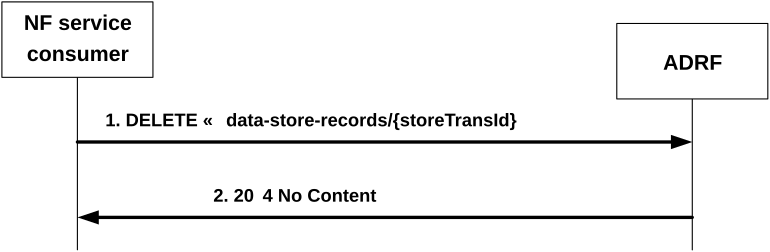
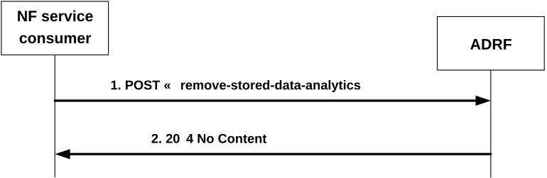

# 4.2.2.9 Nadrf_DataManagement_Delete service operation

## 4.2.2.9.1 General

The Nadrf_DataManagement_Delete service operation is used by an NF service consumer to delete stored data or analytics.

## 4.2.2.9.2 Requesting removal of stored data or analytics

Figure 4.2.2.9.2-1 shows a scenario where the NF service consumer sends a request to the ADRF to delete stored data or analytics.

Figure 4.2.2.9.2-1: NF service consumer requesting to remove stored data or analytics

The NF service consumer shall invoke the Nadrf_DataManagement_Delete service operation to remove stored data or analytics. The NF service consumer shall send an HTTP DELETE request with "{apiRoot}/nadrf-datamanagement/\<apiVersion\>/data-store-records/{storeTransId}" as Resource URI representing an "Individual ADRF Data Store Record" resource, as shown in figure 4.2.2.9.2-1, step 1, where "{storeTransId}" is the transaction identifier of the stored record that is to be deleted.

Upon the reception of an HTTP DELETE request with "{apiRoot}/nadrf-datamanagement/\<apiVersion\>/data-store-records/{storeTransId}" as Resource URI, if the ADRF successfully processed and accepted the received HTTP DELETE request, the ADRF shall:

\- remove the corresponding stored record;

\- respond with HTTP "204 No Content" status code.

If errors occur when processing the HTTP DELETE request, the ADRF shall send an HTTP error response as specified in clause 5.1.7.

If the ADRF determines the received HTTP DELETE request needs to be redirected, the ADRF shall send an HTTP redirect response as specified in clause 6.10.9 of 3GPP TS 29.500 \[4\].

## 4.2.2.9.3 Requesting removal of stored data or analytics using data or analytics specification

Figure 4.2.2.9.3-1 shows a scenario where the NF service consumer sends a request to the ADRF to delete stored data or analytics based on a data or analytics specification.

Figure 4.2.2.9.3-1: NF service consumer requesting to remove stored data or analytics

The NF service consumer shall invoke the Nadrf_DataManagement_Delete service operation to remove stored data or analytics based on a data or analytics specification. The NF service consumer shall send an HTTP POST request with "{apiRoot}/nadrf-datamanagement/\<apiVersion\>/remove-stored-data-analytics" as URI, as shown in figure 4.2.2.9.3-1, step 1. The POST request body shall contain an NadrfStoredDataSpec data structure. The NadrfStoredDataSpec data structure provided in the request body shall include:

\- a time window in which the data to be deleted was collected in the "timePeriod" attribute; and

\- one of the following:

\- a data specification in the "dataSpec" attribute;

> \- an analytics specification in the "anaSpec" attribute;

\- a data set identifier within the "dataSetId" attribute, if the "EnhDataMgmt" feature is supported.

Upon the reception of an HTTP POST request with "{apiRoot}/nadrf-datamanagement/\<apiVersion\>/remove-stored-data-analytics" as URI, if the ADRF successfully processed and accepted the received HTTP POST request, the ADRF shall respond with HTTP "204 No Content" status. The ADRF shall remove any stored analytics or data that match the analytics specification, the data specification, or the data set identifier received in the request.

If errors occur when processing the HTTP POST request, the ADRF shall send an HTTP error response as specified in clause 5.1.7.
