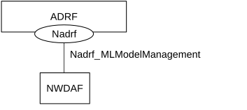
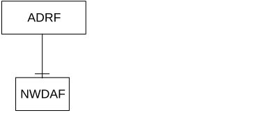
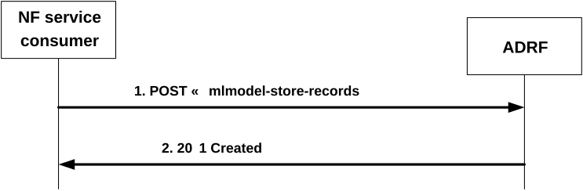
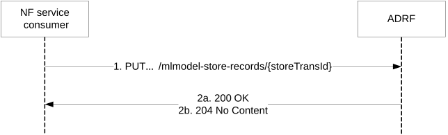
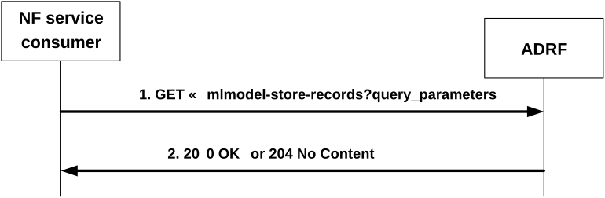
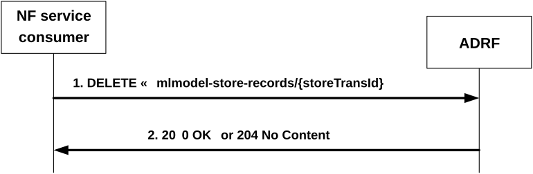
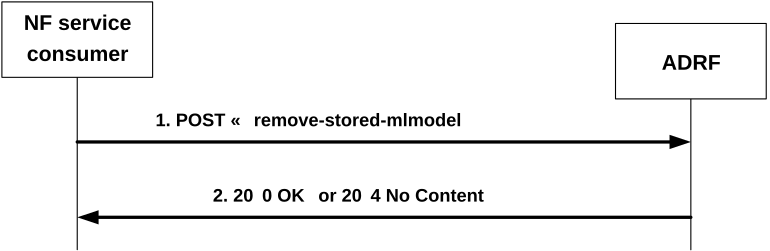

# 4.3 Nadrf\_ MLModelManagement Service

## 4.3.1 Service Description

### 4.3.1.1 Overview

The Nadrf\_ MLModelManagement service as defined in 3GPP TS 23.288 \[14\], is provided by the Analytics Data Repository Function (ADRF).

This service:

> \- allows NF service consumers to store ML model(s) in the ADRF;

\- allows NF service consumers to retrieve ML model(s) from an ADRF; and

\- allows NF service consumers to delete ML model(s) from an ADRF.

> NOTE: In this specification, the storage of the ML model includes the storage of ML model and ML model address; the retrieval of the ML model includes the retrieval of the ML model address; and the removal of the ML model includes the removal of ML model and ML model address.

### 4.3.1.2 Service Architecture

The 5G System Architecture is defined in 3GPP TS 23.501 \[2\]. The Network Data Analytics Exposure architecture is defined in 3GPP TS 23.288 \[14\].

The Nadrf_MLModelManagement service is part of the Nadrf service-based interface exhibited by the Analytics Data Repository Function (ADRF).

Known consumers of the Nadrf_MLModelManagement service are:

\- Network Data Analytics Function (NWDAF).

The Nadrf_MLModelManagement service is provided by the ADRF and consumed by the NF service consumers as shown in figure 4.3.1.2-1 for the SBI representation model and in figure 4.3.1.2-2 for the reference point representation model.

Figure 4.3.1.2-1: Reference Architecture for the Nadrf_MLModelManagement Service; SBI representation

Figure 4.3.1.2-2: Nadrf_MLModelManagement service architecture, reference point representation

### 4.3.1.3 Network Functions

#### 4.3.1.3.1 Analytics Data Repository Function (ADRF)

The Analytics Data Repository Function (ADRF) provides the functionality to allow NF service consumers to store, retrieve, and remove ML model(s) from the ADRF.

#### 4.3.1.3.2 NF Service Consumers

The NWDAF:

> \- supports storing of ML model(s) in the ADRF;

\- supports retrieving of ML model(s) from an ADRF; and

\- supports deletion of ML model(s) from an ADRF.

## 4.3.2 Service Operations

### 4.3.2.1 Introduction

Table 4.3.2.1-1: Operations of the Nadrf_MLModelManagement Service

| Service operation name                   | Description                                                                                 | Initiated by                |
|------------------------------------------|---------------------------------------------------------------------------------------------|-----------------------------|
| Nadrf_MLModelManagement_StorageRequest   | This service operation is used by an NF to request the ADRF to store or update ML model(s). | NF service consumer (NWDAF) |
| Nadrf_MLModelManagement_RetrievalRequest | This service operation is used by an NF to retrieve stored ML model(s) from the ADRF.       | NF service consumer (NWDAF) |
| Nadrf_MLModelManagement_Delete           | This service operation is used by an NF to delete stored ML model(s) in the ADRF.           | NF service consumer (NWDAF) |

### 4.3.2.2 Nadrf\_MLModelManagement_StorageRequest service operation

#### 4.3.2.2.1 General

The Nadrf_MLModelManagement_StorageRequest service operation is used by an NF service consumer to store ML model(s).

#### 4.3.2.2.2 Request Storage of ML model(s)

Figure 4.3.2.2.2-1 shows a scenario where the NF service consumer sends a request to the ADRF to store ML model(s).

Figure 4.3.2.2.2-1: NF service consumer requesting to store ML model(s)

The NF service consumer shall invoke the Nadrf_MLModelManagement_StorageRequest service operation to store ML model(s). The NF service consumer shall send an HTTP POST request with "{apiRoot}/nadrf-mlmodelmanagement/\<apiVersion\>/mlmodel-store-records" as Resource URI representing the "ADRF ML Model Store Records" resource, as shown in figure 4.3.2.2.2-1, step 1, to create an "Individual ADRF ML Model Store Record" according to the information in the message body. The NadrfMLModelStoreRecord data structure provided in the request body shall include either the MLModelInfo data structure in the "mlModelInfo" attribute or the MLModel data structure in the "mlModels" attribute, while either the NF instance identifier, within the "nfInstanceId" attribute, or the NF set identifier, within the "nfSetId" attribute of the NWDAF containing MTLF shall also be provided. If the MLModelInfo data structure is provided, the unique ML model identifier within the "modelUniqueId" attribute, the address of the ML model within the "mlFileAddr" attribute, and the storage size required for each of the ML model(s) in the "mlStorageSize" attribute shall be included, while the list of allowed consumer(s) within the "allowConsumerList" may also be provided. If the MLModel data structure is provided, the unique ML model identifier within the "modelUniqueId" attribute and the ML model within the "mlModel" attribute shall be included.

Upon the reception of an HTTP POST request with "{apiRoot}/nadrf-mlmodelmanagement/\<apiVersion\>/mlmodel-store-records" as Resource URI and NadrfMLModelStoreRecord data structure as request body, the ADRF shall:

\- create a new ML model store record;

\- assign a storeTransId;

\- download the ML model(s) if needed; and

\- store the ML model(s).

> NOTE 1: If the ML model(s) are already stored or being stored in the ADRF, the ADRF will still create a new "Individual ADRF ML Model Store Record" resource and assign a new storeTransId if the ADRF intends to not really store the ML model(s) in the memory again based on the implementation.

If the ADRF created an "Individual ADRF ML Model Store Record" resource, the ADRF shall respond with "201 Created" with the message body containing a representation of the created ML model record, as shown in figure 4.3.2.2.2-1, step 2. If the storage of the ML models provided in the "mlModelInfo" attribute or "mlModels" attribute of the request partially failed, the ADRF may include information about the models that failed to be stored within the "modelStoreResult" attribute in the response. The ADRF shall include a Location HTTP header field, which shall contain the URI of the created record i.e. "{apiRoot}/nadrf- mlmodelmanagement/\<apiVersion\>/mlmodel-store-records/{storeTransId}".

If the storage of all the ML models provided in the "mlModelInfo" attribute or "mlModels" attribute of the request failed for the same reason, then:

\- if the ML model file address(es) was/were not found, the ADRF shall send an HTTP "404 Not Found" status code with the response body containing a ProblemDetails data structure with the "cause" attribute including the "ML_MODEL_FILE_ADDRESS_NOT_FOUND" application error response as specified in clause 5.2.7; or

\- if the ML model file(s) download failed, the ADRF shall send an HTTP "500 Internal Server Error" status code with the response body containing a ProblemDetails data structure with the "cause" attribute including the "ML_MODEL_FILE_DOWNLOAD_FAILED" application error response as specified in clause 5.2.7.

If an error occurs when processing the HTTP POST request, the ADRF shall send an HTTP error response as specified in clause 5.2.7.

#### 4.3.2.2.3 Update Storage of ML model(s)

Figure 4.3.2.2.3-1 shows a scenario where the NF service consumer sends a request to the ADRF to update ML model(s).

Figure 4.3.2.2.3-1: NF service consumer requesting to update ML model(s)

The NF service consumer shall invoke the Nadrf_MLModelManagement_StorageRequest service operation to update ML model(s). The NF service consumer shall send an HTTP PUT request with "{apiRoot}/nadrf-mlmodelmanagement/\<apiVersion\>/mlmodel-store-records/{storeTransId}" as Resource URI representing an "Individual ADRF ML Model Store Record" resource, as shown in figure 4.3.2.2.3-1, step 1, to update that resource according to the information in the message body. The NadrfMLModelStoreRecord data structure provided in the request body shall include the same contents as described in clause 4.3.2.2.2.

Upon the reception of an HTTP PUT request with "{apiRoot}/nadrf-mlmodelmanagement/\<apiVersion\>/mlmodel-store-records/{storeTransId}" as Resource URI and NadrfMLModelStoreRecord data structure as request body, the ADRF shall:

\- download the ML model(s) if needed;

\- update the ML model store record;

and shall respond with:

a\) HTTP "200 OK" status code with the message body containing a representation of updated ML model record, as shown in figure 4.3.2.2.3-1, step 2a. or

b\) HTTP "204 No Content" status code, as shown in figure 4.3.2.2.3-1, step 2b.

If an error occurs when processing the HTTP PUT request, the ADRF shall send an HTTP error response as specified in clause 5.2.7.

If the ADRF determines the received HTTP PUT request needs to be redirected, the ADRF shall send an HTTP redirect response as specified in clause 6.10.9 of 3GPP TS 29.500 \[4\].

### 4.3.2.3 Nadrf_MLModelManagement_RetrievalRequest service operation

#### 4.3.2.3.1 General

The Nadrf_MLModelManagement_RetrievalRequest service operation is used by an NF service consumer to retrieve stored ML model(s).

#### 4.3.2.3.2 Request and get stored ML model(s) from ADRF ML Model Store

Figure 4.3.2.3.2-1 shows a scenario where the NF service consumer sends a request to the ADRF to retrieve stored ML model(s).

Figure 4.3.2.3.2-1: NF service consumer requesting to retrieve stored ML model(s)

The NF service consumer shall invoke the Nadrf_MLModelManagement_RetrievalRequest service operation to retrieve stored ML model(s). The NF service consumer shall send an HTTP GET request with "{apiRoot}/nadrf-mlmodelmanagement/\<apiVersion\>/mlmodel-store-records" as Resource URI representing the "ADRF ML Model Store Records" resource, as shown in figure 4.3.2.3.2-1, step 1, to request ADRF ML model store records according to the storage transaction identifier within the "store-trans-id" query parameter or the unique ML model identifier(s) within the "model-unique-ids" query parameter.

Upon the reception of the HTTP GET request, the ADRF shall:

\- find the ML model(s) according to the requested parameters.

If one or more of the requested ML model(s) are found, the ADRF shall respond with "200 OK" status code with the message body containing the NadrfMLModelStoreRecord data structure. The NadrfMLModelStoreRecord data structure in the response body shall include the MLModelInfo data structure in the "mlModelInfo" attribute with the unique ML model identifier in the "modelUniqueId" attribute and the address of the ML model file stored in the ADRF in the "mlFileAddr" attribute.

If the NF Service Consumer is not included in the allowed NF consumer list for the ML model and/or is not same as the NF of the NWDAF containing MTLF that stored the model, the ADRF shall send an HTTP "403 Forbidden" error response including the "cause" attribute set to "RETRIEVAL_ML_MODEL_NOT_ALLOWED".

If none of the requested ML model(s) exist, the ADRF shall respond with "204 No Content". If an error occurs when processing the HTTP GET request, the ADRF shall send an HTTP error response as specified in clause 5.2.7.

### 4.3.2.4 Nadrf_MLModelManagement_Delete service operation

#### 4.3.2.4.1 General

The Nadrf_MLModelManagement_Delete service operation is used by an NF service consumer to delete stored ML model(s).

#### 4.3.2.4.2 Requesting removal of stored ML model(s)

Figure 4.3.2.4.2-1 shows a scenario where the NF service consumer sends a request to the ADRF to delete stored ML model(s).

Figure 4.3.2.4.2-1: NF service consumer requesting to remove stored ML model(s)

The NF service consumer shall invoke the Nadrf_MLModelManagement_Delete service operation to remove the ML model(s) that are stored in the corresponding storage transaction. The NF service consumer shall send an HTTP DELETE request with "{apiRoot}/nadrf-mlmodelmanagement/\<apiVersion\>/mlmodel-store-records/{storeTransId}" as Resource URI representing an "Individual ADRF ML Model Store Record" resource, as shown in figure 4.3.2.4.2-1, step 1, where "{storeTransId}" is the transaction identifier of the stored record that is to be deleted.

Upon the reception of an HTTP DELETE request with "{apiRoot}/nadrf-mlmodelmanagement/\<apiVersion\>/mlmodel-store-records/{storeTransId}" as Resource URI, if the ADRF successfully processed and accepted the received HTTP DELETE request, the ADRF shall:

\- remove the storage transaction corresponding stored ML model record;

\- respond with HTTP "204 No Content" status code, or with HTTP "200 OK" status code with the message body containing, for each of the ML Models that had been stored under the given storage transaction identifier, the MLModelDelResult data structure with the unique ML model identifier in the "modelUniqueId" attribute and the result in the "deleteResult" attribute.

If the deletion of all the ML models that had been stored under the given storage transaction identifier failed for the same reason, then:

\- if the ML model(s) was/were not found the ADRF shall send an HTTP "404 Not Found" status code with the response body containing a ProblemDetails data structure with the "cause" attribute including the "ML_MODEL_NOT_FOUND" application error response as specified in clause 5.2.7; or

\- if the ML model(s) was/were found but not deleted the ADRF shall send an HTTP "500 Internal Server Error" status code with the response body containing a ProblemDetails data structure with the "cause" attribute including the "ML_MODEL_FOUND_BUT_NOT_DELETED" application error response as specified in clause 5.2.7.

If errors occur when processing the HTTP DELETE request, the ADRF shall send an HTTP error response as specified in clause 5.2.7.

If the ADRF determines the received HTTP DELETE request needs to be redirected, the ADRF shall send an HTTP redirect response as specified in clause 6.10.9 of 3GPP TS 29.500 \[4\].

#### 4.3.2.4.3 Requesting removal of stored ML model(s) using unique ML model identifier

Figure 4.3.2.4.3-1 shows a scenario where the NF service consumer sends a request to the ADRF to delete stored ML model(s) based on the unique ML model identifier.

Figure 4.3.2.4.3-1: NF service consumer requesting to remove stored ML model(s)

The NF service consumer shall invoke the Nadrf_MLModelManagement_Delete service operation to remove stored ML model(s) based on the unique ML model identifier. The NF service consumer shall send an HTTP POST request with "{apiRoot}/nadrf-mlmodelmanagement/\<apiVersion\>/remove-stored-mlmodel" as URI, as shown in figure 4.3.2.4.3-1, step 1. The POST request body shall contain the list of ML model identifiers of the ML models that are to be deleted.

Upon the reception of an HTTP POST request with "{apiRoot}/nadrf-mlmodelmanagement/\<apiVersion\>/remove-stored-mlmodel" as URI, if the ADRF successfully processed and accepted the received HTTP POST request, the ADRF shall remove any stored ML model(s) that match the unique ML model identifier(s) received in the request and respond with HTTP "204 No Content" status if all deletions were successful or with HTTP "200 OK" status with the message body containing the MLModelDelResult data structure if the deletion was partially successful.

If the deletion of all the ML models identified by the unique ML model identifier in the "modelUniqueId" attribute of the request failed for the same reason, then:

\- if the ML model(s) was/were not found the ADRF shall send an HTTP "404 Not Found" status code with the response body containing a ProblemDetails data structure with the "cause" attribute including the "ML_MODEL_NOT_FOUND" application error response as specified in clause 5.2.7; or

\- if the ML model(s) was/were found but not deleted the ADRF shall send an HTTP "500 Internal Server Error" status code with the response body containing a ProblemDetails data structure with the "cause" attribute including the "ML_MODEL_FOUND_BUT_NOT_DELETED" application error response as specified in clause 5.2.7.

If errors occur when processing the HTTP POST request, the ADRF shall send an HTTP error response as specified in clause 5.2.7.
