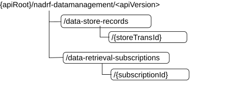

# 5.1.3 Resources

## 5.1.3.1 Overview

This clause describes the structure for the Resource URIs, the resources and methods used for the service.

Figure 5.1.3.1-1 depicts the resource URIs structure for the Nadrf_DataManagement API.

Figure 5.1.3.1-1: Resource URI structure of the Nadrf_DataManagement API

Table 5.1.3.1-1 provides an overview of the resources and applicable HTTP methods.

Table 5.1.3.1-1: Resources and methods overview

| Resource name                               | Resource URI                                   | HTTP method or custom operation | Description                                                                           |
|---------------------------------------------|------------------------------------------------|---------------------------------|---------------------------------------------------------------------------------------|
| ADRF Data Store Records                     | /data-store-records                            | GET                             | Retrieve the stored data or analytics                                                 |
|                                             |                                                | POST                            | Create a new Individual Data Store resource.                                          |
| Individual ADRF Data Store Record           | /data-store-records/{storeTransId}             | DELETE                          | Delete an individual ADRF Data Store Record identified by {storeTransId}.             |
| ADRF Data Retrieval Subscriptions           | /data-retrieval-subscriptions                  | POST                            | Create a new Individual ADRF Data Retrieval Subscription resource.                    |
| Individual ADRF Data Retrieval Subscription | /data-retrieval-subscriptions/{subscriptionId} | DELETE                          | Delete an individual ADRF Data Retrieval Subscription identified by {subscriptionId}. |

## 5.1.3.2 Resource: ADRF Data Store Records

### 5.1.3.2.1 Description

The ADRF Data Store Records resource represents all data storage records to the Nadrf_DataManagement Service at a given ADRF. The resource allows an NF service consumer to create a new Individual ADRF Data Store Record resource and to retrieve Individual ADRF Data Store Record resources that fulfil certain criteria.

### 5.1.3.2.2 Resource Definition

Resource URI: **{apiRoot}/nadrf-datamanagement/\<apiVersion\>/data-store-records**

The \<apiVersion\> shall be set as described in clause 5.1.1.

This resource shall support the resource URI variables defined in table 5.1.3.2.2-1.

Table 5.1.3.2.2-1: Resource URI variables for this resource

| Name    | Data type | Definition       |
|---------|-----------|------------------|
| apiRoot | string    | See clause 5.1.1 |

### 5.1.3.2.3 Resource Standard Methods

#### 5.1.3.2.3.1 POST

This method shall support the URI query parameters specified in table 5.1.3.2.3.1-1.

Table 5.1.3.2.3.1-1: URI query parameters supported by the POST method on this resource

| Name | Data type | P   | Cardinality | Description | Applicability |
|------|-----------|-----|-------------|-------------|---------------|
| n/a  |           |     |             |             |               |

This method shall support the request data structures specified in table 5.1.3.2.3.1-2 and the response data structures and response codes specified in table 5.1.3.2.3.1-3.

Table 5.1.3.2.3.1-2: Data structures supported by the POST Request Body on this resource

| Data type            | P   | Cardinality | Description                                    |
|----------------------|-----|-------------|------------------------------------------------|
| NadrfDataStoreRecord | M   | 1           | New individual Data Store Record to be created |

Table 5.1.3.2.3.1-3: Data structures supported by the POST Response Body on this resource

<table>
<colgroup>
<col style="width: 16%" />
<col style="width: 4%" />
<col style="width: 12%" />
<col style="width: 11%" />
<col style="width: 54%" />
</colgroup>
<thead>
<tr class="header">
<th>Data type</th>
<th>P</th>
<th>Cardinality</th>
<th>
Response

codes
</th>
<th>Description</th>
</tr>
</thead>
<tbody>
<tr class="odd">
<td>NadrfDataStoreRecord</td>
<td>M</td>
<td>1</td>
<td>201 Created</td>
<td>The creation of an Individual Data Store Record resource is confirmed, and a representation of that resource is returned.</td>
</tr>
<tr class="even">
<td colspan="5">NOTE: The mandatory HTTP error status code for the HTTP POST method listed in Table 5.1.7.1-1 of 3GPP TS 29.500 [4] shall also apply.</td>
</tr>
</tbody>
</table>

Table 5.1.3.2.3.1-4: Headers supported by the 201 response code on this resource

<table>
<colgroup>
<col style="width: 17%" />
<col style="width: 13%" />
<col style="width: 4%" />
<col style="width: 11%" />
<col style="width: 52%" />
</colgroup>
<thead>
<tr class="header">
<th>Name</th>
<th>Data type</th>
<th>P</th>
<th>Cardinality</th>
<th>Description</th>
</tr>
</thead>
<tbody>
<tr class="odd">
<td>Location</td>
<td>string</td>
<td>M</td>
<td>1</td>
<td>
Contains the URI of the newly created resource, according to the structure:

{apiRoot}/nadrf-datamanagement/&lt;apiVersion&gt;/data-store-records/{storeTransId}
</td>
</tr>
</tbody>
</table>

#### 5.1.3.2.3.2 GET

This method shall support the URI query parameters specified in table 5.1.3.2.3.2-1.

Table 5.1.3.2.3.2-1: URI query parameters supported by the GET method on this resource

| Name                                                                                                 | Data type     | P   | Cardinality | Description                                                                                                                                                                                                |
|------------------------------------------------------------------------------------------------------|---------------|-----|-------------|------------------------------------------------------------------------------------------------------------------------------------------------------------------------------------------------------------|
| store-trans-id                                                                                       | string        | O   | 0..1        | Identifies the "Storage Transaction Identifier" of data store record in ADRF. (NOTE)                                                                                                                       |
| fetch-correlation-ids                                                                                | array(string) | O   | 1..N        | Identifies fetch correlation identifiers received as part of fetch instruction. (NOTE)                                                                                                                     |
| data-set-id                                                                                          | string        | O   | 0..1        | Identifies a data set, i.e. the data or analytics records that contain the same value in the data set identifier of their data set tag. It may only be provided if the "EnhDataMgmt" feature is supported. |
| NOTE: Exactly one of "store-trans-id", "fetch-correlation-ids", and "data-set-id" shall be provided. |               |     |             |                                                                                                                                                                                                            |

This method shall support the request data structures specified in table 5.1.3.2.3.1-2 and the response data structures and response codes specified in table 5.1.3.2.3.1-3.

Table 5.1.3.2.3.1-2: Data structures supported by the GET Request Body on this resource

| Data type | P   | Cardinality | Description |
|-----------|-----|-------------|-------------|
| n/a       |     |             |             |

Table 5.1.3.2.3.1-3: Data structures supported by the GET Response Body on this resource

<table>
<colgroup>
<col style="width: 22%" />
<col style="width: 2%" />
<col style="width: 11%" />
<col style="width: 15%" />
<col style="width: 48%" />
</colgroup>
<thead>
<tr class="header">
<th>Data type</th>
<th>P</th>
<th>Cardinality</th>
<th>
Response

codes
</th>
<th>Description</th>
</tr>
</thead>
<tbody>
<tr class="odd">
<td>NadrfDataStoreRecord</td>
<td>M</td>
<td>1</td>
<td>200 OK</td>
<td>Data Store record.</td>
</tr>
<tr class="even">
<td>n/a</td>
<td></td>
<td></td>
<td>204 No Content</td>
<td>If the request ADRF Data Store Record does not exist, the ADRF shall respond with "204 No Content ".</td>
</tr>
<tr class="odd">
<td>RedirectResponse</td>
<td>O</td>
<td>0..1</td>
<td>307 Temporary Redirect</td>
<td>
Temporary redirection.

(NOTE 2)
</td>
</tr>
<tr class="even">
<td>RedirectResponse</td>
<td>O</td>
<td>0..1</td>
<td>308 Permanent Redirect</td>
<td>
Permanent redirection.

(NOTE 2)
</td>
</tr>
<tr class="odd">
<td colspan="5">
NOTE 1: The mandatory HTTP error status codes for the HTTP GET method listed in table 5.2.7.1-1 of 3GPP TS 29.500 [4] shall also apply.

NOTE 2: The RedirectResponse data structure may be provided by an SCP (cf. clause 6.10.9.1 of 3GPP TS 29.500 [4]).
</td>
</tr>
</tbody>
</table>

Table 5.1.3.2.3.1-4: Headers supported by the 307 Response Code on this resource

<table>
<colgroup>
<col style="width: 16%" />
<col style="width: 14%" />
<col style="width: 4%" />
<col style="width: 11%" />
<col style="width: 52%" />
</colgroup>
<thead>
<tr class="header">
<th>Name</th>
<th>Data type</th>
<th>P</th>
<th>Cardinality</th>
<th>Description</th>
</tr>
</thead>
<tbody>
<tr class="odd">
<td>Location</td>
<td>string</td>
<td>M</td>
<td>1</td>
<td>
Contains an alternative URI of the resource located in an alternative ADRF (service) instance towards which the request should be redirected.

For the case where the request is redirected to the same target via a different SCP, refer to clause 6.10.9.1 of 3GPP TS 29.500 [4].
</td>
</tr>
<tr class="even">
<td>3gpp-Sbi-Target-Nf-Id</td>
<td>string</td>
<td>O</td>
<td>0..1</td>
<td>Contains the identifier of the target ADRF (service) instance towards which the request should be redirected.</td>
</tr>
</tbody>
</table>

Table 5.1.3.2.3.1-5: Headers supported by the 308 Response Code on this resource

<table>
<colgroup>
<col style="width: 16%" />
<col style="width: 14%" />
<col style="width: 4%" />
<col style="width: 11%" />
<col style="width: 52%" />
</colgroup>
<thead>
<tr class="header">
<th>Name</th>
<th>Data type</th>
<th>P</th>
<th>Cardinality</th>
<th>Description</th>
</tr>
</thead>
<tbody>
<tr class="odd">
<td>Location</td>
<td>string</td>
<td>M</td>
<td>1</td>
<td>
Contains an alternative URI of the resource located in an alternative ADRF (service) instance towards which the request should be redirected.

For the case where the request is redirected to the same target via a different SCP, refer to clause 6.10.9.1 of 3GPP TS 29.500 [4].
</td>
</tr>
<tr class="even">
<td>3gpp-Sbi-Target-Nf-Id</td>
<td>string</td>
<td>O</td>
<td>0..1</td>
<td>Contains the identifier of the target ADRF (service) instance towards which the request should be redirected.</td>
</tr>
</tbody>
</table>

### 5.1.3.2.4 Resource Custom Operations

None.

## 5.1.3.3 Resource: Individual ADRF Data Store Record

### 5.1.3.3.1 Description

The Individual ADRF Data Store Record resource represents data or analytics stored via the Nadrf_DataManagement_StorageRequest in ADRF.

### 5.1.3.3.2 Resource Definition

Resource URI: **{apiRoot}/nadrf-datamanagement/\<apiVersion\>/data-store-records/{storeTransId}**

The \<apiVersion\> shall be set as described in clause 5.1.1.

This resource shall support the resource URI variables defined in table 5.1.3.3.2-1.

Table 5.1.3.3.2-1: Resource URI variables for this resource

| Name         | Data type | Definition                                  |
|--------------|-----------|---------------------------------------------|
| apiRoot      | string    | See clause 5.1.1.                           |
| storeTransId | string    | Identifies an individual data store record. |

### 5.1.3.3.3 Resource Standard Methods

#### 5.1.3.3.3.1 DELETE

This method shall support the URI query parameters specified in table 5.1.3.3.3.1-1.

Table 5.1.3.3.3.1-1: URI query parameters supported by the DELETE method on this resource

| Name | Data type | P   | Cardinality | Description | Applicability |
|------|-----------|-----|-------------|-------------|---------------|
| n/a  |           |     |             |             |               |

This method shall support the request data structures specified in table 5.1.3.3.3.1-2 and the response data structures and response codes specified in table 5.1.3.3.3.1-3.

Table 5.1.3.3.3.1-2: Data structures supported by the DELETE Request Body on this resource

| Data type | P   | Cardinality | Description |
|-----------|-----|-------------|-------------|
| n/a       |     |             |             |

Table 5.1.3.3.3.1-3: Data structures supported by the DELETE Response Body on this resource

<table>
<colgroup>
<col style="width: 16%" />
<col style="width: 4%" />
<col style="width: 12%" />
<col style="width: 11%" />
<col style="width: 54%" />
</colgroup>
<thead>
<tr class="header">
<th>Data type</th>
<th>P</th>
<th>Cardinality</th>
<th>
Response

codes
</th>
<th>Description</th>
</tr>
</thead>
<tbody>
<tr class="odd">
<td>n/a</td>
<td></td>
<td></td>
<td>204 No Content</td>
<td>The Individual ADRF Data Store Record resource was deleted successfully.</td>
</tr>
<tr class="even">
<td>RedirectResponse</td>
<td>O</td>
<td>0..1</td>
<td>307 Temporary Redirect</td>
<td>
Temporary redirection, during Individual ADRF Data Store Record deletion.

(NOTE 2)
</td>
</tr>
<tr class="odd">
<td>RedirectResponse</td>
<td>O</td>
<td>0..1</td>
<td>308 Permanent Redirect</td>
<td>
Permanent redirection, during Individual ADRF Data Store Record deletion.

(NOTE 2)
</td>
</tr>
<tr class="even">
<td colspan="5">
NOTE 1: The mandatory HTTP error status code for the HTTP DELETE method listed in Table 5.2.7.1-1 of 3GPP TS 29.500 [4] shall also apply.

NOTE 2: The RedirectResponse data structure may be provided by an SCP (cf. clause 6.10.9.1 of 3GPP TS 29.500 [4]).
</td>
</tr>
</tbody>
</table>

Table 5.1.3.3.3.1-4: Headers supported by the 307 Response Code on this resource

<table>
<colgroup>
<col style="width: 16%" />
<col style="width: 14%" />
<col style="width: 4%" />
<col style="width: 11%" />
<col style="width: 52%" />
</colgroup>
<thead>
<tr class="header">
<th>Name</th>
<th>Data type</th>
<th>P</th>
<th>Cardinality</th>
<th>Description</th>
</tr>
</thead>
<tbody>
<tr class="odd">
<td>Location</td>
<td>string</td>
<td>M</td>
<td>1</td>
<td>
Contains an alternative URI of the resource located in an alternative ADRF (service) instance towards which the request is redirected.

For the case where the request is redirected to the same target via a different SCP, refer to clause 6.10.9.1 of 3GPP TS 29.500 [4].
</td>
</tr>
<tr class="even">
<td>3gpp-Sbi-Target-Nf-Id</td>
<td>string</td>
<td>O</td>
<td>0..1</td>
<td>Identifier of the target ADRF (service) instance towards which the request is redirected.</td>
</tr>
</tbody>
</table>

Table 5.1.3.3.3.1-5: Headers supported by the 308 Response Code on this resource

<table>
<colgroup>
<col style="width: 16%" />
<col style="width: 14%" />
<col style="width: 4%" />
<col style="width: 11%" />
<col style="width: 52%" />
</colgroup>
<thead>
<tr class="header">
<th>Name</th>
<th>Data type</th>
<th>P</th>
<th>Cardinality</th>
<th>Description</th>
</tr>
</thead>
<tbody>
<tr class="odd">
<td>Location</td>
<td>string</td>
<td>M</td>
<td>1</td>
<td>
Contains an alternative URI of the resource located in an alternative ADRF (service) instance towards which the request is redirected.

For the case where the request is redirected to the same target via a different SCP, refer to clause 6.10.9.1 of 3GPP TS 29.500 [4].
</td>
</tr>
<tr class="even">
<td>3gpp-Sbi-Target-Nf-Id</td>
<td>string</td>
<td>O</td>
<td>0..1</td>
<td>Identifier of the target ADRF (service) instance towards which the request is redirected.</td>
</tr>
</tbody>
</table>

### 5.1.3.3.4 Resource Custom Operations

None in this release of the specification.

## 5.1.3.4 Resource: ADRF Data Retrieval Subscriptions

### 5.1.3.4.1 Description

The ADRF Data Retrieval Subscriptions resource represents all data retrieval subscriptions to the Nadrf_DataManagement Service at a given ADRF. The resource allows an NF service consumer to create a new Individual ADRF Data Retrieval Subscription resource.

### 5.1.3.4.2 Resource Definition

Resource URI: **{apiRoot}/nadrf-datamanagement/\<apiVersion\>/data-retrieval-subscriptions**

The \<apiVersion\> shall be set as described in clause 5.1.1.

This resource shall support the resource URI variables defined in table 5.1.3.4.2-1.

Table 5.1.3.4.2-1: Resource URI variables for this resource

| Name    | Data type | Definition       |
|---------|-----------|------------------|
| apiRoot | string    | See clause 5.1.1 |

### 5.1.3.4.3 Resource Standard Methods

#### 5.1.3.4.3.1 POST

This method shall support the URI query parameters specified in table 5.1.3.4.3.1-1.

Table 5.1.3.4.3.1-1: URI query parameters supported by the POST method on this resource

| Name | Data type | P   | Cardinality | Description | Applicability |
|------|-----------|-----|-------------|-------------|---------------|
| n/a  |           |     |             |             |               |

This method shall support the request data structures specified in table 5.1.3.4.3.1-2 and the response data structures and response codes specified in table 5.1.3.4.3.1-3.

Table 5.1.3.4.3.1-2: Data structures supported by the POST Request Body on this resource

| Data type                      | P   | Cardinality | Description                                                         |
|--------------------------------|-----|-------------|---------------------------------------------------------------------|
| NadrfDataRetrievalSubscription | M   | 1           | Individual ADRF Data Retrieval Subscription resource to be created. |

Table 5.1.3.4.3.1-3: Data structures supported by the POST Response Body on this resource

<table>
<colgroup>
<col style="width: 16%" />
<col style="width: 4%" />
<col style="width: 12%" />
<col style="width: 11%" />
<col style="width: 54%" />
</colgroup>
<thead>
<tr class="header">
<th>Data type</th>
<th>P</th>
<th>Cardinality</th>
<th>
Response

codes
</th>
<th>Description</th>
</tr>
</thead>
<tbody>
<tr class="odd">
<td>NadrfDataRetrievalSubscription</td>
<td>M</td>
<td>1</td>
<td>201 Created</td>
<td>The creation of an Individual ADRF Data Retrieval Subscription resource is confirmed and a representation of that resource is returned.</td>
</tr>
<tr class="even">
<td colspan="5">NOTE: The mandatory HTTP error status code for the HTTP POST method listed in Table 5.2.7.1-1 of 3GPP TS 29.500 [4] shall also apply.</td>
</tr>
</tbody>
</table>

Table 5.1.3.4.3.1-4: Headers supported by the 201 response code on this resource

| Name     | Data type | P   | Cardinality | Description                                                                                                                                                             |
|----------|-----------|-----|-------------|-------------------------------------------------------------------------------------------------------------------------------------------------------------------------|
| Location | string    | M   | 1           | Contains the URI of the newly created resource, according to the structure: {apiRoot}/nadrf-datamanagement/\<apiVersion\>/data-retrieval-subscriptions/{subscriptionId} |

### 5.1.3.4.4 Resource Custom Operations

None in this release of the specification.

## 5.1.3.5 Resource: Individual ADRF Data Retrieval Subscription

### 5.1.3.5.1 Description

The Individual ADRF Data Retrieval Subscription resource represents single ADRF data retrieval subscription to the Nadrf_DataManagement Service at a given ADRF. The resource allows an NF service consumer to delete Individual ADRF Data Retrieval Subscription resource.

### 5.1.3.5.2 Resource Definition

Resource URI: **{apiRoot}/nadrf-datamanagement/\<apiVersion\>/data-retrieval-subscriptions/{subscriptionId}**

This resource shall support the resource URI variables defined in table 5.1.3.5.2-1.

Table 5.1.3.5.2-1: Resource URI variables for this resource

| Name           | Data type | Definition                                                     |
|----------------|-----------|----------------------------------------------------------------|
| apiRoot        | string    | See clause 5.1.1                                               |
| subscriptionId | string    | Identifies a subscription to the Nadrf_DataManagement service. |

### 5.1.3.5.3 Resource Standard Methods

#### 5.1.3.5.3.1 DELETE

This method shall support the URI query parameters specified in table 5.1.3.5.3.1-1.

Table 5.1.3.5.3.1-1: URI query parameters supported by the DELETE method on this resource

| Name | Data type | P   | Cardinality | Description | Applicability |
|------|-----------|-----|-------------|-------------|---------------|
| n/a  |           |     |             |             |               |

This method shall support the request data structures specified in table 5.1.3.5.3.1-2 and the response data structures and response codes specified in table 5.1.3.5.3.1-3.

Table 5.1.3.5.3.1-2: Data structures supported by the DELETE Request Body on this resource

| Data type | P   | Cardinality | Description |
|-----------|-----|-------------|-------------|
| n/a       |     |             |             |

Table 5.1.3.5.3.1-3: Data structures supported by the DELETE Response Body on this resource

<table>
<colgroup>
<col style="width: 16%" />
<col style="width: 4%" />
<col style="width: 12%" />
<col style="width: 11%" />
<col style="width: 54%" />
</colgroup>
<thead>
<tr class="header">
<th>Data type</th>
<th>P</th>
<th>Cardinality</th>
<th>
Response

codes
</th>
<th>Description</th>
</tr>
</thead>
<tbody>
<tr class="odd">
<td>n/a</td>
<td></td>
<td></td>
<td>204 No Content</td>
<td>The Individual ADRF Data Retrieval Subscription resource was deleted successfully.</td>
</tr>
<tr class="even">
<td>RedirectResponse</td>
<td>O</td>
<td>0..1</td>
<td>307 Temporary Redirect</td>
<td>
Temporary redirection, during Individual ADRF Data Store Record deletion.

(NOTE 2)
</td>
</tr>
<tr class="odd">
<td>RedirectResponse</td>
<td>O</td>
<td>0..1</td>
<td>308 Permanent Redirect</td>
<td>
Permanent redirection, during Individual ADRF Data Store Record deletion.

(NOTE 2)
</td>
</tr>
<tr class="even">
<td colspan="5">
NOTE 1: The mandatory HTTP error status code for the HTTP DELETE method listed in Table 5.2.7.1-1 of 3GPP TS 29.500 [4] shall also apply.

NOTE 2: The RedirectResponse data structure may be provided by an SCP (cf. clause 6.10.9.1 of 3GPP TS 29.500 [4]).
</td>
</tr>
</tbody>
</table>

Table 5.1.3.5.3.1-4: Headers supported by the 307 Response Code on this resource

<table>
<colgroup>
<col style="width: 16%" />
<col style="width: 14%" />
<col style="width: 4%" />
<col style="width: 11%" />
<col style="width: 52%" />
</colgroup>
<thead>
<tr class="header">
<th>Name</th>
<th>Data type</th>
<th>P</th>
<th>Cardinality</th>
<th>Description</th>
</tr>
</thead>
<tbody>
<tr class="odd">
<td>Location</td>
<td>string</td>
<td>M</td>
<td>1</td>
<td>
Contains an alternative URI of the resource located in an alternative ADRF (service) instance towards which the request is redirected.

For the case where the request is redirected to the same target via a different SCP, refer to clause 6.10.9.1 of 3GPP TS 29.500 [4].
</td>
</tr>
<tr class="even">
<td>3gpp-Sbi-Target-Nf-Id</td>
<td>string</td>
<td>O</td>
<td>0..1</td>
<td>Identifier of the target ADRF (service) instance towards which the request is redirected.</td>
</tr>
</tbody>
</table>

Table 5.1.3.5.3.1-5: Headers supported by the 308 Response Code on this resource

<table style="width:100%;">
<colgroup>
<col style="width: 16%" />
<col style="width: 14%" />
<col style="width: 4%" />
<col style="width: 11%" />
<col style="width: 52%" />
</colgroup>
<thead>
<tr class="header">
<th>Name</th>
<th>Data type</th>
<th>P</th>
<th>Cardinality</th>
<th>Description</th>
</tr>
</thead>
<tbody>
<tr class="odd">
<td>Location</td>
<td>string</td>
<td>M</td>
<td>1</td>
<td>
Contains an alternative URI of the resource located in an alternative ADRF (service) instance towards which the request is redirected.

For the case where the request is redirected to the same target via a different SCP, refer to clause 6.10.9.1 of 3GPP TS 29.500 [4].
</td>
</tr>
<tr class="even">
<td>3gpp-Sbi-Target-Nf-Id</td>
<td>string</td>
<td>O</td>
<td>0..1</td>
<td>Identifier of the target ADRF (service) instance towards which the request is redirected.</td>
</tr>
</tbody>
</table>

### 5.1.3.5.4 Resource Custom Operations

None in this release of the specification.
