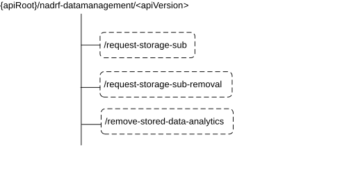

# 5.1.4 Custom Operations without associated resources

## 5.1.4.1 Overview

The structure of the custom operation URIs of the Nadrf_DataManagement service is shown in Figure 5.1.4.1-1.

Figure 5.1.4.1-1: Custom operation URI structure of the Nadrf_DataManagement API

Table 5.1.4.1-1 provides an overview of the custom operations and applicable HTTP methods.

Table 5.1.4.1-1: Custom operations without associated resources

| Custom operation URI                                                       | Mapped HTTP method | Description                                                                                                                |
|----------------------------------------------------------------------------|--------------------|----------------------------------------------------------------------------------------------------------------------------|
| {apiRoot}/nadrf-datamanagement/\<apiVersion\>/request-storage-sub          | POST               | Request the ADRF to create a subscription for data or analytics and then store the received data or analytics in the ADRF. |
| {apiRoot}/nadrf-datamanagement/\<apiVersion\>/request-storage-sub-removal  | POST               | Request the ADRF to remove a subscription for data or analytics.                                                           |
| {apiRoot}/nadrf-datamanagement/\<apiVersion\>/remove-stored-data-analytics | POST               | Request the ADRF to remove already stored data or analytics.                                                               |

## 5.1.4.2 Operation: request-storage-sub

### 5.1.4.2.1 Description

The operation is used by the NF service consumer to request the ADRF to create a subscription for data or analytics and then store the received data or analytics in the ADRF.

### 5.1.4.2.2 Operation Definition

This operation shall support the request data structures shown in Table 5.1.4.2.2-1 and the response data structures and error codes specified in Tables 5.1.4.2.2-2.

Table 5.1.4.2.2-1: Data structures supported by the POST Request Body on this resource

| Data type                  | P   | Cardinality | Description                                                            |
|----------------------------|-----|-------------|------------------------------------------------------------------------|
| NadrfDataStoreSubscription | M   | 1           | Information about the storage subscription that the ADRF shall create. |

Table 5.1.4.2.2-2: Data structures supported by the POST Response Body on this resource

<table>
<colgroup>
<col style="width: 17%" />
<col style="width: 3%" />
<col style="width: 12%" />
<col style="width: 11%" />
<col style="width: 54%" />
</colgroup>
<thead>
<tr class="header">
<th>Data type</th>
<th>P</th>
<th>Cardinality</th>
<th>
Response

codes
</th>
<th>Description</th>
</tr>
</thead>
<tbody>
<tr class="odd">
<td>NadrfDataStoreSubscriptionRef</td>
<td>M</td>
<td>1</td>
<td>200 OK</td>
<td>Successful request to trigger the creation of a subscription for data or analytics at the ADRF. A reference is provided.</td>
</tr>
<tr class="even">
<td>RedirectResponse</td>
<td>O</td>
<td>0..1</td>
<td>307 Temporary Redirect</td>
<td>
Temporary redirection.

(NOTE 2)
</td>
</tr>
<tr class="odd">
<td>RedirectResponse</td>
<td>O</td>
<td>0..1</td>
<td>308 Permanent Redirect</td>
<td>
Permanent redirection.

(NOTE 2)
</td>
</tr>
<tr class="even">
<td colspan="5">
NOTE 1: The mandatory HTTP error status code for the HTTP POST method listed in Table 5.1.7.1-1 of 3GPP TS 29.500 [4] shall also apply.

NOTE 2: The RedirectResponse data structure may be provided by an SCP (cf. clause 6.10.9.1 of 3GPP TS 29.500 [4]).
</td>
</tr>
</tbody>
</table>

Table 5.1.4.2.2-3: Headers supported by the 307 Response Code on this custom operation

<table>
<colgroup>
<col style="width: 20%" />
<col style="width: 13%" />
<col style="width: 4%" />
<col style="width: 11%" />
<col style="width: 49%" />
</colgroup>
<tbody>
<tr class="odd">
<td>Name</td>
<td>Data type</td>
<td>P</td>
<td>Cardinality</td>
<td>Description</td>
</tr>
<tr class="even">
<td>Location</td>
<td>string</td>
<td>M</td>
<td>1</td>
<td>
Contains an alternative target URI located in an alternative ADRF (service) instance towards which the request should be redirected.

For the case where the request is redirected to the same target via a different SCP, refer to clause 6.10.9.1 of 3GPP TS 29.500 [4].
</td>
</tr>
<tr class="odd">
<td>3gpp-Sbi-Target-Nf-Id</td>
<td>string</td>
<td>O</td>
<td>0..1</td>
<td>Contains the identifier of the target ADRF (service) instance towards which the request should be redirected.</td>
</tr>
</tbody>
</table>

Table 5.1.4.2.2-4: Headers supported by the 308 Response Code on this custom operation

<table>
<colgroup>
<col style="width: 20%" />
<col style="width: 13%" />
<col style="width: 4%" />
<col style="width: 11%" />
<col style="width: 49%" />
</colgroup>
<tbody>
<tr class="odd">
<td>Name</td>
<td>Data type</td>
<td>P</td>
<td>Cardinality</td>
<td>Description</td>
</tr>
<tr class="even">
<td>Location</td>
<td>string</td>
<td>M</td>
<td>1</td>
<td>
Contains an alternative target URI located in an alternative ADRF (service) instance towards which the request should be redirected.

For the case where the request is redirected to the same target via a different SCP, refer to clause 6.10.9.1 of 3GPP TS 29.500 [4].
</td>
</tr>
<tr class="odd">
<td>3gpp-Sbi-Target-Nf-Id</td>
<td>string</td>
<td>O</td>
<td>0..1</td>
<td>Contains the identifier of the target ADRF (service) instance towards which the request should be redirected.</td>
</tr>
</tbody>
</table>

## 5.1.4.3 Operation: request-storage-sub-removal

### 5.1.4.3.1 Description

The operation is used by the NF service consumer to request the ADRF to remove a subscription for data or analytics which was used to store the received data or analytics in the ADRF.

### 5.1.4.3.2 Operation Definition

This operation shall support the request data structures shown in Table 5.1.4.3.2-1 and the response data structures and error codes specified in Tables 5.1.4.3.2-2.

Table 5.1.4.3.2-1: Data structures supported by the POST Request Body on this resource

| Data type                     | P   | Cardinality | Description                                                             |
|-------------------------------|-----|-------------|-------------------------------------------------------------------------|
| NadrfDataStoreSubscriptionRef | M   | 1           | Reference used to identify the subscription that the ADRF shall remove. |

Table 5.1.4.3.2-2: Data structures supported by the POST Response Body on this resource

<table>
<colgroup>
<col style="width: 17%" />
<col style="width: 3%" />
<col style="width: 12%" />
<col style="width: 14%" />
<col style="width: 51%" />
</colgroup>
<thead>
<tr class="header">
<th>Data type</th>
<th>P</th>
<th>Cardinality</th>
<th>
Response

codes
</th>
<th>Description</th>
</tr>
</thead>
<tbody>
<tr class="odd">
<td>n/a</td>
<td></td>
<td></td>
<td>204 No Content</td>
<td>Successful request to trigger the removal of a subscription for data or analytics at the ADRF.</td>
</tr>
<tr class="even">
<td>RedirectResponse</td>
<td>O</td>
<td>0..1</td>
<td>307 Temporary Redirect</td>
<td>
Temporary redirection.

(NOTE 2)
</td>
</tr>
<tr class="odd">
<td>RedirectResponse</td>
<td>O</td>
<td>0..1</td>
<td>308 Permanent Redirect</td>
<td>
Permanent redirection.

(NOTE 2)
</td>
</tr>
<tr class="even">
<td colspan="5">
NOTE 1: The mandatory HTTP error status code for the HTTP POST method listed in Table 5.1.7.1-1 of 3GPP TS 29.500 [4] shall also apply.

NOTE 2: The RedirectResponse data structure may be provided by an SCP (cf. clause 6.10.9.1 of 3GPP TS 29.500 [4]).
</td>
</tr>
</tbody>
</table>

Table 5.1.4.3.2-3: Headers supported by the 307 Response Code on this custom operation

<table>
<colgroup>
<col style="width: 20%" />
<col style="width: 13%" />
<col style="width: 4%" />
<col style="width: 11%" />
<col style="width: 49%" />
</colgroup>
<tbody>
<tr class="odd">
<td>Name</td>
<td>Data type</td>
<td>P</td>
<td>Cardinality</td>
<td>Description</td>
</tr>
<tr class="even">
<td>Location</td>
<td>string</td>
<td>M</td>
<td>1</td>
<td>
Contains an alternative target URI located in an alternative ADRF (service) instance towards which the request should be redirected.

For the case where the request is redirected to the same target via a different SCP, refer to clause 6.10.9.1 of 3GPP TS 29.500 [4].
</td>
</tr>
<tr class="odd">
<td>3gpp-Sbi-Target-Nf-Id</td>
<td>string</td>
<td>O</td>
<td>0..1</td>
<td>Contains the identifier of the target ADRF (service) instance towards which the request should be redirected.</td>
</tr>
</tbody>
</table>

Table 5.1.4.3.2-4: Headers supported by the 308 Response Code on this custom operation

<table>
<colgroup>
<col style="width: 20%" />
<col style="width: 13%" />
<col style="width: 4%" />
<col style="width: 11%" />
<col style="width: 49%" />
</colgroup>
<tbody>
<tr class="odd">
<td>Name</td>
<td>Data type</td>
<td>P</td>
<td>Cardinality</td>
<td>Description</td>
</tr>
<tr class="even">
<td>Location</td>
<td>string</td>
<td>M</td>
<td>1</td>
<td>
Contains an alternative target URI located in an alternative ADRF (service) instance towards which the request should be redirected.

For the case where the request is redirected to the same target via a different SCP, refer to clause 6.10.9.1 of 3GPP TS 29.500 [4].
</td>
</tr>
<tr class="odd">
<td>3gpp-Sbi-Target-Nf-Id</td>
<td>string</td>
<td>O</td>
<td>0..1</td>
<td>Contains the identifier of the target ADRF (service) instance towards which the request should be redirected.</td>
</tr>
</tbody>
</table>

## 5.1.4.4 Operation: remove-stored-data-analytics

### 5.1.4.4.1 Description

The operation is used by the NF service consumer to request the ADRF to remove stored data or analytics based on a data or analytics specification.

### 5.1.4.4.2 Operation Definition

This operation shall support the request data structures shown in Table 5.1.4.4.2-1 and the response data structures and error codes specified in Tables 5.1.4.4.2-2.

Table 5.1.4.4.2-1: Data structures supported by the POST Request Body on this resource

| Data type           | P   | Cardinality | Description                                                              |
|---------------------|-----|-------------|--------------------------------------------------------------------------|
| NadrfStoredDataSpec | M   | 1           | Information about the specification of data or analytics stored in ADRF. |

Table 5.1.4.4.2-2: Data structures supported by the POST Response Body on this resource

<table>
<colgroup>
<col style="width: 17%" />
<col style="width: 3%" />
<col style="width: 12%" />
<col style="width: 14%" />
<col style="width: 51%" />
</colgroup>
<thead>
<tr class="header">
<th>Data type</th>
<th>P</th>
<th>Cardinality</th>
<th>
Response

codes
</th>
<th>Description</th>
</tr>
</thead>
<tbody>
<tr class="odd">
<td>n/a</td>
<td></td>
<td></td>
<td>204 No Content</td>
<td>Successful request to remove data or analytics at the ADRF based on a data or analytics specification.</td>
</tr>
<tr class="even">
<td>RedirectResponse</td>
<td>O</td>
<td>0..1</td>
<td>307 Temporary Redirect</td>
<td>
Temporary redirection.

(NOTE 2)
</td>
</tr>
<tr class="odd">
<td>RedirectResponse</td>
<td>O</td>
<td>0..1</td>
<td>308 Permanent Redirect</td>
<td>
Permanent redirection.

(NOTE 2)
</td>
</tr>
<tr class="even">
<td colspan="5">
NOTE 1: The mandatory HTTP error status code for the HTTP POST method listed in Table 5.1.7.1-1 of 3GPP TS 29.500 [4] shall also apply.

NOTE 2: The RedirectResponse data structure may be provided by an SCP (cf. clause 6.10.9.1 of 3GPP TS 29.500 [4]).
</td>
</tr>
</tbody>
</table>

Table 5.1.4.4.2-3: Headers supported by the 307 Response Code on this custom operation

<table>
<colgroup>
<col style="width: 20%" />
<col style="width: 13%" />
<col style="width: 4%" />
<col style="width: 11%" />
<col style="width: 49%" />
</colgroup>
<tbody>
<tr class="odd">
<td>Name</td>
<td>Data type</td>
<td>P</td>
<td>Cardinality</td>
<td>Description</td>
</tr>
<tr class="even">
<td>Location</td>
<td>string</td>
<td>M</td>
<td>1</td>
<td>
Contains an alternative target URI located in an alternative ADRF (service) instance towards which the request should be redirected.

For the case where the request is redirected to the same target via a different SCP, refer to clause 6.10.9.1 of 3GPP TS 29.500 [4].
</td>
</tr>
<tr class="odd">
<td>3gpp-Sbi-Target-Nf-Id</td>
<td>string</td>
<td>O</td>
<td>0..1</td>
<td>Contains the identifier of the target ADRF (service) instance towards which the request should be redirected.</td>
</tr>
</tbody>
</table>

Table 5.1.4.4.2-4: Headers supported by the 308 Response Code on this custom operation

<table>
<colgroup>
<col style="width: 20%" />
<col style="width: 13%" />
<col style="width: 4%" />
<col style="width: 11%" />
<col style="width: 49%" />
</colgroup>
<tbody>
<tr class="odd">
<td>Name</td>
<td>Data type</td>
<td>P</td>
<td>Cardinality</td>
<td>Description</td>
</tr>
<tr class="even">
<td>Location</td>
<td>string</td>
<td>M</td>
<td>1</td>
<td>
Contains an alternative target URI located in an alternative ADRF (service) instance towards which the request should be redirected.

For the case where the request is redirected to the same target via a different SCP, refer to clause 6.10.9.1 of 3GPP TS 29.500 [4].
</td>
</tr>
<tr class="odd">
<td>3gpp-Sbi-Target-Nf-Id</td>
<td>string</td>
<td>O</td>
<td>0..1</td>
<td>Contains the identifier of the target ADRF (service) instance towards which the request should be redirected.</td>
</tr>
</tbody>
</table>
