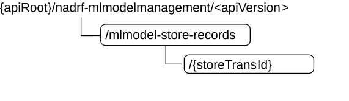

# 5.2.3 Resources

## 5.2.3.1 Overview

This clause describes the structure for the Resource URIs, the resources and methods used for the service.

Figure 5.2.3.1-1 depicts the resource URIs structure for the Nadrf_MLModelManagement API.

Figure 5.2.3.1-1: Resource URI structure of the Nadrf_MLModelManagement API

Table 5.2.3.1-1 provides an overview of the resources and applicable HTTP methods.

Table 5.2.3.1-1: Resources and methods overview

| Resource name                         | Resource URI                          | HTTP method or custom operation | Description                                                                   |
|---------------------------------------|---------------------------------------|---------------------------------|-------------------------------------------------------------------------------|
| ADRF ML Model Store Records           | /mlmodel-store-records                | GET                             | Retrieve the stored ML model(s).                                              |
|                                       |                                       | POST                            | Create a new Individual ADRF ML Model Store Record resource.                  |
| Individual ADRF ML Model Store Record | /mlmodel-store-records/{storeTransId} | DELETE                          | Delete an Individual ADRF ML Model Store Record identified by {storeTransId}. |
|                                       |                                       | PUT                             | Modify an Individual ADRF ML Model Store Record identified by {storeTransId}. |

## 5.2.3.2 Resource: ADRF ML Model Store Records

### 5.2.3.2.1 Description

The ADRF ML Model Store Records resource represents all ML model storage records to the Nadrf_MLModelManagement Service at a given ADRF. The resource allows an NF service consumer to create a new Individual ADRF ML Model Store Record resource and to retrieve Individual ADRF ML Model Store Record resources that fulfil certain criteria.

### 5.2.3.2.2 Resource Definition

Resource URI: **{apiRoot}/nadrf-mlmodelmanagement/\<apiVersion\>/mlmodel-store-records**

The \<apiVersion\> shall be set as described in clause 5.2.1.

This resource shall support the resource URI variables defined in table 5.2.3.2.2-1.

Table 5.2.3.2.2-1: Resource URI variables for this resource

| Name    | Data type | Definition       |
|---------|-----------|------------------|
| apiRoot | string    | See clause 5.2.1 |

### 5.2.3.2.3 Resource Standard Methods

#### 5.2.3.2.3.1 POST

This method shall support the URI query parameters specified in table 5.2.3.2.3.1-1.

Table 5.2.3.2.3.1-1: URI query parameters supported by the POST method on this resource

| Name | Data type | P   | Cardinality | Description | Applicability |
|------|-----------|-----|-------------|-------------|---------------|
| n/a  |           |     |             |             |               |

This method shall support the request data structures specified in table 5.2.3.2.3.1-2 and the response data structures and response codes specified in table 5.2.3.2.3.1-3.

Table 5.2.3.2.3.1-2: Data structures supported by the POST Request Body on this resource

| Data type               | P   | Cardinality | Description                                        |
|-------------------------|-----|-------------|----------------------------------------------------|
| NadrfMLModelStoreRecord | M   | 1           | New individual ML Model Store Record to be created |

Table 5.2.3.2.3.1-3: Data structures supported by the POST Response Body on this resource

<table>
<colgroup>
<col style="width: 24%" />
<col style="width: 3%" />
<col style="width: 11%" />
<col style="width: 10%" />
<col style="width: 50%" />
</colgroup>
<thead>
<tr class="header">
<th><strong>Data type</strong></th>
<th><strong>P</strong></th>
<th><strong>Cardinality</strong></th>
<th>
<strong>Response</strong>

<strong>codes</strong>
</th>
<th><strong>Description</strong></th>
</tr>
</thead>
<tbody>
<tr class="odd">
<td>NadrfMLModelStoreRecord</td>
<td>M</td>
<td>1</td>
<td>201 Created</td>
<td>The creation of an Individual ADRF ML Model Store Record resource is confirmed, and a representation of that resource is returned.</td>
</tr>
<tr class="even">
<td>ProblemDetails</td>
<td>O</td>
<td>0..1</td>
<td>404 Not Found</td>
<td>NOTE 2</td>
</tr>
<tr class="odd">
<td>ProblemDetails</td>
<td>O</td>
<td>0..1</td>
<td>500 Internal Server Error</td>
<td>NOTE 2</td>
</tr>
<tr class="even">
<td colspan="5">
NOTE 1: The mandatory HTTP error status code for the POST method listed in Table 5.1.7.1-1 of 3GPP TS 29.500 [4] also apply.

NOTE 2: Failure cases are described in clause 5.2.7.3.
</td>
</tr>
</tbody>
</table>

Table 5.2.3.2.3.1-4: Headers supported by the 201 response code on this resource

| Name     | Data type | P   | Cardinality | Description                                                                                                                                                       |
|----------|-----------|-----|-------------|-------------------------------------------------------------------------------------------------------------------------------------------------------------------|
| Location | string    | M   | 1           | Contains the URI of the newly created resource, according to the structure: {apiRoot}/nadrf-mlmodelmanagement/\<apiVersion\>/mlmodel-store-records/{storeTransId} |

#### 5.2.3.2.3.2 GET

This method shall support the URI query parameters specified in table 5.2.3.2.3.2-1.

Table 5.2.3.2.3.2-1: URI query parameters supported by the GET method on this resource

| Name                                                                                                 | Data type       | P   | Cardinality | Description                                                                              |
|------------------------------------------------------------------------------------------------------|-----------------|-----|-------------|------------------------------------------------------------------------------------------|
| store-trans-id                                                                                       | string          | C   | 0..1        | Identifies the "Storage Transaction Identifier" of ML model store record in ADRF. (NOTE) |
| model-unique-ids                                                                                     | array(Uinteger) | C   | 0..N        | Identifies the unique ML model identifiers of the ML models stored in ADRF. (NOTE)       |
| NOTE: Exactly one of the "store-trans-id" and "model-unique-ids" query parameters shall be provided. |                 |     |             |                                                                                          |

This method shall support the request data structures specified in table 5.2.3.2.3.2-2 and the response data structures and response codes specified in table 5.2.3.2.3.2-3.

Table 5.2.3.2.3.2-2: Data structures supported by the GET Request Body on this resource

| Data type | P   | Cardinality | Description |
|-----------|-----|-------------|-------------|
| n/a       |     |             |             |

Table 5.2.3.2.3.2-3: Data structures supported by the GET Response Body on this resource

<table>
<colgroup>
<col style="width: 24%" />
<col style="width: 3%" />
<col style="width: 11%" />
<col style="width: 14%" />
<col style="width: 46%" />
</colgroup>
<thead>
<tr class="header">
<th>Data type</th>
<th>P</th>
<th>Cardinality</th>
<th>
Response

codes
</th>
<th>Description</th>
</tr>
</thead>
<tbody>
<tr class="odd">
<td>NadrfMLModelStoreRecord</td>
<td>M</td>
<td>1</td>
<td>200 OK</td>
<td>ML Model Store record.</td>
</tr>
<tr class="even">
<td>n/a</td>
<td></td>
<td></td>
<td>204 No Content</td>
<td>If the request ADRF ML Model Store Record does not exist, the ADRF shall respond with "204 No Content".</td>
</tr>
<tr class="odd">
<td>RedirectResponse</td>
<td>O</td>
<td>0..1</td>
<td>307 Temporary Redirect</td>
<td>
Temporary redirection.

(NOTE 3)
</td>
</tr>
<tr class="even">
<td>RedirectResponse</td>
<td>O</td>
<td>0..1</td>
<td>308 Permanent Redirect</td>
<td>
Permanent redirection.

(NOTE 3)
</td>
</tr>
<tr class="odd">
<td>ProblemDetails</td>
<td>O</td>
<td>0..1</td>
<td>403 Forbidden</td>
<td>(NOTE 2)</td>
</tr>
<tr class="even">
<td colspan="5">
NOTE 1: The mandatory HTTP error status codes for the HTTP GET method listed in table 5.2.7.1-1 of 3GPP TS 29.500 [4] shall also apply.

NOTE 2: Failure cases are described in clause 5.2.7.

NOTE 3: The RedirectResponse data structure may be provided by an SCP (cf. clause 6.10.9.1 of 3GPP TS 29.500 [4]).
</td>
</tr>
</tbody>
</table>

Table 5.2.3.2.3.2-4: Headers supported by the 307 Response Code on this resource

<table>
<colgroup>
<col style="width: 16%" />
<col style="width: 14%" />
<col style="width: 4%" />
<col style="width: 11%" />
<col style="width: 52%" />
</colgroup>
<thead>
<tr class="header">
<th>Name</th>
<th>Data type</th>
<th>P</th>
<th>Cardinality</th>
<th>Description</th>
</tr>
</thead>
<tbody>
<tr class="odd">
<td>Location</td>
<td>string</td>
<td>M</td>
<td>1</td>
<td>
Contains an alternative URI of the resource located in an alternative ADRF (service) instance towards which the request should be redirected.

For the case where the request is redirected to the same target via a different SCP, refer to clause 6.10.9.1 of 3GPP TS 29.500 [4].
</td>
</tr>
<tr class="even">
<td>3gpp-Sbi-Target-Nf-Id</td>
<td>string</td>
<td>O</td>
<td>0..1</td>
<td>Contains the identifier of the target ADRF (service) instance towards which the request should be redirected.</td>
</tr>
</tbody>
</table>

Table 5.2.3.2.3.2-5: Headers supported by the 308 Response Code on this resource

<table>
<colgroup>
<col style="width: 16%" />
<col style="width: 14%" />
<col style="width: 4%" />
<col style="width: 11%" />
<col style="width: 52%" />
</colgroup>
<thead>
<tr class="header">
<th>Name</th>
<th>Data type</th>
<th>P</th>
<th>Cardinality</th>
<th>Description</th>
</tr>
</thead>
<tbody>
<tr class="odd">
<td>Location</td>
<td>string</td>
<td>M</td>
<td>1</td>
<td>
Contains an alternative URI of the resource located in an alternative ADRF (service) instance towards which the request should be redirected.

For the case where the request is redirected to the same target via a different SCP, refer to clause 6.10.9.1 of 3GPP TS 29.500 [4].
</td>
</tr>
<tr class="even">
<td>3gpp-Sbi-Target-Nf-Id</td>
<td>string</td>
<td>O</td>
<td>0..1</td>
<td>Contains the identifier of the target ADRF (service) instance towards which the request should be redirected.</td>
</tr>
</tbody>
</table>

### 5.2.3.2.4 Resource Custom Operations

None.

## 5.2.3.3 Resource: Individual ADRF ML Model Store Record

### 5.2.3.3.1 Description

The Individual ADRF ML Model Store Record resource represents ML model(s) stored via the Nadrf_MLModelManagement_StorageRequest in ADRF.

### 5.2.3.3.2 Resource Definition

Resource URI: **{apiRoot}/nadrf-mlmodelmanagement/\<apiVersion\>/mlmodel-store-records/{storeTransId}**

The \<apiVersion\> shall be set as described in clause 5.2.1.

This resource shall support the resource URI variables defined in table 5.2.3.3.2-1.

Table 5.2.3.3.2-1: Resource URI variables for this resource

| Name         | Data type | Definition                                  |
|--------------|-----------|---------------------------------------------|
| apiRoot      | string    | See clause 5.2.1.                           |
| storeTransId | string    | Identifies an individual data store record. |

### 5.2.3.3.3 Resource Standard Methods

#### 5.2.3.3.3.1 DELETE

This method shall support the URI query parameters specified in table 5.2.3.3.3.1-1.

Table 5.2.3.3.3.1-1: URI query parameters supported by the DELETE method on this resource

| Name | Data type | P   | Cardinality | Description | Applicability |
|------|-----------|-----|-------------|-------------|---------------|
| n/a  |           |     |             |             |               |

This method shall support the request data structures specified in table 5.2.3.3.3.1-2 and the response data structures and response codes specified in table 5.2.3.3.3.1-3.

Table 5.2.3.3.3.1-2: Data structures supported by the DELETE Request Body on this resource

| Data type | P   | Cardinality | Description |
|-----------|-----|-------------|-------------|
| n/a       |     |             |             |

Table 5.2.3.3.3.1-3: Data structures supported by the DELETE Response Body on this resource

<table>
<colgroup>
<col style="width: 22%" />
<col style="width: 3%" />
<col style="width: 11%" />
<col style="width: 10%" />
<col style="width: 52%" />
</colgroup>
<thead>
<tr class="header">
<th><strong>Data type</strong></th>
<th><strong>P</strong></th>
<th><strong>Cardinality</strong></th>
<th>
<strong>Response</strong>

<strong>codes</strong>
</th>
<th><strong>Description</strong></th>
</tr>
</thead>
<tbody>
<tr class="odd">
<td>n/a</td>
<td></td>
<td></td>
<td>204 No Content</td>
<td>The Individual ADRF ML Model Store Record resource was deleted successfully.</td>
</tr>
<tr class="even">
<td>array(MLModelDelResult)</td>
<td>M</td>
<td>1..N</td>
<td>200 OK</td>
<td>Attempted to remove ML model(s) in the Individual ADRF ML Model Store Record resource. A representation of ML Model delete result information is returned.</td>
</tr>
<tr class="odd">
<td>RedirectResponse</td>
<td>O</td>
<td>0..1</td>
<td>307 Temporary Redirect</td>
<td>
Temporary redirection, during Individual ADRF ML Model Store Record deletion.

(NOTE 2)
</td>
</tr>
<tr class="even">
<td>RedirectResponse</td>
<td>O</td>
<td>0..1</td>
<td>308 Permanent Redirect</td>
<td>
Permanent redirection, during Individual ADRF ML Model Store Record deletion.

(NOTE 2)
</td>
</tr>
<tr class="odd">
<td>ProblemDetails</td>
<td>O</td>
<td>0..1</td>
<td>404 Not Found</td>
<td>NOTE 3</td>
</tr>
<tr class="even">
<td>ProblemDetails</td>
<td>O</td>
<td>0..1</td>
<td>500 Internal Server Error</td>
<td>NOTE 3</td>
</tr>
<tr class="odd">
<td colspan="5">
NOTE 1: The mandatory HTTP error status code for the DELETE method listed in Table 5.2.7.1-1 of 3GPP TS 29.500 [4] also apply.

NOTE 2: The RedirectResponse data structure may be provided by an SCP (cf. clause 6.10.9.1 of 3GPP TS 29.500 [4]).

NOTE 3: Failure cases are described in clause 5.2.7.3.
</td>
</tr>
</tbody>
</table>

Table 5.2.3.3.3.1-4: Headers supported by the 307 Response Code on this resource

<table>
<colgroup>
<col style="width: 16%" />
<col style="width: 14%" />
<col style="width: 4%" />
<col style="width: 11%" />
<col style="width: 52%" />
</colgroup>
<thead>
<tr class="header">
<th>Name</th>
<th>Data type</th>
<th>P</th>
<th>Cardinality</th>
<th>Description</th>
</tr>
</thead>
<tbody>
<tr class="odd">
<td>Location</td>
<td>string</td>
<td>M</td>
<td>1</td>
<td>
Contains an alternative URI of the resource located in an alternative ADRF (service) instance towards which the request is redirected.

For the case where the request is redirected to the same target via a different SCP, refer to clause 6.10.9.1 of 3GPP TS 29.500 [4].
</td>
</tr>
<tr class="even">
<td>3gpp-Sbi-Target-Nf-Id</td>
<td>string</td>
<td>O</td>
<td>0..1</td>
<td>Identifier of the target ADRF (service) instance towards which the request is redirected.</td>
</tr>
</tbody>
</table>

Table 5.2.3.3.3.1-5: Headers supported by the 308 Response Code on this resource

<table>
<colgroup>
<col style="width: 16%" />
<col style="width: 14%" />
<col style="width: 4%" />
<col style="width: 11%" />
<col style="width: 52%" />
</colgroup>
<thead>
<tr class="header">
<th>Name</th>
<th>Data type</th>
<th>P</th>
<th>Cardinality</th>
<th>Description</th>
</tr>
</thead>
<tbody>
<tr class="odd">
<td>Location</td>
<td>string</td>
<td>M</td>
<td>1</td>
<td>
Contains an alternative URI of the resource located in an alternative ADRF (service) instance towards which the request is redirected.

For the case where the request is redirected to the same target via a different SCP, refer to clause 6.10.9.1 of 3GPP TS 29.500 [4].
</td>
</tr>
<tr class="even">
<td>3gpp-Sbi-Target-Nf-Id</td>
<td>string</td>
<td>O</td>
<td>0..1</td>
<td>Identifier of the target ADRF (service) instance towards which the request is redirected.</td>
</tr>
</tbody>
</table>

#### 5.2.3.3.3.2 PUT

This method shall support the URI query parameters specified in table 5.2.3.3.3.2-1.

Table 5.2.3.3.3.2-1: URI query parameters supported by the PUT method on this resource

| Name | Data type | P   | Cardinality | Description | Applicability |
|------|-----------|-----|-------------|-------------|---------------|
| n/a  |           |     |             |             |               |

This method shall support the request data structures specified in table 5.2.3.3.3.2-2 and the response data structures and response codes specified in table 5.2.3.3.3.2-3.

Table 5.2.3.3.3.2-2: Data structures supported by the PUT Request Body on this resource

| Data type               | P   | Cardinality | Description                                                |
|-------------------------|-----|-------------|------------------------------------------------------------|
| NadrfMLModelStoreRecord | M   | 1           | Parameters to replace an individual ML Model Store Record. |

Table 5.2.3.3.3.2-3: Data structures supported by the PUT Response Body on this resource

<table>
<colgroup>
<col style="width: 24%" />
<col style="width: 3%" />
<col style="width: 11%" />
<col style="width: 10%" />
<col style="width: 50%" />
</colgroup>
<thead>
<tr class="header">
<th><strong>Data type</strong></th>
<th><strong>P</strong></th>
<th><strong>Cardinality</strong></th>
<th>
<strong>Response</strong>

<strong>codes</strong>
</th>
<th><strong>Description</strong></th>
</tr>
</thead>
<tbody>
<tr class="odd">
<td>NadrfMLModelStoreRecord</td>
<td>M</td>
<td>1</td>
<td>200 OK</td>
<td>The Individual ADRF ML Model Store Record resource was modified successfully and a representation of that resource is returned.</td>
</tr>
<tr class="even">
<td>n/a</td>
<td></td>
<td></td>
<td>204 No Content</td>
<td>The Individual ADRF ML Model Store Record resource was modified successfully.</td>
</tr>
<tr class="odd">
<td>RedirectResponse</td>
<td>O</td>
<td>0..1</td>
<td>307 Temporary Redirect</td>
<td>
Temporary redirection, during Individual ADRF ML Model Store Record modification.

(NOTE 3)
</td>
</tr>
<tr class="even">
<td>RedirectResponse</td>
<td>O</td>
<td>0..1</td>
<td>308 Permanent Redirect</td>
<td>
Permanent redirection, during Individual ADRF ML Model Store Record modification.

(NOTE 3)
</td>
</tr>
<tr class="odd">
<td>ProblemDetails</td>
<td>O</td>
<td>0..1</td>
<td>404 Not Found</td>
<td>(NOTE 2)</td>
</tr>
<tr class="even">
<td>ProblemDetails</td>
<td>O</td>
<td>0..1</td>
<td>500 Internal Server Error</td>
<td>(NOTE 2)</td>
</tr>
<tr class="odd">
<td colspan="5">
NOTE 1: The mandatory HTTP error status code for the PUT method listed in Table 5.2.7.1-1 of 3GPP TS 29.500 [4] also apply.

NOTE 2: Failure cases are described in clause 5.2.7.3.

NOTE 3: The RedirectResponse data structure may be provided by an SCP (cf. clause 6.10.9.1 of 3GPP TS 29.500 [4]).
</td>
</tr>
</tbody>
</table>

### 5.2.3.3.4 Resource Custom Operations

None in this release of the specification.
