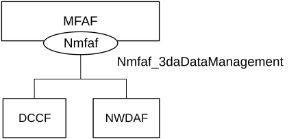
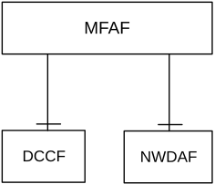
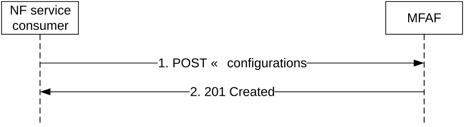
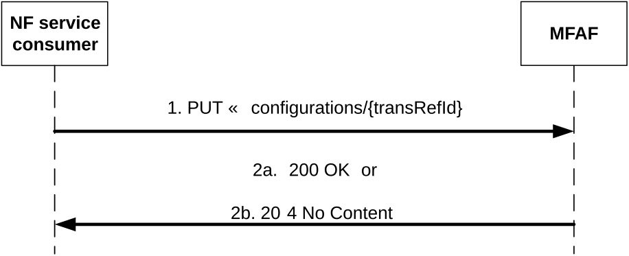
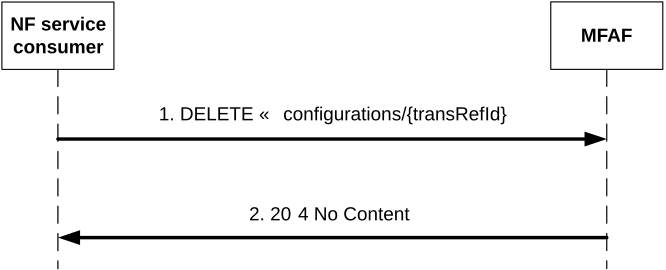
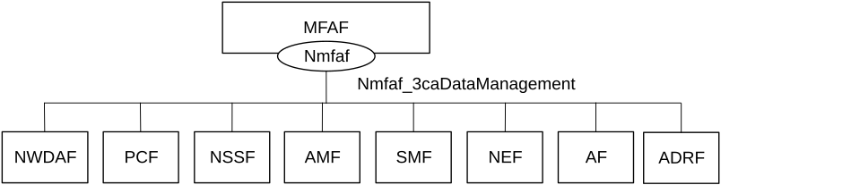
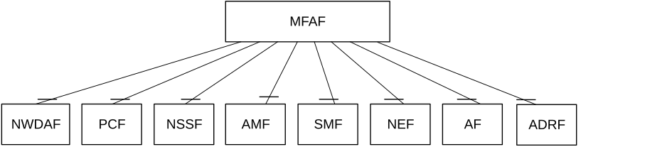
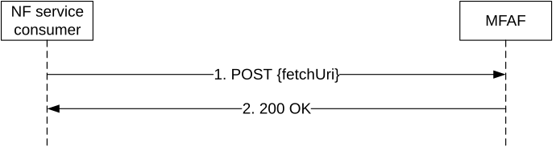
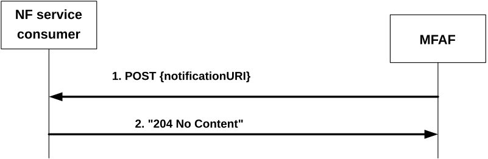

# 4 Services offered by the MFAF

## 4.1 Introduction

The Messaging Framework Adaptor Services are used for the Messaging Framework Adaptor Function (MFAF) to enable the 5GS to interact with the messaging framework using Nmfaf services. The MFAF offers to other NFs the following services:

> \- Nmfaf_3daDataManagement; and
>
> \- Nmfaf_3caDataManagement.

**Table 4.1-1: Service provided by MFAF**

<table>
<colgroup>
<col style="width: 25%" />
<col style="width: 37%" />
<col style="width: 12%" />
<col style="width: 11%" />
<col style="width: 13%" />
</colgroup>
<thead>
<tr class="header">
<th><strong>Service Name</strong></th>
<th><strong>Description</strong></th>
<th><strong>Service Operations</strong></th>
<th>
<strong>Operation</strong>

<strong>Semantics</strong>
</th>
<th><strong>Example Consumer(s)</strong></th>
</tr>
</thead>
<tbody>
<tr class="odd">
<td rowspan="2">Nmfaf_3daDataManagement</td>
<td rowspan="2">The 3GPP DCCF Adaptor (3DA) Data Management Service enables the DCCF to convey to the messaging framework, information about the data the messaging framework will receive from a Data Source, formatting and processing instructions and the Data Consumer and notification endpoints.</td>
<td>Configure</td>
<td>Request / Response</td>
<td>DCCF, NWDAF</td>
</tr>
<tr class="even">
<td>Deconfigure</td>
<td>Request / Response</td>
<td>DCCF, NWDAF</td>
</tr>
<tr class="odd">
<td rowspan="2">Nmfaf_3caDataManagement</td>
<td rowspan="2">The 3GPP Consumer Adaptor (3CA) Data Management Service delivers data to each Data Consumer or notification endpoint after formatting and processing of data received by the messaging framework.</td>
<td>Notify</td>
<td>Subscribe / Notify</td>
<td>NWDAF, PCF, NSSF, AMF, SMF, NEF, AF, ADRF</td>
</tr>
<tr class="even">
<td>Fetch</td>
<td>Request / Response</td>
<td>NWDAF, PCF, NSSF, AMF, SMF, NEF, AF, ADRF</td>
</tr>
</tbody>
</table>

Table 4.1-2 summarizes the corresponding APIs defined for this specification.

**Table 4.1-2: API Descriptions**

| **Service Name**        | **Clause** | **Description**                 | **OpenAPI Specification File** | **apiName**             | **Annex**                             |
|-------------------------|------------|---------------------------------|--------------------------------|-------------------------|---------------------------------------|
| Nmfaf_3daDataManagement | 4.2        | API for Nmfaf_3daDataManagement | Nmfaf_3daDataManagement.yaml   | nmfaf-3dadatamanagement | Annex A.2 Nmfaf_3daDataManagement API |
| Nmfaf_3caDataManagement | 4.3        | API for Nmfaf_3caDataManagement | Nmfaf_3caDataManagement.yaml   | nmfaf-3cadatamanagement | Annex A.3 Nmfaf_3caDataManagement API |

## 4.2 Nmfaf_3daDataManagement Service

### 4.2.1 Service Description

#### 4.2.1.1 Overview

The Nmfaf_3daDataManagement service as defined in 3GPP TS 23.288 \[14\], is provided by the Messaging Framework Adaptor Function (MFAF).

This service:

\- allows NF consumers to configure or reconfigure the MFAF to map data or analytics received by the MFAF to out-bound notification endpoints; and

\- allows NF consumers to reconfigure the MFAF to stop mapping data or analytics received by the MFAF to out-bound notification endpoints.

#### 4.2.1.2 Service Architecture

The 5G System Architecture is defined in 3GPP TS 23.501 \[2\]. The Network Data Analytics Exposure architecture is defined in 3GPP TS 23.288 \[14\].

The Nmfaf_3daDataManagement service is part of the Nmfaf service-based interface exhibited by the Messaging Framework Adaptor Function (MFAF).

Known consumer of the Nmfaf_3daDataManagement service is:

\- Data Collection Coordination Function (DCCF)

Figure 4.2.1.2-1: Reference Architecture for the Nmfaf_3daDataManagement Service; SBI representation

Figure 4.2.1.2-2: Reference Architecture for the Nmfaf_3daDataManagement Service; reference point representation

#### 4.2.1.3 Network Functions

##### 4.2.1.3.1 Messaging Framework Adaptor Function (MFAF)

The Messaging Framework Adaptor Function (MFAF) provides the functionality to allow NF consumers to configure or reconfigure the behaviour of mapping data or analytics received by the MFAF to out-bound notification endpoints.

##### 4.2.1.3.2 NF Service Consumers

The Data Collection Coordination Function (DCCF) and the NWDAF support:

\- configuring the MFAF to map data or analytics received by the MFAF to out-bound notification endpoints and to format and process the out-bound data or analytics; and

\- reconfiguring the MFAF to stop the sending of data to consumers.

### 4.2.2 Service Operations

#### 4.2.2.1 Introduction

**Table 4.2.2.1-1: Operations of the Nmfaf_3daDataManagement Service**

| **Service operation name**          | **Description**                                                                                                                                                                                                         | **Initiated by**                  |
|-------------------------------------|-------------------------------------------------------------------------------------------------------------------------------------------------------------------------------------------------------------------------|-----------------------------------|
| Nmfaf_3daDataManagement_Configure   | This service operation is used by an NF to configure or reconfigure the MFAF to map data or analytics received by the MFAF to out-bound notification endpoints and to format and process the outbound data or analytics | NF service consumer (DCCF, NWDAF) |
| Nmfaf_3daDataManagement_Deconfigure | This service operation is used by an NF to stop mapping data or analytics received by the MFAF to one or more outbound notification endpoints.                                                                          | NF service consumer (DCCF, NWDAF) |

#### 4.2.2.2 Nmfaf_3daDataManagement_Configure service operation

##### 4.2.2.2.1 General

The Nmfaf_3daDataManagement_Configure service operation is used by an NF service consumer to configure or update the configuration of the MFAF for mapping data or analytics received by the MFAF to out-bound notification endpoints, and formatting and processing the out-bound data or analytics.

##### 4.2.2.2.2 Initial configuration for mapping data or analytics

Figure 4.2.2.2.2-1 shows a scenario where the NF service consumer (e.g. DCCF) sends a request to the MFAF to request the configuration of mapping data or analytics (as shown in 3GPP TS 23.288 \[14\]).

Figure 4.2.2.2.2-1: NF service consumer create the configuration

The NF service consumer shall invoke the Nmfaf_3daDataManagement_Configure service operation to create the configuration(s). The NF service consumer shall send an HTTP POST request with "{apiRoot}/nmfaf-3dadatamanagement/\<apiVersion\>/configurations" as Resource URI representing the "MFAF Configurations", as shown in figure 4.2.2.2.2-1, step 1, to create a configuration for an "Individual MFAF Configuration" according to the information in message body. The MfafConfiguration data structure provided in the request body

shall include:

\- a description of the configurations as "messageConfigurations" attribute that, for each configuration, the MessageConfiguration data type shall include

1\) a notification URI of Data Consumer or Analytics Consumer or other endpoint where to receive the requested mapping data or analytics as "notificationURI" attribute; and

2)- if the configuration is used for mapping analytics or data collection, a Notification Correlation ID for the Data or Analytics Consumer (or other endpoint) as "correId" attribute;

and may include:

1\) the formatting instructions as "formatInstruct" attribute;

2\) the processing instructions as "procInstruct" attribute or "multiProcInstructs" attribute if the "MultiProcessingInstruction" feature is supported;

3\) the MFAF notification information to identify the Event Notifications received from the NWDAF or Data Source NF (e.g. AMF, SMF), which can be sent to the consumer or other notification endpoints, as "mfafNotiInfo" attribute;

4\) NF instance identifier of the ADRF as "adrfId" attribute; and

5\) the notification endpoints within the "notifEndpoints" attribute, if the "DataAnaCollect" feature is supported.

Upon the reception of an HTTP POST request with: "{apiRoot}/nmfaf-3dadatamanagement/\<apiVersion\>/configurations" as Resource URI and MfafConfiguration data structure as request body, the MFAF shall:

\- create a new configuration;

\- assign a transaction reference id;

\- if no MFAF notification information has been provided in the request, determine the MFAF notification information and add it to the configuration that is created and will be returned to the NF service consumer;

\- store the configuration.

If the MFAF created an "Individual MFAF Configuration" resource, the MFAF shall respond with "201 Created" with the message body containing a representation of the created subscription, as shown in figure 4.2.2.2.2-1, step 2.

If an error occurs when processing the HTTP POST request, the MFAF shall send an HTTP error response as specified in clause 5.1.7.

##### 4.2.2.2.3 Update the configuration of existing individual mapping data or analytics

Figure 4.2.2.2.3-1 shows a scenario where the NF service consumer sends a request to the MFAF to update the configuration of mapping data or analytics (as shown in 3GPP TS 23.288 \[14\])

Figure 4.2.2.2.3-1: NF service consumer updates configuration

The NF service consumer shall invoke the Nmfaf_3daDataManagement_Configure service operation to update the configuration(s). The NF service consumer shall send an HTTP PUT request with "{apiRoot}/nmfaf-3dadatamanagement/\<apiVersion\>/configurations/{transRefId}" as Resource URI representing the "Individual MFAF Configuration", as shown in figure 4.2.2.2.3-1, step 1, to update the subscription for an "Individual MFAF Configuration" resource identified by the {transRefId}. The MfafConfiguration data structure provided in the request body shall include:

\- a description of the configurations as "messageConfigurations" attribute that, for each configuration, the MfafConfiguration data structure provided in the request body shall include the same contents as described in 4.2.2.2.2.

Upon the reception of an HTTP PUT request with: "{apiRoot}/nmfaf-3dadatamanagement/\<apiVersion\>/configurations/{transRefId}" as Resource URI and MfafConfiguration data structure as request body, the MFAF shall:

\- update the configuration of corresponding transaction reference Id; and

\- store the configuration.

If the MFAF successfully processed and accepted the received HTTP PUT request, the MFAF shall update an "Individual MFAF Configuration" resource, and shall respond with:

a\) HTTP "200 OK" status code with the message body containing a representation of the updated configuration, as shown in figure 4.2.2.2.3-1, step 2a. or

b\) HTTP "204 No Content" status code, as shown in figure 4.2.2.2.3-1, step 2b.

If an error occurs when processing the HTTP PUT request, the MFAF shall send an HTTP error response as specified in clause 5.1.7.

If the MFAF determines the received HTTP PUT request needs to be redirected, the MFAF shall send an HTTP redirect response as specified in clause 6.10.9 of 3GPP TS 29.500 \[4\].

#### 4.2.2.3 Nmfaf_3daDataManagement_Deconfigure service operation

##### 4.2.2.3.1 General

The Nmfaf_3daDataManagement_Deconfigure service operation is used by an NF service consumer to stop mapping data or analytics received by the MFAF to one or more out-bound notification endpoints.

##### 4.2.2.3.2 Stop mapping data or analytics

Figure 4.2.2.3.2-1 shows a scenario where the NF service consumer sends a request to the MFAF to update the configuration to stop mapping data or analytics (as shown in 3GPP TS 23.288 \[14\])

Figure 4.2.2.3.2-1: NF service consumer stops mapping data or analytics

The NF service consumer shall invoke the Nmfaf_3daDataManagement_Deconfigure service operation to stop the MFAF to map data or analytics. The NF service consumer shall send an HTTP DELETE request with "{apiRoot}/nmfaf-3dadatamanagement/\<apiVersion\>/configurations/{transRefId}" as Resource URI, where {transRefId} represents the "Individual MFAF Configuration" to be deleted, as shown in figure 4.2.2.3.2-1, step 1.

Upon the reception of an HTTP DELETE request and if the MFAF successfully processed and accepted the received HTTP DELETE request from the NF service consumer, the MFAF shall acknowledge the request by sending a "204 No Content" response to the NF service consumer, as shown in figure 4.2.2.3.2-1, step 2. Further, the MFAF shall remove the individual resource linked to the delete request.

If errors occur when processing the HTTP DELETE request, the MFAF shall send an HTTP error response as specified in clause 5.1.7.

If the MFAF determines the received HTTP DELETE request needs to be redirected, the MFAF shall send an HTTP redirect response as specified in clause 6.10.9 of 3GPP TS 29.500 \[4\].

## 4.3 Nmfaf_3caDataManagement Service

### 4.3.1 Service Description

#### 4.3.1.1 Overview

The Nmfaf_3caDataManagement service as defined in 3GPP TS 23.288 \[14\], is provided by the Messaging Framework Adaptor Function (MFAF).

This service:

\- allows NF consumers to collect the data or analytics from the MFAF.

#### 4.3.1.2 Service Architecture

The 5G System Architecture is defined in 3GPP TS 23.501 \[2\]. The Network Data Analytics Exposure architecture is defined in 3GPP TS 23.288 \[14\].

The Nmfaf_3caDataManagement service is part of the Nmfaf service-based interface exhibited by the Messaging Framework Adaptor Function (MFAF).

Known consumers of the Nmfaf_3caDataManagement service are:

\- Network Data Analytics Function (NWDAF)

\- Policy Control Function (PCF)

\- Network Slice Selection Function (NSSF)

\- Access and Mobility Management Function (AMF)

\- Session Management Function (SMF)

\- Network Exposure Function (NEF)

\- Application Function (AF)

\- Analytics Data Repository Function (ADRF)

Figure 4.3.1.2-1: Reference Architecture for the Nmfaf_3caDataManagement Service; SBI representation

Figure 4.3.1.2-2: Reference Architecture for the Nmfaf_3caDataManagement Service; reference point representation

#### 4.3.1.3 Network Functions

##### 4.3.1.3.1 Messaging Framework Adaptor Function (MFAF)

The Messaging Framework Adaptor Function (MFAF) provides the functionality to supply data or analytics, or an indication of availability of data or analytics to notification endpoints configured in Nmfaf_3caDataManagement service as described in clause 4.2.1.

##### 4.3.1.3.2 NF Service Consumers

The NWDAF, PCF, NSSF, AMF, SMF, NEF, ADRF and AF:

\- supports retrieving data or analytics from the MFAF.

### 4.3.2 Service Operations

#### 4.3.2.1 Introduction

Table 4.3.2.1-1: Operations of the Nmfaf_3caDataManagement Service

| Service operation name                                                                                                                                                                                                            | Description                                                                                                                                                                        | Initiated by                                                       |
|-----------------------------------------------------------------------------------------------------------------------------------------------------------------------------------------------------------------------------------|------------------------------------------------------------------------------------------------------------------------------------------------------------------------------------|--------------------------------------------------------------------|
| Nmfaf_3caDataManagement_Fetch                                                                                                                                                                                                     | This service operation is used by an NF to retrieve stored data or analytics from the MFAF.                                                                                        | NF service consumer (NWDAF, PCF, NSSF, AMF, SMF, ADRF, NEF and AF) |
| Nmfaf_3caDataManagement_Subscribe                                                                                                                                                                                                 | This is a pseudo operation, the actual subscription is created via Nmfaf_3daDataManagement Service. (NOTE)                                                                         |                                                                    |
| Nmfaf_3caDataManagement_Notify                                                                                                                                                                                                    | This service operation is used by an NF with either data or analytics to provide data or analytics or notification of availability of data or analytics to notification endpoints. | MFAF                                                               |
| NOTE: In the current release OpenAPI 3.0.0 is adopted, with OpenAPI 3.0.0 it is not possible to document a stand-alone callback operation, thus the Notify operation has to be defined in combination with a Subscribe operation. |                                                                                                                                                                                    |                                                                    |

NOTE: Nmfaf_3caDataManagement_Subscribe service operation is not used by any NF service consumers in this release.

#### 4.3.2.2 Nmfaf_3caDataManagement_Fetch service operation

##### 4.3.2.2.1 General

The Nmfaf_3caDataManagement_Fetch service operation allows consumer to retrieves data or analytics from the MFAF as indicated by Nmfaf_3caDataManagement_Notify Fetch Instruction.

##### 4.3.2.2.2 Retrieve data or analytics from the MFAF

Figure 4.3.2.2.2-1 shows a scenario where the NF service consumer (e.g. NWDAF) sends a request to the MFAF to retrieve the data or analytics as indicated by Nmfaf_3caDataManagement_Notify Fetch Instruction.

Figure 4.3.2.2.2-1: NF service consumer retrieve data or analytics from the MFAF

The NF service consumer shall invoke the Nmfaf_3caDataManagement_Fetch service operation to retrieve stored data or analytics. The NF service consumer shall send an HTTP POST request to the URI "{fetchUri}" which was previously provided by the MFAF within a FetchInstruction data structure in an MFAF notification, as shown in figure 4.3.2.2.2-1, step 1, to fetch data or analytics from the MFAF.

The request body shall include fetch correlation identifiers, which were also previously provided by the MFAF in the "fetchCorrIds" attribute within a FetchInstruction data structure in an MFAF notification.

Upon the reception of the HTTP POST request, the MFAF shall:

\- find the data or analytics according to the requested parameters.

If the requested data is found, the MFAF shall respond with "200 OK" status code with the message body containing the NmfafDataAnaNotification data structure. The NmfafDataAnaNotification data structure in the response body shall include one of the following:

\- information about network data analytics function events that occurred in the "anaNotifications" attribute;

\- data collected from data sources (e.g. SMF, NEF) in the "dataNotif" attribute.

If errors occur when processing the HTTP POST request, the NF service consumer shall send an HTTP error response as specified in clause 5.2.7.

If the MFAF determines the received HTTP POST request needs to be redirected, the MFAF shall send an HTTP redirect response as specified in clause 6.10.9 of 3GPP TS 29.500 \[4\].

#### 4.3.2.2A Nmfaf_3caDataManagement_Subscribe service operation

This is a pseudo operation, the MFAF does not actually provide Subscribe service operation through Nmfaf_3caDataManagement service. The actual subscription is created via Nmfaf_3daDataManagement Service.

#### 4.3.2.3 Nmfaf_3caDataManagement_Notify service operation

##### 4.3.2.3.1 General

The Nmfaf_3caDataManagement_Notify service operation provides data or analytics or notification of availability of data or analytics to notification endpoints.

##### 4.3.2.3.2 Notification about the subscribed data or analytics

Figure 4.3.2.3.2-1 shows a scenario where the MFAF sends a request to the NF service consumer to notify it about data or analytics or fetch instructions.

The subscription corresponding to the notification is created by the service consumer via Nmfaf_3daDataManagement Service Operation.

Figure 4.3.2.3.2-1: MFAF notifies the NF service consumer about subscribed data or analytics or fetch instructions

The MFAF shall invoke the Nmfaf_3caDataManagement_Notify service operation to notify about subscribed data or analytics, or notification about the availability of data or analytics. The MFAF shall send an HTTP POST request to the "{notificationURI}" received in the subscription (see clause 5.2.5 for the definition of this notificationURI), as shown in figure 4.3.2.3.2-1, step 1. The NmfafDataRetrievalNotification data structure provided in the request body shall include:

\- notification correlation Id within the "correId" attribute;

and shall include one of the following:

\- fetch instructions indicate whether the data or analytics are to be fetched by the Consumer in the "fetchInstruction" attribute;

\- information about the MFAF data or analytics in the "dataAnaNotif" attribute, which contains one of the following:

\- information about network data analytics function events that occurred in the "anaNotifications" attribute;

\- data collected from data sources (e.g. SMF, NEF) in the "dataNotif" attribute.

Upon the reception of an HTTP POST request with "{notificationURI}" as Resource URI and NmfafDataRetrievalNotification data structure as request body, if the NF service consumer successfully processed and accepted the received HTTP POST request, the NF Service Consumer shall:

\- store the notification;

\- respond with HTTP "204 No Content" status code.

If errors occur when processing the HTTP POST request, the NF service consumer shall send an HTTP error response as specified in clause 5.2.7.

If the NF service consumer determines the received HTTP POST request needs to be redirected, the NF service consumer shall send an HTTP redirect response as specified in clause 6.10.9 of 3GPP TS 29.500 \[4\].

After the successful processing of the HTTP POST request, if the MFAF requests the NF service consumer to retrieve the data or analytics with the "fetchInstruct" attribute, the NF service consumer may invoke the Nmfaf_3caDataManagement_Fetch service operation to retrieve the notified data or analytics as defined in clause 4.3.2.2.
