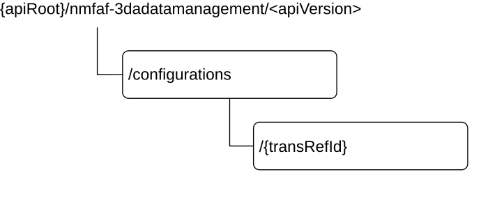

# 5.1 Nmfaf_3daDataManagement Service API

## 5.1.1 Introduction

The Nmfaf_3daDataManagement Service shall use the Nmfaf_3daDataManagement API.

The API URI of the Nmfaf_3daDataManagement API shall be:

**{apiRoot}/\<apiName\>/\<apiVersion\>**

The request URIs used in HTTP requests from the NF service consumer towards the NF service producer shall have the Resource URI structure defined in clause 4.4.1 of 3GPP TS 29.501 \[5\], i.e.:

**{apiRoot}/\<apiName\>/\<apiVersion\>/\<apiSpecificResourceUriPart\>**

with the following components:

\- The {apiRoot} shall be set as described in 3GPP TS 29.501 \[5\].

\- The \<apiName\> shall be "nmfaf-3dadatamanagement".

\- The \<apiVersion\> shall be "v1".

\- The \<apiSpecificResourceUriPart\> shall be set as described in clause 5.1.3.

## 5.1.2 Usage of HTTP

### 5.1.2.1 General

HTTP/2, IETF RFC 9113 \[11\], shall be used as specified in clause 5 of 3GPP TS 29.500 \[4\].

HTTP/2 shall be transported as specified in clause 5.3 of 3GPP TS 29.500 \[4\].

The OpenAPI \[6\] specification of HTTP messages and content bodies for the Nmfaf_3daDataManagement API is contained in Annex A.

### 5.1.2.2 HTTP standard headers

#### 5.1.2.2.1 General

See clause 5.1.2 of 3GPP TS 29.500 \[4\] for the usage of HTTP standard headers.

#### 5.1.2.2.2 Content type

JSON, IETF RFC 8259 \[12\], shall be used as content type of the HTTP bodies specified in the present specification as specified in clause 5.4 of 3GPP TS 29.500 \[4\]. The use of the JSON format shall be signalled by the content type "application/json".

"Problem Details" JSON object shall be used to indicate additional details of the error in a HTTP response body and shall be signalled by the content type "application/problem+json", as defined in IETF RFC 9457 \[13\].

### 5.1.2.3 HTTP custom headers

The mandatory HTTP custom header fields specified in clause 5.1.3.2 of 3GPP TS 29.500 \[4\] shall be applicable.

## 5.1.3 Resources

### 5.1.3.1 Overview

This clause describes the structure for the Resource URIs, the resources and methods used for the service.

Figure 5.1.3.1-1 depicts the resource URIs structure for the Nmfaf_3daDataManagement API.

**Figure 5.1.3.1-1: Resource URI structure of the Nmfaf_3daDataManagement API**

Table 5.1.3.1-1 provides an overview of the resources and applicable HTTP methods.

**Table 5.1.3.1-1: Resources and methods overview**

| **Resource name**             | **Resource URI**             | **HTTP method or custom operation** | **Description**                                                                  |
|-------------------------------|------------------------------|-------------------------------------|----------------------------------------------------------------------------------|
| MFAF Configurations           | /configurations              | POST                                | Creates a new individual MFAF Configuration resource.                            |
| Individual MFAF Configuration | /configurations/{transRefId} | PUT                                 | Modifies an existing Individual MFAF Configuration subresource.                  |
|                               |                              | DELETE                              | Deletes an Individual MFAF Configuration identified by subresource {transRefId}. |

### 5.1.3.2 Resource: MFAF Configurations

#### 5.1.3.2.1 Description

The MFAF Configurations resource represents all configuration to the Nmfaf_3daDataManagement Service at a given MFAF. The resource allows an NF service consumer to create a new Individual MFAF Configuration resource.

#### 5.1.3.2.2 Resource Definition

Resource URI: **{apiRoot}/nmfaf-3dadatamanagement/\<apiVersion\>/configurations**

The \<apiVersion\> shall be set as described in clause 5.1.1.

This resource shall support the resource URI variables defined in table 5.1.3.2.2-1.

Table 5.1.3.2.2-1: Resource URI variables for this resource

| Name    | Data type | Definition       |
|---------|-----------|------------------|
| apiRoot | string    | See clause 5.1.1 |

#### 5.1.3.2.3 Resource Standard Methods

#### 5.1.3.2.3.1 POST

This method shall support the URI query parameters specified in table 5.1.3.2.3.1-1.

Table 5.1.3.2.3.1-1: URI query parameters supported by the POST method on this resource

| Name | Data type | P   | Cardinality | Description | Applicability |
|------|-----------|-----|-------------|-------------|---------------|
| n/a  |           |     |             |             |               |

This method shall support the request data structures specified in table 5.1.3.2.3.1-2 and the response data structures and response codes specified in table 5.1.3.2.3.1-3.

Table 5.1.3.2.3.1-2: Data structures supported by the POST Request Body on this resource

| Data type         | P   | Cardinality | Description                                          |
|-------------------|-----|-------------|------------------------------------------------------|
| MfafConfiguration | M   | 1           | Create a new Individual MFAF Configuration resource. |

Table 5.1.3.2.3.1-3: Data structures supported by the POST Response Body on this resource

<table>
<colgroup>
<col style="width: 16%" />
<col style="width: 4%" />
<col style="width: 12%" />
<col style="width: 11%" />
<col style="width: 54%" />
</colgroup>
<thead>
<tr class="header">
<th>Data type</th>
<th>P</th>
<th>Cardinality</th>
<th>
Response

codes
</th>
<th>Description</th>
</tr>
</thead>
<tbody>
<tr class="odd">
<td>MfafConfiguration</td>
<td>M</td>
<td>1</td>
<td>201 Created</td>
<td>The creation of an Individual MFAF Configuration resource is confirmed and a representation of that resource is returned.</td>
</tr>
<tr class="even">
<td colspan="5">NOTE: The manadatory HTTP error status code for the POST method listed in Table 5.2.7.1-1 of 3GPP TS 29.500 [4] also apply.</td>
</tr>
</tbody>
</table>

Table 5.1.3.2.3.1-4: Headers supported by the 201 response code on this resource

| Name     | Data type | P   | Cardinality | Description                                                                                                                                              |
|----------|-----------|-----|-------------|----------------------------------------------------------------------------------------------------------------------------------------------------------|
| Location | string    | M   | 1           | Contains the URI of the newly created resource, according to the structure: {apiRoot}/nmfaf-3dadatamanagement/\<apiVersion\>/configurations/{transRefId} |

#### 5.1.3.2.4 Resource Custom Operations

None in this release of the specification.

### 5.1.3.3 Resource: Individual MFAF Configuration

#### 5.1.3.2.1 Description

The Individual MFAF Configurations resource represents an individual configuration created in the MFAF and associated with transaction reference Id.

#### 5.1.3.3.2 Resource Definition

Resource URI: **{apiRoot}/nmfaf-3dadatamanagement/\<apiVersion\>/configurations/{transRefId}**

The \<apiVersion\> shall be set as described in clause 5.1.1.

This resource shall support the resource URI variables defined in table 5.1.3.3.2-1.

Table 5.1.3.3.2-1: Resource URI variables for this resource

| Name       | Data type | Definition                                                        |
|------------|-----------|-------------------------------------------------------------------|
| apiRoot    | string    | See clause 5.1.1                                                  |
| transRefId | string    | Unique identifier of the individual MFAF Configurations resource. |

#### 5.1.3.3.3 Resource Standard Methods

#### 5.1.3.3.3.1 PUT

This method shall support the URI query parameters specified in table 5.1.3.3.3.1-1.

Table 5.1.3.3.3.1-1: URI query parameters supported by the PUT method on this resource

| Name | Data type | P   | Cardinality | Description | Applicability |
|------|-----------|-----|-------------|-------------|---------------|
| n/a  |           |     |             |             |               |

This method shall support the request data structures specified in table 5.1.3.3.3.1-2 and the response data structures and response codes specified in table 5.1.3.3.3.1-3.

Table 5.1.3.3.3.1-2: Data structures supported by the PUT Request Body on this resource

| Data type         | P   | Cardinality | Description                     |
|-------------------|-----|-------------|---------------------------------|
| MfafConfiguration | M   | 1           | The updated MFAF Configuration. |

Table 5.1.3.3.3.1-3: Data structures supported by the PUT Response Body on this resource

<table>
<colgroup>
<col style="width: 16%" />
<col style="width: 4%" />
<col style="width: 12%" />
<col style="width: 11%" />
<col style="width: 54%" />
</colgroup>
<thead>
<tr class="header">
<th>Data type</th>
<th>P</th>
<th>Cardinality</th>
<th>
Response

codes
</th>
<th>Description</th>
</tr>
</thead>
<tbody>
<tr class="odd">
<td>MfafConfiguration</td>
<td>M</td>
<td>1</td>
<td>200 OK</td>
<td>The update of an Individual MFAF Configuration resource is confirmed and a representation of that resource is returned.</td>
</tr>
<tr class="even">
<td>n/a</td>
<td></td>
<td></td>
<td>204 No Content</td>
<td>Successful case: The Individual MFAF Configuration resource was modified.</td>
</tr>
<tr class="odd">
<td>RedirectResponse</td>
<td>O</td>
<td>0..1</td>
<td>307 Temporary Redirect</td>
<td>
Temporary redirection, during resource modification.

(NOTE 2)
</td>
</tr>
<tr class="even">
<td>RedirectResponse</td>
<td>O</td>
<td>0..1</td>
<td>308 Permanent Redirect</td>
<td>
Permanent redirection, during resource modification.

(NOTE 2)
</td>
</tr>
<tr class="odd">
<td colspan="5">
NOTE 1: The manadatory HTTP error status code for the PUT method listed in Table 5.2.7.1-1 of 3GPP TS 29.500 [4] also apply.

NOTE 2: The RedirectResponse data structure may be provided by an SCP (cf. clause 6.10.9.1 of 3GPP TS 29.500 [4]).
</td>
</tr>
</tbody>
</table>

Table 5.1.3.3.3.1-4: Headers supported by the 307 Response Code on this resource

<table>
<colgroup>
<col style="width: 16%" />
<col style="width: 14%" />
<col style="width: 4%" />
<col style="width: 11%" />
<col style="width: 52%" />
</colgroup>
<thead>
<tr class="header">
<th>Name</th>
<th>Data type</th>
<th>P</th>
<th>Cardinality</th>
<th>Description</th>
</tr>
</thead>
<tbody>
<tr class="odd">
<td>Location</td>
<td>string</td>
<td>M</td>
<td>1</td>
<td>
Contains an alternative URI of the resource located in an alternative NF (service) instance towards which the request is redirected.

For the case where the request is redirected to the same target via a different SCP, refer to clause 6.10.9.1 of 3GPP TS 29.500 [4].
</td>
</tr>
<tr class="even">
<td>3gpp-Sbi-Target-Nf-Id</td>
<td>string</td>
<td>O</td>
<td>0..1</td>
<td>Identifier of the target MFAF (service) instance towards which the request is redirected.</td>
</tr>
</tbody>
</table>

Table 5.1.3.3.3.1-5: Headers supported by the 308 Response Code on this resource

<table>
<colgroup>
<col style="width: 16%" />
<col style="width: 14%" />
<col style="width: 4%" />
<col style="width: 11%" />
<col style="width: 52%" />
</colgroup>
<thead>
<tr class="header">
<th>Name</th>
<th>Data type</th>
<th>P</th>
<th>Cardinality</th>
<th>Description</th>
</tr>
</thead>
<tbody>
<tr class="odd">
<td>Location</td>
<td>string</td>
<td>M</td>
<td>1</td>
<td>
Contains an alternative URI of the resource located in an alternative NF (service) instance towards which the request is redirected.

For the case where the request is redirected to the same target via a different SCP, refer to clause 6.10.9.1 of 3GPP TS 29.500 [4].
</td>
</tr>
<tr class="even">
<td>3gpp-Sbi-Target-Nf-Id</td>
<td>string</td>
<td>O</td>
<td>0..1</td>
<td>Identifier of the target MFAF (service) instance towards which the request is redirected.</td>
</tr>
</tbody>
</table>

#### 5.1.3.3.3.2 DELETE

This method shall support the URI query parameters specified in table 5.1.3.3.3.2-1.

Table 5.1.3.3.3.2-1: URI query parameters supported by the DELETE method on this resource

| Name | Data type | P   | Cardinality | Description | Applicability |
|------|-----------|-----|-------------|-------------|---------------|
| n/a  |           |     |             |             |               |

This method shall support the request data structures specified in table 5.1.3.3.3.2-2 and the response data structures and response codes specified in table 5.1.3.3.3.2-3.

Table 5.1.3.3.3.2-2: Data structures supported by the DELETE Request Body on this resource

| Data type | P   | Cardinality | Description |
|-----------|-----|-------------|-------------|
| n/a       |     |             |             |

Table 5.1.3.3.3.2-3: Data structures supported by the DELETE Response Body on this resource

<table>
<colgroup>
<col style="width: 16%" />
<col style="width: 4%" />
<col style="width: 12%" />
<col style="width: 11%" />
<col style="width: 54%" />
</colgroup>
<thead>
<tr class="header">
<th>Data type</th>
<th>P</th>
<th>Cardinality</th>
<th>
Response

codes
</th>
<th>Description</th>
</tr>
</thead>
<tbody>
<tr class="odd">
<td>n/a</td>
<td></td>
<td></td>
<td>204 No Content</td>
<td>Successful case: The Individual MFAF Configuration resource matching the transRefId was deleted.</td>
</tr>
<tr class="even">
<td>RedirectResponse</td>
<td>O</td>
<td>0..1</td>
<td>307 Temporary Redirect</td>
<td>
Temporary redirection, during resource deletion

(NOTE 2)
</td>
</tr>
<tr class="odd">
<td>RedirectResponse</td>
<td>O</td>
<td>0..1</td>
<td>308 Permanent Redirect</td>
<td>
Permanent redirection, during resource deletion

(NOTE 2)
</td>
</tr>
<tr class="even">
<td colspan="5">
NOTE 1: The manadatory HTTP error status code for the DELETE method listed in Table 5.2.7.1-1 of 3GPP TS 29.500 [4] also apply.

NOTE 2: The RedirectResponse data structure may be provided by an SCP (cf. clause 6.10.9.1 of 3GPP TS 29.500 [4]).
</td>
</tr>
</tbody>
</table>

Table 5.1.3.3.3.2-4: Headers supported by the 307 Response Code on this resource

<table>
<colgroup>
<col style="width: 16%" />
<col style="width: 14%" />
<col style="width: 4%" />
<col style="width: 11%" />
<col style="width: 52%" />
</colgroup>
<thead>
<tr class="header">
<th>Name</th>
<th>Data type</th>
<th>P</th>
<th>Cardinality</th>
<th>Description</th>
</tr>
</thead>
<tbody>
<tr class="odd">
<td>Location</td>
<td>string</td>
<td>M</td>
<td>1</td>
<td>
Contains an alternative URI of the resource located in an alternative NF (service) instance towards which the request is redirected.

For the case where the request is redirected to the same target via a different SCP, refer to clause 6.10.9.1 of 3GPP TS 29.500 [4].
</td>
</tr>
<tr class="even">
<td>3gpp-Sbi-Target-Nf-Id</td>
<td>string</td>
<td>O</td>
<td>0..1</td>
<td>Identifier of the target MFAF (service) instance towards which the request is redirected.</td>
</tr>
</tbody>
</table>

Table 5.1.3.3.3.2-5: Headers supported by the 308 Response Code on this resource

<table>
<colgroup>
<col style="width: 16%" />
<col style="width: 14%" />
<col style="width: 4%" />
<col style="width: 11%" />
<col style="width: 52%" />
</colgroup>
<thead>
<tr class="header">
<th>Name</th>
<th>Data type</th>
<th>P</th>
<th>Cardinality</th>
<th>Description</th>
</tr>
</thead>
<tbody>
<tr class="odd">
<td>Location</td>
<td>string</td>
<td>M</td>
<td>1</td>
<td>
Contains an alternative URI of the resource located in an alternative NF (service) instance towards which the request is redirected.

For the case where the request is redirected to the same target via a different SCP, refer to clause 6.10.9.1 of 3GPP TS 29.500 [4].
</td>
</tr>
<tr class="even">
<td>3gpp-Sbi-Target-Nf-Id</td>
<td>string</td>
<td>O</td>
<td>0..1</td>
<td>Identifier of the target MFAF (service) instance towards which the request is redirected.</td>
</tr>
</tbody>
</table>

## 5.1.4 Custom Operations without associated resources

None in this release of the specification.

## 5.1.5 Notifications

None in this release of the specification.

## 5.1.6 Data Model

### 5.1.6.1 General

This clause specifies the application data model supported by the API.

Table 5.1.6.1-1 specifies the data types defined for the Nmfaf_3daDataManagement service based interface protocol.

Table 5.1.6.1-1: Nmfaf_3daDataManagement specific Data Types

| Data type            | Clause defined | Description                            | Applicability |
|----------------------|----------------|----------------------------------------|---------------|
| MfafConfiguration    | 5.1.6.2.2      | The description of MFAF configuration  |               |
| MessageConfiguration | 5.1.6.2.3      | The description of the configurations. |               |
| MfafNotiInfo         | 5.1.6.2.4      | The MFAF notification information.     |               |

Table 5.1.6.1-2 specifies data types re-used by the Nmfaf_3daDataManagement service based interface protocol from other specifications, including a reference to their respective specifications and when needed, a short description of their use within the Nmfaf_3daDataManagement service based interface.

Table 5.1.6.1-2: Nmfaf_3daDataManagement re-used Data Types

| Data type             | Reference             | Comments                                                                               | Applicability  |
|-----------------------|-----------------------|----------------------------------------------------------------------------------------|----------------|
| FormattingInstruction | 3GPP TS 29.574 \[15\] | Contains data or analytics formatting Instructions.                                    |                |
| NotifyEndpoint        | 3GPP TS 29.574 \[15\] | The information of notification endpoint.                                              | DataAnaCollect |
| ProcessingInstruction | 3GPP TS 29.574 \[15\] | Contains instructions related to the processing                                        |                |
| SupportedFeatures     | 3GPP TS 29.571 \[22\] | Used to negotiate the applicability of the optional features defined in table 5.1.8-1. |                |
| Uri                   | 3GPP TS 29.571 \[22\] | URI.                                                                                   |                |

### 5.1.6.2 Structured data types

#### 5.1.6.2.1 Introduction

This clause defines the structures to be used in resource representations.

#### 5.1.6.2.2 Type: MfafConfiguration

Table 5.1.6.2.2-1: Definition of type MfafConfiguration

| Attribute name        | Data type                   | P   | Cardinality | Description                                                  | Applicability |
|-----------------------|-----------------------------|-----|-------------|--------------------------------------------------------------|---------------|
| messageConfigurations | array(MessageConfiguration) | M   | 1..N        | The configuration of the MFAF for mapping data or analytics. |               |

#### 5.1.6.2.3 Type: MessageConfiguration

Table 5.1.6.2.3-1: Definition of type MessageConfiguration

<table>
<colgroup>
<col style="width: 17%" />
<col style="width: 15%" />
<col style="width: 4%" />
<col style="width: 11%" />
<col style="width: 25%" />
<col style="width: 25%" />
</colgroup>
<thead>
<tr class="header">
<th>Attribute name</th>
<th>Data type</th>
<th>P</th>
<th>Cardinality</th>
<th>Description</th>
<th>Applicability</th>
</tr>
</thead>
<tbody>
<tr class="odd">
<td>correId</td>
<td>string</td>
<td>M</td>
<td>1</td>
<td>If the configuration is used for mapping analytics or data collection, representing the Analytics Consumer Notification Correlation ID or Data Consumer Notification Correlation ID.</td>
<td></td>
</tr>
<tr class="even">
<td>formatInstruct</td>
<td>FormattingInstruction</td>
<td>O</td>
<td>0..1</td>
<td>Formatting instructions to be used for sending event notifications.</td>
<td></td>
</tr>
<tr class="odd">
<td>mfafNotiInfo</td>
<td>MfafNotiInfo</td>
<td>C</td>
<td>0..1</td>
<td>The MFAF notification information. It shall be provided in a response message if it had not been provided in the respective request message.</td>
<td></td>
</tr>
<tr class="even">
<td>notificationURI</td>
<td>Uri</td>
<td>M</td>
<td>1</td>
<td>The notification URI of Data Consumer or Analytics Consumer or other endpoint where to receive the requested mapping data or analytics</td>
<td></td>
</tr>
<tr class="odd">
<td>notifEndpoints</td>
<td>array(NotifyEndpoint)</td>
<td>O</td>
<td>1..N</td>
<td>The additional information of notification target address and correlation identifier. (NOTE 3)</td>
<td>DataAnaCollect</td>
</tr>
<tr class="even">
<td>procInstruct</td>
<td>ProcessingInstruction</td>
<td>O</td>
<td>0..1</td>
<td>Processing instructions to be used for sending event notifications. (NOTE 1)</td>
<td></td>
</tr>
<tr class="odd">
<td>multiProcInstructs</td>
<td>array(ProcessingInstruction)</td>
<td>O</td>
<td>1..N</td>
<td>Processing instructions to be used for sending event notifications. (NOTE 1)</td>
<td>MultiProcessingInstruction</td>
</tr>
<tr class="even">
<td>adrfId</td>
<td>NfInstanceId</td>
<td>O</td>
<td>0..1</td>
<td>NF instance identifier of the ADRF in which data and analytics can be stored.</td>
<td></td>
</tr>
<tr class="odd">
<td>suppFeat</td>
<td>SupportedFeatures</td>
<td>C</td>
<td>0..1</td>
<td>This IE represents a list of Supported features as described in clause 5.1.8. (NOTE 2)</td>
<td></td>
</tr>
<tr class="even">
<td colspan="6">
NOTE 1: The "multiProcInstructs" attribute shall be used instead of the "procInstruct" attribute when the "MultiProcessingInstruction" feature is supported.

NOTE 2 It shall be present in the POST request if at least one feature defined in clause 5.1.8 is supported, and it shall be present in the POST response if the NF service consumer includes the "suppFeat" attribute in the POST request.

NOTE 3 If the "notifCorrId" attribute within the NotifyEndpoint data type is absent, the MFAF shall generate a dummy identifier for this notification endpoint to be used in notifications.
</td>
</tr>
</tbody>
</table>

#### 5.1.6.2.4 Type: MfafNotiInfo

Table 5.1.6.2.4-1: Definition of type MfafNotiInfo

| Attribute name | Data type | P   | Cardinality | Description                                               | Applicability |
|----------------|-----------|-----|-------------|-----------------------------------------------------------|---------------|
| mfafNotifUri   | Uri       | M   | 1           | The notification URI of MFAF Notification Target Address. |               |
| mfafCorreId    | string    | M   | 1           | The MFAF Notification Correlation ID                      |               |

### 5.1.6.3 Simple data types and enumerations

#### 5.1.6.3.1 Introduction

This clause defines simple data types and enumerations that can be referenced from data structures defined in the previous clauses.

#### 5.1.6.3.2 Simple data types

The simple data types defined in table 5.1.6.3.2-1 shall be supported.

Table 5.1.6.3.2-1: Simple data types

| Type Name | Type Definition | Description | Applicability |
|-----------|-----------------|-------------|---------------|
|           |                 |             |               |

### 5.1.6.4 Data types describing alternative data types or combinations of data types

None in current specification.

### 5.1.6.5 Binary data

None in current specification.

## 5.1.7 Error Handling

### 5.1.7.1 General

For the Nmfaf_3daDataManagement API, HTTP error responses shall be supported as specified in clause 4.8 of 3GPP TS 29.501 \[5\]. Protocol errors and application errors specified in table 5.1.7.2-1 of 3GPP TS 29.500 \[4\] shall be supported for an HTTP method if the corresponding HTTP status codes are specified as mandatory for that HTTP method in table 5.1.7.1-1 of 3GPP TS 29.500 \[4\].

In addition, the requirements in the following clauses are applicable for the Nmfaf_3daDataManagement API.

### 5.1.7.2 Protocol Errors

No specific procedures for the Nmfaf_3daDataManagement service are specified.

### 5.1.7.3 Application Errors

The application errors defined for the Nmfaf_3daDataManagement service are listed in Table 5.1.7.3-1.

Table 5.1.7.3-1: Application errors

| Application Error | HTTP status code | Description |
|-------------------|------------------|-------------|
|                   |                  |             |

## 5.1.8 Feature negotiation

The optional features in table 5.1.8-1 are defined for the Nmfaf_3daDataManagement API. They shall be negotiated using the extensibility mechanism defined in clause 6.6 of 3GPP TS 29.500 \[4\].

Table 5.1.8-1: Supported Features

| Feature number | Feature Name               | Description                                                                       |
|----------------|----------------------------|-----------------------------------------------------------------------------------|
| 1              | MultiProcessingInstruction | Indicates the support of multiple processing instructions.                        |
| 2              | DataAnaCollect             | This feature indicates support for the enhancement of data and analytics process. |

## 5.1.9 Security

As indicated in 3GPP TS 33.501 \[8\] and 3GPP TS 29.500 \[4\], the access to the Nmfaf_3daDataManagement API may be authorized by means of the OAuth2 protocol (see IETF RFC 6749 \[9\]), based on local configuration, using the "Client Credentials" authorization grant, where the NRF (see 3GPP TS 29.510 \[10\]) plays the role of the authorization server.

If OAuth2 is used, an NF Service Consumer, prior to consuming services offered by the Nmfaf_3daDataManagement API, shall obtain a "token" from the authorization server, by invoking the Access Token Request service, as described in 3GPP TS 29.510 \[10\], clause 5.4.2.2.

> NOTE: When multiple NRFs are deployed in a network, the NRF used as authorization server is the same NRF that the NF Service Consumer used for discovering the Nmfaf_3daDataManagement service.

The Nmfaf_3daDataManagement API defines a single scope "nmfaf-3dadatamanagement" for the entire service, and it does not define any additional scopes at resource or operation level.
