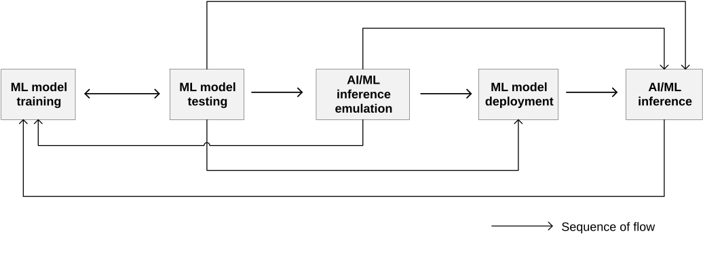
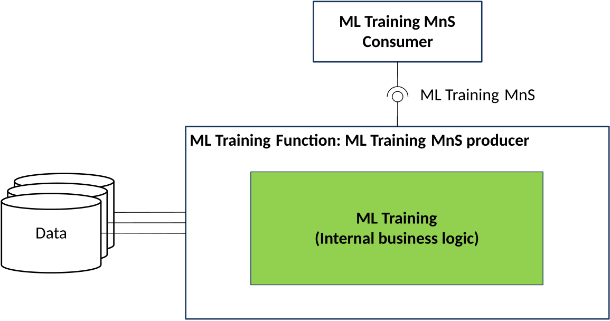
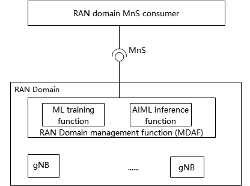
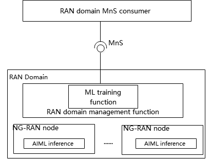
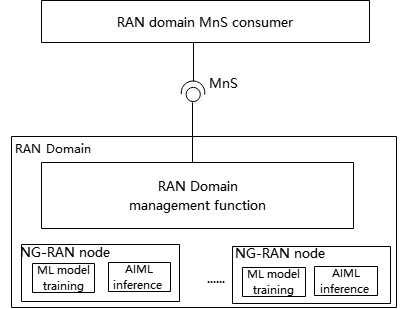
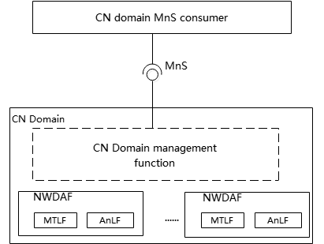
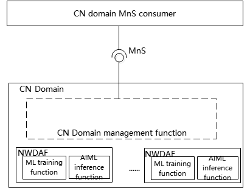

# 4a AI/ML management functionality and service framework

## 4a.0 ML model lifecycle

AI/ML techniques are widely used in 5GS (including 5GC, NG-RAN, and management system), the generic AI/ML operational workflow shown in Figure 4a.0-1, highlights the main steps of an ML model lifecycle.

Figure 4a.0-1: ML model lifecycle

The ML model lifecycle includes training, testing, emulation, deployment, and inference. These steps are briefly described below:

**- ML model training:** training, including initial training, re-training, pre-specialised training and fine-tuning. Training could be for a single ML model or a group of ML models. It may also include validation of the ML model(s) to evaluate the performance when the ML model(s) performs on the validation data. If the validation result does not meet the expectation (e.g., the variance is not acceptable), the MnS Producer may decide to re-train the ML model(s).

**- ML model testing:** testing of a validated ML model to evaluate the performance of the trained ML model when it performs on testing data. If the testing result meets the expectations, the ML model may proceed to the next step If the testing result does not meet the expectations, the ML model needs to be re-trained.

**- AI/ML inference emulation:** running an ML model for inference in an emulation environment. The purpose is to evaluate the inference performance of the ML model in the emulation environment prior to applying it to the target network or system. If the emulation result does not meet the expectation (e.g., inference performance does not meet the target, or the ML model negatively impacts the performance of other existing functionalities), the ML model needs to be re-trained.

NOTE 1: The AI/ML inference emulation is considered optional and can be skipped in the ML model lifecycle.

**- ML model deployment:** ML model deployment includes the ML model loading process (a.k.a. a sequence of atomic actions) to make a trained ML model available for use at the target AI/ML inference function.

ML model deployment may not be needed in some cases, for example when the training function and inference function are co-located.

**- AI/ML inference:** performing inference using trained ML model(s) by the AI/ML inference function. The AI/ML inference may also trigger model re-training or update based on e.g., performance monitoring and evaluation.

NOTE 2: Depending on system implementation and AI/ML functionality arrangements, both AI/ML inference emulation and ML deployment steps may be skipped.

NOTE 3: The sequence of ML model lifecycle in Figure 4a.0-1 is the typical process in an E2E perspective. The actual sequence will depend on certain training techniques as described in their use cases, e.g., ML reinforcement learning, Distributed training or Federated learning, etc.

## 4a.1 Functionality and service framework for ML model training

An ML training Function playing the role of ML training MnS producer, may consume various data for ML model training purpose.

As illustrated in Figure 4a.1-1 the ML model training capability is provided via ML training MnS in the context of SBMA to the authorized MnS consumer(s) by ML training MnS producer.

Figure 4a.1-1: Functional overview and service framework for ML model training

The internal business logic of ML model training leverages the current and historical relevant data, including those listed below to monitor the networks and/or services where relevant to the ML model, prepare the data, trigger and conduct the training:

\- Performance Measurements (PM) as per 3GPP TS 28.552 \[4\], 3GPP TS 32.425 \[5\] and Key Performance Indicators (KPIs) as per 3GPP TS 28.554 \[6\].

\- Trace/MDT/RLF/RCEF/RRC data, as per 3GPP TS 32.422 \[7\].

\- QoE and service experience data as per 3GPP TS 28.405 \[9\].

\- Analytics data offered by NWDAF as per 3GPP TS 23.288 \[3\].

\- Alarm information and notifications as per 3GPP TS 28.111 \[22\].

\- CM information and notifications.

\- MDA reports from MDA MnS producers as per 3GPP TS 28.104 \[2\].

\- Management data from non-3GPP systems.

\- Other data that can be used for training.

## 4a.2 AI/ML functionalities management scenarios (relation with managed AI/ML features)

The ML training function and/or AI/ML inference function can be located in the RAN domain MnS consumer (e.g. cross-domain management system),a domain-specific management system (i.e. a management function for RAN or CN), or in a network function (NF).

For MDA, the ML training function can be located inside or outside the MDAFwhile the AI/ML inference function is located in the MDAF.

For NWDAF, the ML training function can be located in the MTLF of the NWDAF or in the management system, and the AI/ML inference function is located in the AnLF.

For NG-RAN, the ML training function and AI/ML inference function can both be located in the NG-RAN node.or the ML training function can be located in the management system and AI/ML inference function is located in the NG-RAN node. Where the ML training function corresponds to ML model training that stated in clause 16.20.2 in TS 38.300 \[16\] and AI/ML inference function can correspond to AI/ML inference stated in clause 16.20.2 in TS 38.300 \[16\].

For LMF-based AI/ML Positioning, the ML training function can be located in the LMF or CN-domain management function, and the AI/ML inference function can be located in the LMF.

Therefore, multiple location scenarios for ML training function and AI/ML inference functions are possible.

**Scenario 1:**

The ML training function and AI/ML inference function are both located in the 3GPP management system (e.g. a RAN domain management function). For example, for RAN domain-specific MDA, both the ML training function and AI/ML inference functions for MDA can be located in the RAN domain-specific MDAF as depicted in figure 4a.2-1.

Figure 4a.2-1: Management for RAN domain specific MDAF

Similarly, for CN domain-specific MDA the ML training function and AI/ML inference function can be located in CN domain-specific MDAF.

**Scenario 2:**

For AI/ML for NG-RAN, the ML model training is located in the 3GPP RAN domain-specific management function while the AI/ML inference is located in NG-RAN node. For AI/ML inference use case, refer to Network Energy Saving, Load Balancing, Mobility Optimization as defined in clause 16.20 in TS 38.300 \[16\]. See Figure 4a.2-2.

Figure 4a.2-2: Management where the ML model training is located in RAN domain management function and AI/ML inference is located in NG-RAN node

**Scenario 3:**

For AI/ML in NG-RAN, the ML model training and AI/ML inference are both located in the NG-RAN node.For ML model training and AI/ML inference use case, refer to Network Energy Saving, Load Balancing, Mobility Optimization as defined in clause 16.20 in TS 38.300 \[16\]. See Figure 4a.2-3.

Figure 4a.2-3: Management where the ML model training and AI/ML inference are both located in NG-RAN node.

**Scenario 4:**

For NWDAF, both the MTLF and AnLF are located in the NWDAF. See Figure 4a.2-4.

Figure 4a.2-4: Management where the MTLF and AnLF are both located in CN
