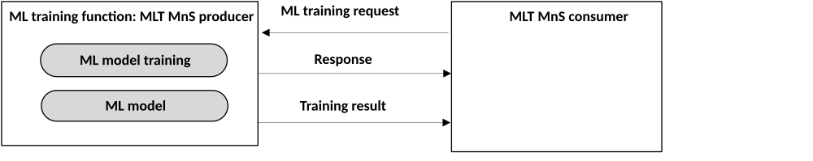

#### 6.2b.2.1 ML model training requested by consumer

Figure 6.2b.2.1-1: ML model training requested by ML training MnS consumer

The ML model training may be triggered by the request(s) from one or more ML training MnS consumer(s). The consumer may be for example a network function, a management function, an operator, or another functional differentiation.

To trigger an initial ML model training, the MnS consumer needs to specify in the ML training request the inference type which indicates the function or purpose of the ML model, e.g. CoverageProblemAnalysis \[see TS 28.104 \[2\]\]. The ML training MnS producer can perform the initial training according to the designated inference type. To trigger an ML model re-training, the MnS consumer needs to specify in the ML training request the identifier of the ML model to be re-trained.

The consumer may provide the data source(s) that contain(s) the training data which are considered as inputs candidates for training. To obtain the valid training outcomes, consumers may also designate their requirements for model performance (e.g. accuracy, etc) in the training request.

The performance of the ML model depends on the degree of commonality between the distribution of the data used for training and the distribution of the data used for inference. As time progresses, the distribution of the input data used for inference might change as compared to the distribution of the data used for training. In such a scenario, the performance of the ML model degrades over time. The ML training MnS producer may re-train the ML model if the inference performance of the ML model falls below a certain threshold, which needs to be configurable by the MnS consumer.

Following the ML training request by the ML training MnS consumer, the ML training MnS producer provides a response to the consumer indicating whether the request was accepted.

If the request is accepted, the ML training MnS producer decides when to start the ML model training with consideration of the request(s) from the consumer(s). Once the training is decided, the producer performs the following:

> \- selects the training data, with consideration of the consumer provided candidate training data. Since the training data directly influences the algorithm and performance of the trained ML model, the ML training MnS producer may examine the consumer's provided training data and decide to select none, some or all of them. In addition, the ML training MnS producer may select some other training data that are available;
>
> \- trains the ML model using the selected training data;
>
> \- validate the trained model using validation set of the training data;
>
> \- provides the training results (including the identifier of the ML model generated from the initially trained ML model or the version number of the ML model associated with the re-trained model, training performance results, etc.) to the ML training MnS consumer(s).
