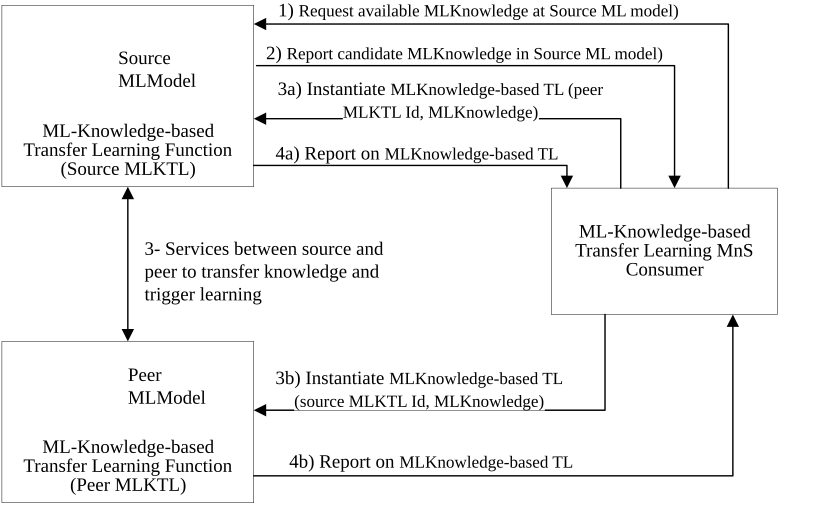

#### 6.2b.2.10 ML-Knowledge-based Transfer Learning

##### 6.2b.2.10.1 Description

It is known that existing ML capability can be leveraged in producing new or improving other ML capability. Specifically, transfer learning allows knowledge contained in one or more ML models to be transferred to another ML model. Transfer learning relies on task and domain similarity to determine whether parts of a deployed ML model can be reused in another domain / task with some modifications.

In multi-vendor environments, aspects of transfer learning need to be supported in network management systems. However, as ML models are not expected to be multi-vendor objects, i.e. an ML model cannot be transferred directly from one function to another, the knowledge contained within the model, referred to as ML knowledge, should be transferred instead of the ML model itself.

ML knowledge represents the information representing experience gained by the training of an ML model (e.g. experience that indicates the recommended outputs for a given set of input data). This information can be of various forms such as statistics (e.g. a distribution) or summaries (e.g. tables).

For example, knowledge contained in an ML model deployed to perform mobility optimization during the day can be leveraged to produce a new ML model to perform mobility optimization at night. As illustrated in Figure 6.2b.2.10.1-1, the network or its management system needs to have the required management services to support ML Knowledge-based Transfer Learning (MLKTL). ML Knowledge-based Transfer Learning refers to the capability of enabling and managing the transfer learning between any two ML models or training functions.

Figure 6.2b.2.10.1-1: ML Knowledge-based Transfer Learning (MLKTL) flow between the source MLKTL  
(which is the ML training function with the pre-trained ML model), the peer MLKTL  
(which is the ML training function that shall train a new ML model) and the MLKTL MnS consumer  
(which may be the operator or another management function that triggers or controls MLKTL)

NOTE 1: The services between the source and peer for the transfer knowledge and triggering of learning is implementation specific and is not in scope of the current specification.

NOTE 2: Transfer learning (including knowledge-based transfer learning) can be sensitive from a data exposure and privacy aspect. Knowledge-based transfer learning will not be triggered for non-authorized MnS consumers, but the authorization of the MnS consumers is not in scope of the current document.

##### 6.2b.2.10.2 Use cases

##### 6.2b.2.10.2.1 Discovering sharable Knowledge

For transfer learning, it is expected that the source ML Knowledge-based Transfer Learning (MLKTL) Functionshares its knowledge with the target ML training function, either through a single instance of knowledge transfer or through an interactive transfer learning process. The ML knowledge here represents any experiences or information gathered by the ML model within the source MLKTL Functionthrough training, inference, updates, or testing. This knowledge can be in the form of data statistics, features of the underlying ML model, or the output of the ML model. The 3GPP management systems should provide mechanisms for an MnS consumer to discover this potentially shareable knowledge as well as the means for the MLKTL provider to share that knowledge with the MnS consumer.

##### 6.2b.2.10.2.2 Knowledge sharing and transfer learning

Transfer learning may be triggered by an MnS consumer, either to fulfil its own learning needs or delegate the process to another ML training function. The model containing the knowledge may be an independent managed entity or it could be an attribute of a managed ML model or ML training function. In the latter case, MLKTL does not involve sharing the ML model itself or parts of it but would focus on enabling the sharing of the knowledge contained within the ML model or ML-enabled function.

The 3GPP management system should provide mechanisms and services needed to realize the ML Knowledge-based transfer learning process. Specifically, the 3GPP management system should enable an MnS consumer to request and receive sharable knowledge as well as means for the MnS producer of MLKTL to share the knowledge with the MnS consumer or a designated target ML training function. Similarly, the 3GPP management system should support MnS consumers in managing and controlling the MLKTL process, including handling requests associated with knowledge transfer learning between two ML models directly or via a shared knowledge repository.

The two use cases should address the four scenarios illustrated below.

It should be noted that, the use cases and requirements here focus on the required management capabilities the implementation of the knowledge transfer learning processes are implementation details that are out of the scope of the present document.

**Scenario 1**: Interactions for ML-Knowledge-based Transfer Learning (MLKTL) to support training at the ML knowledge Transfer MnS consumer as a peer - ML knowledge-based Transfer Learning MnS consumer obtains the ML knowledge which it then uses for training the new ML model based on knowledge received from the MLKTL source Function.

**Scenario 2**: Interactions for ML-Knowledge-based Transfer Learning (MLKTL) to support training at the peer ML Knowledge-based Transfer Learning Functiontriggered by the MLKTL Source - the ML Knowledge-based Transfer Learning MnS consumer acting as the MLKTL Source (the source of the ML knowledge) triggers the training at the ML knowledge-based Transfer Function by providing the ML knowledge to be used for the training, the ML Knowledge-based Transfer Learning MnS consumer then undertakes the training.

**Scenario 3**: Interactions for ML-Knowledge-based Transfer Learning (MLKTL) to support training at the Peer ML knowledge-based Transfer Learning Function who is different from the ML knowledge-based Transfer Learning MnS consumer - the ML knowledge-based Transfer Learning MnS consumer triggers training at the MLKTL peer Function. The MLKTL MnS consumer then obtains the ML knowledge from the MLKTL source Functionand then uses the knowledge for training the new ML model based on knowledge received from the MLKTL source Function.

**Scenario 4**: Interactions for ML-Knowledge-based Transfer Learning (MLKTL) to support training at the Source ML knowledge Transfer Function- the ML knowledge-based Transfer Learning MnS consumer triggers training at the MLKTL source Function. The MLKTL MnS consumer then takes its available ML knowledge-based and uses the knowledge for training the new ML model based.
