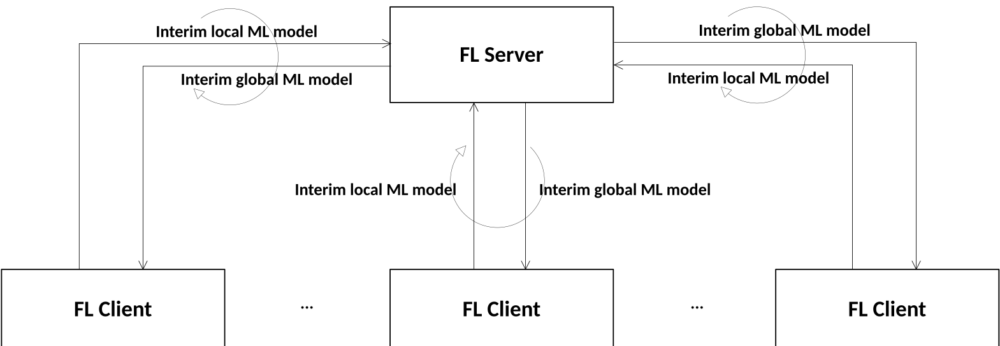

#### 6.2b.2.15 Management of Federated learning

##### 6.2b.2.15.1 Description

Federated learning (FL) is a distributed machine learning approach that allows multiple FL clients to collaboratively train an ML model on local datasets contained in each FL Client without explicitly exchanging data samples.

FL is supported by a group of FL clients and FL server wherein FL client keeps the data localized and private and trains the ML model directly on the local nodes (client) where the data is obtained or stored.

Federated learning can be categorized into two main types: Horizontal federated learning (HFL) and Vertical federated learning (VFL), based on the nature of the data distribution and the way the model training is orchestrated among participants. For HFL, the process typically includes FL Client discovery and selection, local ML model training and updates by the FL Clients, ML model updates aggregation, and global ML model distribution by the FL Server. Management of Federated learning can be used for AI/ML-based use cases specified in \[2\] and \[3\].

Figure 6.2b.2.15.1-1: ML model distribution and aggregation for HFL

NOTE 1: A prior agreement as well as authentication procedures needs to be established between FL Server and FL clients before sharing any information between these functions.

NOTE 2: The management system can only invoke federated‑learning procedures when all participating nodes can guarantee secure aggregation of locally trained updates, have verified data‑privacy compliance, and provide sufficient, joint communication capacity to exchange model updates. These aspects are though outside the scope of standardization.

##### 6.2b.2.15.2 Use cases

##### 6.2b.2.15.2.1 Management of different roles in Federated learning

For FL, an ML model is collaboratively trained by a group of FL clients (e.g. MTLF in NWDAFs) including one acting as FL server and the others acting as FL clients. Federated Learning training allows multiple FL clients to collaboratively train an ML model on local datasets.

For managing the FL, the ML training MnS consumer needs to know the FL clients and FL server involved in the FL, so that the consumer understands the impact of each one of them and can manage them correspondingly.

When receiving an ML training request, the ML training MnS Producer should evaluate whether FL process needs to be started according to the training requirements (e.g. minimum number of FL Clients, minimum number of total iterations, minimum number of data samples and available time of the FL Clients, fault tolerance, energy source and carbon emission information) provided by the ML training consumer. Based on the received requirements, the ML training MnS Producer with the role of FL server may select (including adding and removing) appropriate FL Clients.

To evaluate the performance of FL, the consumer can query the performance of the final global ML model running on the local training data set of participating FL clients. For instance, if an FL server cannot produce a global ML model with satisfied performance for the FL clients, the consumer may interact with the MnS ML training producer to optimize the FL for future training, e.g. updating the criteria for selecting FL clients.

In addition, the consumer needs to get the information about the contribution of each FL client to the FL process, for instance, the number of iterations in which the FL client participated in the FL, the number of data samples the FL client used and thetraining duration performed by the FL Client.
