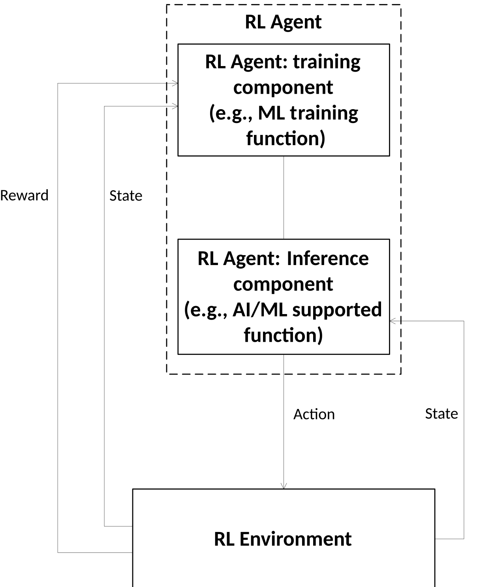
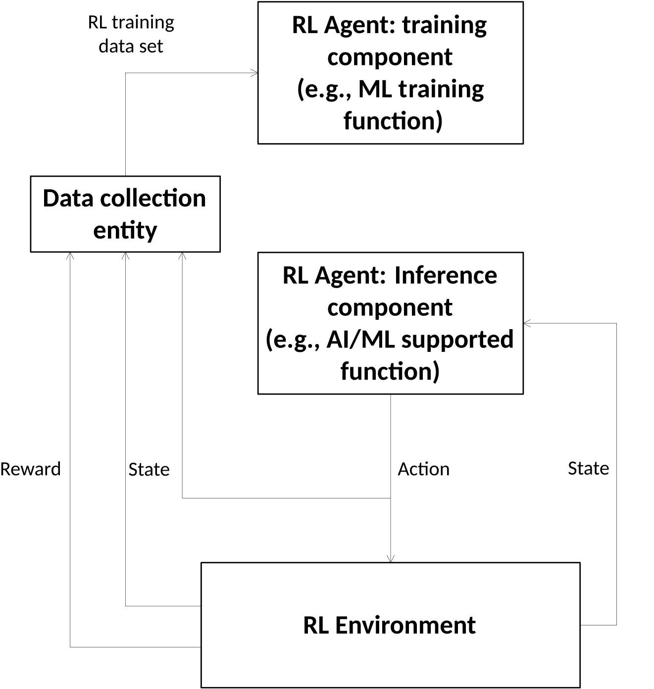

#### 6.2b.2.16 Management of Reinforcement Learning

##### 6.2b.2.16.1 Description 

In RL, the agent uses a trial-and-error approach to develop a policy that maximises its cumulative reward over time.

RL can be used for supporting various AI/ML functions (including NG-RAN AI/ML supported functions, e.g., Energy Saving (ES), Mobility Load Balancing (MLB) and Mobility Robustness Optimization (MRO), etc.) when the ML training function is located in OAM. For these scenarios, RL needs to be managed.

An RL agent functionally consists of two main parts: a training component and an inference component.

The training component learns to generate or update the RL model from the outcomes of its actions taken by the inference component in an RL environment (e.g., a live 5G subnetwork or a simulated environment). RL can occur in one of two modes for:

\- **RL in online mode**: in online mode, the RL model is trained and applied in real time through direct interaction between the RL agent components and the RL environment. In this approach, the RL agent’s training component continuously learns by receiving rewards, and observing state transitions resulting from its actions, while the RL agent’s inference component uses the trained model in real time to determine actions in the RL environment.

Figure 6.2b.2.16.1-1: RL in online mode

For RL operating in online mode within a target network, direct interaction with the network occurs in real-time. As a result, both ML model testing and AI/ML emulation steps may not be executed as a distinct step, and if the RL agent training components and RL agent inference component are not co-located, model deployment may occur automatically between them without an external deployment trigger.

NOTE 1: RL in online mode is not supported in current release specifications.

\- **RL in offline mode**: In offline mode, instead of direct interaction, the training process relies on a pre-collected dataset from a data collection entity (e.g., the MnS producer for collecting the performance measurements, Trace events, MDT/UE level measurements, alarm information, and/or configuration parameters updates, etc.). This dataset consists of state transition, action, and reward information collected over a period of time from the RL environment, allowing the RL agent training component to train the model without real-time interaction with the environment.

Figure 6.2b.2.16.1-2: RL in offline mode

For RL in offline mode, the RL model may undergo ML model testing and AI/ML emulation steps before being deployed in the target network.

For RL in online mode, the RL model cannot be tested as much as RL in offline mode. If online RL agent training is discontinued in the target network, the RL agent inference component continues to operate, and the rewards and state may not be sent to the RL agent training component from the RL environment.

The RL environment will be impacted by actions of the agent. Agent’s action depends on input data, which comes from the RL environment. The RL agent needs the data samples for training regardless of the RL environment they come from.

NOTE 2: Rewards, states, and actions are not subject to standardization. While measurements and KPIs may be defined, the mapping of such data to states and rewards is implementation-specific.

NOTE 3: Figures 6.2b.2.16.1-1 and 6.2b.2.16.1-2 conceptually and logically illustrate how the RL process works in both online and offline modes, without restricting the implementation of RL agent training and inference components.

##### 6.2b.2.16.2 Use cases

##### 6.2b.2.16.2.1 Enabling Reinforcement Learning

Once the RL model is trained and deployed (if training and inference occur on separate entities), the inference component adopts the RL model and makes decisions based on state transitions in the RL environment.

To enable, facilitate, and manage RL for 5GS, the 3GPP management system needs to support the following RL components in performing their respective functions:

\- **RL agent training component:** collects the data for training, trains the RL model and reports the training result of the training component. The data for training includes state transitions, rewards from the RL environment for online RL, or the pre-processed data set for a period of time from the data collection entity for offline RL, as well as the actions taken by the RL agent inference component. The trained RL model would be used by the inference component to determine actions for observed state conditions. Additionally, the RL agent training component needs to indicate the RL environment(s) (e.g., a live subnetwork or a simulation subnetwork) for which an RL model has been trained.

\- **RL agent inference component:** activates the trained RL model (RL policy), receives state transitions from the RL environment, and determine actions based on the RL model. The RL agent inference component needs to be configured with the information about the RL environment(s) where a trained RL model can be used.

\- **RL environment:** executes the actions determined by the RL agent inference component and reports rewards to the RL agent training component for online RL or to the data collection entity for offline RL.

##### 6.2b.2.16.2.2 Exploration in Reinforcement Learning

Reinforcement Learning (RL) has the ability to learn and adapt itself to dynamic environments and thus finds the near optimal solution for a problem. However, the potential negative impact to the mobile network caused by RL is still the main drawback. In particular, during the exploration step performing trials and learning from errors may have an impact on the operational network and may result in unsafe operations causing network performance degradations. Therefore, the exploration step in RL needs to be under a controlled configuration range that the RL agent is allowed to act upon, so that the RL actions do not violate system performance requirements. If the RL agent behaves in an unexpected manner, there needs to be a set of fall-back actions in place, e.g. to switch from RL-based solution to non-RL-based solution, to fall back to last discrete time step, and to terminate the RL process.

When RL is supported, a consumer may want to provide a scope (e.g. geographical area, time window) that can aid the MnS producer to select/create the environment when performing RL. The environment may include information of the entities the RL agent may impact when performing RL, i.e., the allowed scope for entities to be impacted by RL actions. If the MnS producer supports multiple types of environments, the consumer may want to state their preference for environment type for RL during training, i.e., simulated environment or live network. When the live network is preferred by the MnS consumer, the consumer can provide network performance requirements (e.g. lower bound threshold, acceptable range, maximum performance deterioration Rate, etc.) of performing ML training of RL, to make the MnS producer adapt the training configurations to meet the network performance requirements. Furthermore, the MnS consumer can provide its concerned performance metrics to guide the MnS producer to set reward/state.

NOTE: Support for both environment types can be considered optional in the RL training.
