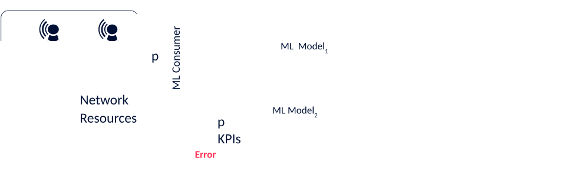

#### 6.2b.2.5 Handling errors in data and ML decisions

Ideally, the ML models are trained on good quality data, i.e. data that was collected correctly and reflected the real network status to represent the expected context in which the ML model is meant to operate. However, this is not always the case in real world as data cannot be completely error-free. Good quality data is void of errors, such as:

> \- Imprecise measurements
>
> \- Missing values or records
>
> \- Records which are communicated with a significant delay (in case of online measurements).

Without errors, an ML model can depend on a few precise inputs, and does not need to exploit the redundancy present in the training data. However, during inference, the ML model is very likely to come across these inconsistencies. When this happens, the ML model shows high error in the inference outputs, even if redundant and uncorrupted data are available from other sources.

Figure 6.2b.2.5-1: The propagation of erroneous information

As such, the training function should attempt to identify errors in the input data. If an model has been trained on erroneous or inconsistent data, the consumer should be made aware of such.
