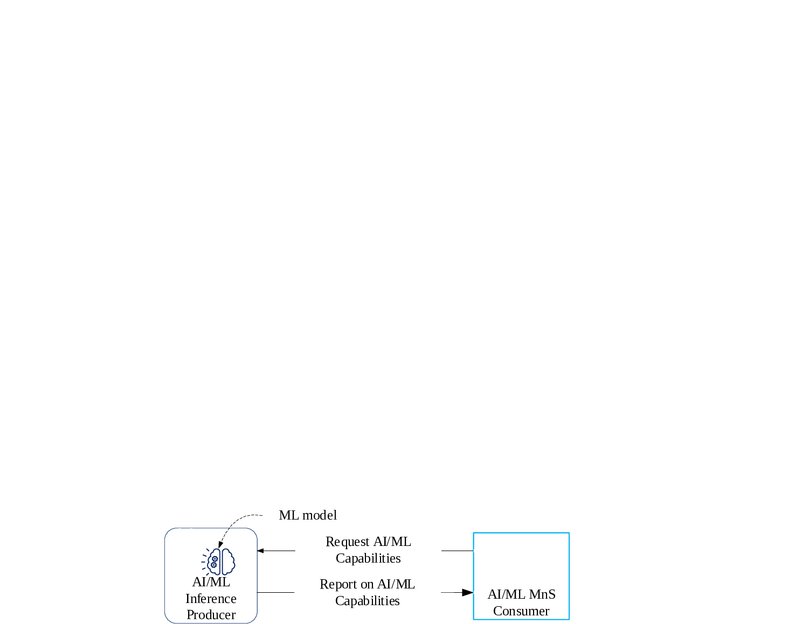

### 6.5.3 AI/ML inference capabilities management

#### 6.5.3.1 Description

A network or management function that applies AI/ML to accomplish specific tasks may be considered to have one or more ML models, each having specific capabilities.

Different network functions, e.g., MDA Functions, may need to rely on existing AI/ML capabilities to accomplish the desired inference. However, the details of such ML-based solutions (i.e., which ML models are applied and how) for accomplishing those inference functionalities is not obvious. The management services are required to identify the capabilities of the involved ML models and to map those capabilities to the desired logic.

#### 6.5.3.2 Use cases

##### 6.5.3.2.1 Identifying capabilities of ML models

Network functions, especially network automation functions, may need to rely on capabilities of ML models that are not internal to those network functions to accomplish the desired automation (inference). For example, as stated in TS 28.104 \[2\], "An MDA Function may optionally be deployed as one or more AI/ML inference function(s) in which the relevant ML models are used for inference per the corresponding MDA capability". Similarly, owing to the differences in the kinds and complexity of intents that need to be fulfilled, an intent fulfillment solution may need to employ the capabilities of existing AI/ML inference functions to fulfill the intents. In any such case, management services are required to identify the capabilities of those existing ML models that are employed by AI/ML inference functions.

Figure 6.5.3.2.1-1: Request and reporting on AI/ML inference capabilities

Figure 6.5.3.2.1-1 shows that the consumer may wish to obtain information about the available AI/ML inference capabilities to determine how to use them for the consumer's needs, e.g., for fulfillment of intent targets or other automation targets.

##### 6.5.3.2.2 Mapping of the capabilities of ML models

Besides the discovery of the capabilities of ML models, services are needed for mapping the ML modelsand capabilities. In other words, instead of the consumer discovering specific capabilities, the consumer may want to know the ML models that can be used to achieve a certain outcome. For this, the producer should be able to inform the consumer of the set of available ML models that together achieve the consumer's automation needs.

In the case of intents for example, the complexity of the stated intents may significantly vary - from simple intents which may be fulfilled with a call to a single ML model to complex intents that may require an intricate orchestration of multiple ML models. For simple intents, it may be easy to map the execution logic to one or multiple ML models. For complex intents, it may be required to employ multiple ML models along with a corresponding functionality that manages their interrelated execution. The usage of the ML models requires the awareness of their capabilities and interrelations.

Moreover, given the complexity of the required mapping to the multiple ML models, services should be supported to provide the mapping of ML models and capabilities.

#### 6.5.3.3 Requirements for AI/ML inference capabilities management

Table 6.5.3.3-1

| Requirement label  | Description                                                                                                                                                                                                                                                                                                                                                                                                                                                                                                                                                        | Related use case(s)                                         |
|--------------------|--------------------------------------------------------------------------------------------------------------------------------------------------------------------------------------------------------------------------------------------------------------------------------------------------------------------------------------------------------------------------------------------------------------------------------------------------------------------------------------------------------------------------------------------------------------------|-------------------------------------------------------------|
| **REQ-ML_CAP-01**  | The AI/ML inference MnS Producer shall have a capability allowing an authorized MnS consumer to request the capabilities of existing ML models available within the AI/ML inference producer.                                                                                                                                                                                                                                                                                                                                                                      | Identifying capabilities of ML models (clause 6.5.3.2.1)    |
| **REQ- ML_CAP-02** | The AI/ML inference MnS Producer shall have a capability to report to an authorized MnS consumer the capabilities of an ML model as a decision described as a triplet \<object(s), parameters, metrics\> with the entries respectively indicating: the object or object types for which the ML model can undertake optimization or control; the configuration parameters on the stated object or object types, which the ML model optimizes or controls to achieve the desired outcomes; and the network metrics which the ML model optimizes through its actions. | Identifying capabilities of ML models (clause 6.5.3.2.1)    |
| **REQ-ML_CAP-03**  | The AI/ML inference MnS Producer shall have a capability to report to an authorized MnS consumer the capabilities of an ML model as an analysis described as a tuple \<object(s), characteristics\> with the entries respectively indicating: the object or object types for which the ML model can undertake analysis; and the network characteristics (related to the stated object or object types) for which the ML model produces analysis                                                                                                                    | Identifying capabilities of ML models (clause 6.5.3.2.1)    |
| **REQ-ML_CAP-04**  | The AI/ML inference MnS Producer shall have a capability allowing an authorized MnS consumer to request a mapping of the consumer's inference targets to the capabilities of one or more ML models.                                                                                                                                                                                                                                                                                                                                                                | Mapping of the capabilities of ML models (clause 6.5.3.2.2) |

