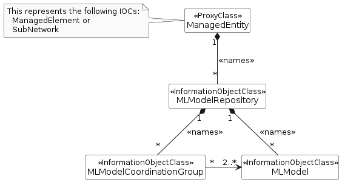
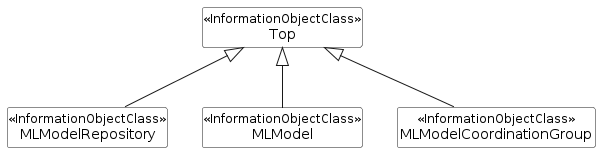

## 7.2a Common information model definitions for AI/ML management

### 7.2a.1 Class diagram

#### 7.2a.1.1 Relationships

Figure 7.2a.1.1-1: Relations for common information models for AI/ML management

#### 7.2a.1.2 Inheritance

Figure 7.2a.1.2-1: Inheritance Hierarchy for common information models for AI/ML management

### 7.2a.2 Class definitions

#### 7.2a.2.1 MLModel

##### 7.2a.2.1.1 Definition

This IOC represents the ML model. ML model algorithm or ML model are not subject to standardization. It is name-contained by MLModelRepository.

This MLModel MOI can be created by the system (MnS producer) or pre-installed. The MnS consumer can request the system to delete the MLModel MOI.

The attribute aIMLInferenceName indicates the type of inference that the ML model MOI currently supports.

For MLModel MOIs representing pre-specialised trained models, no active inference is defined prior to fine-tuning. In such cases, the attribute aIMLInferenceName shall not be present.

For MLModel MOIs representing models that support executable inference (e.g. fine-tuned or re-trained models), the attribute aIMLInferenceName shall be present and shall indicate the inference type currently supported by the ML model.

The MLModel contains 3 types of contexts - TrainingContext, ExpectedRunTimeContext and RunTimeContext which represent status and conditions of the MLModel. These contexts are of mLContext \<\<dataType\>\>, see clauses 7.4.3 and 7.5.1 for details.

It also contains a reference named retrainingEventsMonitorRef which is a pointer to ThresholdMonitor MOI. This indicates the list of performance measurements and the corresponding thresholds that are monitored and used to identify the need for re-training by the MnS Producer. After the MLModel MOI has been instantiated, the MnS Consumer can request MnS producer to instantiate a ThresholdMonitor MOI and update the reference in the MLModel MOI that can be used by the MnS producer to decide on the re-training of the MLModel. The MnS producer can be ML training MnS producer or AI/ML Inference MnS Producer.

The ML model includes information about its applicable type of training, indicated by mLTrainingType, which indicates the type of training that can be applied to the ML model, including initial training, pre-specialised training, fine-tuning, or re-training.

For a pre-specialised trained ML model, the MLModel MOI also include information about its applicable inference scope, which corresponds to a list of inference types which the model can be adapted (fine-tuned) to support.

##### 7.2a.2.1.2 Attributes

The MLModel IOC includes attributes inherited from Top IOC (defined in TS 28.622 \[12\]) and the following attributes:

Table 7.2a.2.1.2-1

| Attribute name                 | Support Qualifier | isReadable |     | isWritable |     | isInvariant | isNotifyable |
|--------------------------------|-------------------|------------|-----|------------|-----|-------------|--------------|
| mLModelId                      | M                 | T          |     | F          |     | F           | T            |
| aIMLInferenceName              | M                 | T          |     | F          |     | F           | T            |
| mLModelVersion                 | M                 | T          |     | F          |     | F           | T            |
| expectedRunTimeContext         | M                 | T          |     | T          |     | F           | T            |
| trainingContext                | CM                | T          |     | F          |     | F           | T            |
| runTimeContext                 | O                 | T          |     | F          |     | F           | T            |
| supportedPerformanceIndicators | O                 | T          |     | F          |     | F           | T            |
| mLCapabilitiesInfoList         | M                 | T          |     | F          |     | F           | T            |
| mLTrainingType                 | M                 | T          |     | F          |     | F           | T            |
| inferenceScope                 | CM                | T          |     | F          |     | F           | T            |
| **Attribute related to role**  |                   |            |     |            |     |             |              |
| retrainingEventsMonitorRef     | O                 | T          |     | T          |     | F           | T            |
| aIMLInferenceReportRefList     | O                 |            | T   |            | F   | F           | T            |
| usedByFunctionRefList          | O                 |            | T   |            | F   | F           | T            |

##### 7.2a.2.1.3 Attribute constraints

Table 7.2a.2.1.3-1

| **Name**        | **Definition**                                                                                        |
|-----------------|-------------------------------------------------------------------------------------------------------|
| trainingContext | Condition: The MnS producer supports specifying the context under which an ML model has been trained. |
| inferenceScope  | Condition: When MLModel MOI represents the ML model which was trained by a pre-specialised training.  |

##### 7.2a.2.1.4 Notifications

The common notifications defined in clause 7.6 are valid for this IOC, without exceptions or additions.

#### 7.2a.2.2 MLModelRepository

##### 7.2a.2.2.1 Definition

The IOC MLModelRepository represents the repository that contains the ML models. It is name-contained by SubNetwork or ManagedElement.

This MLModelRepository instance can be created by the system (MnS producer) or pre-installed.

The MLModelRepository MOI may contain one or more MLModel(s).

##### 7.2a.2.2.2 Attributes

The MLModelRepository IOC inherited from Top IOC (defined in TS 28.622 \[12\]).

##### 7.2a.2.2.3 Attribute constraints

None.

##### 7.2a.2.2.4 Notifications

The common notifications defined in clause 7.6 are valid for this IOC, without exceptions or additions.

#### 7.2a.2.3 MLModelCoordinationGroup

##### 7.2a.2.3.1 Definition

This IOC represents the group of ML models, which can be trained and tested jointly and used to perform inference in a coordinated way. It is name-contained by MLModelRepository.

This MLModelCoordinationGroup instance is created by the system (MnS producer) or pre-installed. The MnS consumer can request the System to delete the MLModelCoordinationGroup MOI.

One ML model may have dependencies on one or more of the other ML models of the same group.

One group is associated with at least two ML models.

##### 7.2a.2.3.2 Attributes

The MLModelCoordinationGroup IOC includes attributes inherited from Top IOC (defined in TS 28.622 \[12\]) and the following attributes:

Table 7.2a.2.3.2-1

| Attribute name                | Support Qualifier | isReadable | isWritable | isInvariant | isNotifyable |
|-------------------------------|-------------------|------------|------------|-------------|--------------|
|                               |                   |            |            |             |              |
| **Attribute related to role** |                   |            |            |             |              |
| memberMLModelRefList          | M                 | T          | F          | F           | T            |

##### 7.2a.2.3.3 Attribute constraints

None.

##### 7.2a.2.3.4 Notifications

The common notifications defined in clause 7.6 are valid for this IOC, without exceptions or additions.
