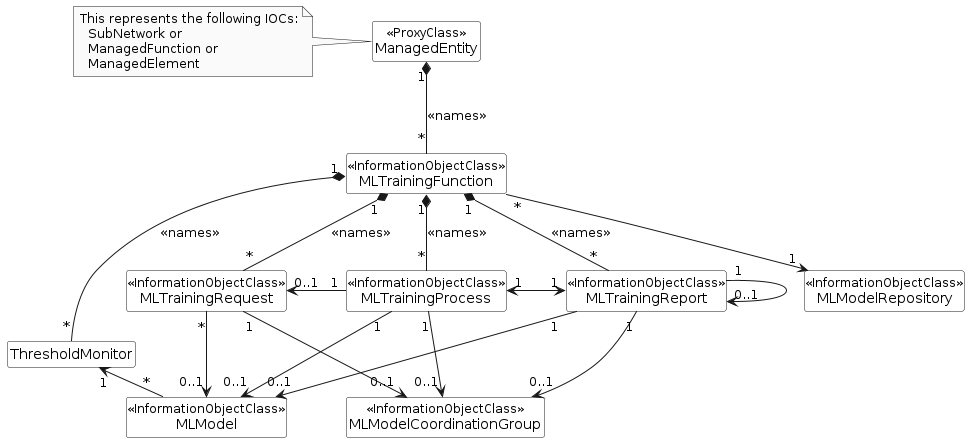
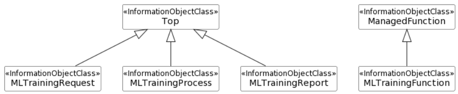

### 7.3a.1 Information model definitions for ML model training

#### 7.3a.1.1 Class diagram

##### 7.3a.1.1.1 Relationships

This clause depicts the set of classes (e.g. IOCs) that encapsulates the information relevant to ML model training. For the UML semantics, see TS 32.156 \[13\].

Figure 7.3a.1.1.1-1: NRM fragment for ML model training

##### 7.3a.1.1.2 Inheritance

Figure 7.3a.1.1.2-1: Inheritance Hierarchy for ML model training related NRMs

#### 7.3a.1.2 Class definitions

##### 7.3a.1.2.1 MLTrainingFunction

###### 7.3a.1.2.1.1 Definition

The IOC MLTrainingFunction represents the function that is responsible for ML model training. The MOI of MLTrainingFunction is also the container of the MLTrainingRequest, MLTrainingReport, MLTrainingProcess and ThresholdMonitor MOI(s).

This MLTrainingFunction instance is created by the system (MnS producer) or pre-installed, it can only be deleted by the system.

The ThresholdMonitor contains the list of performance measurements and the corresponding thresholds that are monitored and used to identify the need for ML model re-training by the MnS Producer.

TheML training function represented by MLTrainingFunction MOI supports training of one or more MLModel(s).

The MLTrainingFunction includes information about its applicable type of training, which includes pre-specialised training, fine-tuning, or re-training.

The MLTrainingFunction MOI have a supportedLearningTechnology attribute to indicate the supported learning technology including Reinforcement learning, Federated learning and Distributed training. This attribute can enable the ML training MnS producer allowing ML training MnS consumer to query if RL/FL/DL is supported.

An MLTrainingFunction instance may contain a set of ML knowledge instances associated with a set of ML models that have been trained. An MnS consumer can find available ML knowledge by reading the mLKnowledge attribute on the ML MLTrainingFunction. Relatedly, the MnS consumer can find the characteristics of a specific ML knowledge instance by reading the related mLKnowledge. The request for training using MLknowledge is not to be combined with training using collected data – the training function should not provide ML knowledge along side the raw data used for creating the ML knowledge.

###### 7.3a.1.2.1.2 Attributes

The MLTrainingFunction IOC includes attributes inherited from ManagedFunction IOC (defined in TS 28.622 \[12\]) and the following attributes:

Table 7.3a.1.2.1.2-1

|                               |                   |            |            |             |              |
|-------------------------------|-------------------|------------|------------|-------------|--------------|
| Attribute name                | Support Qualifier | isReadable | isWritable | isInvariant | isNotifyable |
| supportedLearningTechnology   | M                 | T          | F          | F           | T            |
| fLParticipationInfo           | CM                | T          | F          | F           | T            |
| mLKnowledge                   | O                 | T          | F          | F           | T            |
| mLTrainingType                | M                 | T          | F          | F           | T            |
| **Attribute related to role** |                   |            |            |             |              |
| mLModelRepositoryRef          | M                 | T          | F          | F           | T            |

###### 7.3a.1.2.1.3 Attribute constraints

Table 7.3a.1.2.1.3-1

| Name                | Definition                  |
|---------------------|-----------------------------|
| fLParticipationInfo | Condition: FL is supported. |

###### 7.3a.1.2.1.4 Notifications

The common notifications defined in clause 7.6 are valid for this IOC, without exceptions or additions.

##### 7.3a.1.2.2 MLTrainingRequest

###### 7.3a.1.2.2.1 Definition

The IOC MLTrainingRequest represents the ML model training request that is triggered by the ML training MnS consumer.

To trigger the ML model training process, ML training MnS consumer needs to create MLTrainingRequest instances on the ML training MnS producer. The MLTrainingRequest MOI is contained under one MLTrainingFunction MOI.

The MLTrainingRequest MOI may represent the request for initial ML model training or re-training. For ML model re-training, the MLTrainingRequest is associated to one MLModel for re-training a single ML model or associated to one MLModelCoordinationGroup.

The MLTrainingRequest includes information about a ML training type to define the type of training requested by the MnS consumer. The training type can be one of the following: (1) initial training, where the MnS consumer requests to train an initial version of an ML model, (2) pre-specialised training, where the ML model is trained on a dataset that is not specific to any particular type of inference, (3) re-training, where the ML model is re-trained on the same type of dataset on which it was previously trained to support the same type of inference, and (4) fine-tuning, where the ML model is trained to adapt it to support a new single type of inference.

The aIMLInferenceName indicates the specific inference type that the requested ML model is intended to perform, as requested by the MnS consumer.

The MLTrainingRequest has a source to identify where it is coming from, which is represented with trainingRequestSource attribute. This attribute may be used by an ML training MnS producer to prioritize the training resources for different sources.

In case the request is accepted, the ML training MnS producer decides when to start the ML model training based on MnS consumer requirements. Once the MnS producer decides to start the training based on the request, the ML training MnS producer instantiates one or more MLTrainingProcess MOI(s) that are responsible to perform the followings:

\- collects (more) data for training, if the training data are not available or the data are available but not sufficient for the training;

\- prepares and selects the required training data, with consideration of the MnS consumer’s request provided candidate training data if any. The ML training MnS producer may examine the MnS consumer's provided candidate training data and select none, some or all of them for training. In addition, the ML training MnS producer may select some other training data that are available in order to meet the MnS consumer’s requirements for the ML model training;

\- trains the MLModel using the selected and prepared training data.

The MLTrainingRequest may have a requestStatus field to represent the status of the specific MLTrainingRequest:

\- The attribute values are "NOT_STARTED", " IN_PROGRESS", "SUSPENDED", "FINISHED", and "CANCELLED".

\- When value turns to " IN_PROGRESS", the ML training MnS producer instantiates one or more MLTrainingProcess MOI(s) representing the training process(es) being performed per the request and notifies the MLT MnS consumer(s) who subscribed to the notification.

When all of the training process associated to this request are completed, the value turns to "FINISHED".

The ML training MnS prodcuer shall delete the corresponding MLTrainingRequest instance in case of the status value turns to "FINISHED" or "CANCELLED". The MnS producer may notify the status of the request to MnS consumer after deleting MLTrainingRequest instance.

For the MLTrainingRequest used to trigger the ML model training of RL, the MLTrainingRequest MOI has an rLRequirement attribute to indicate the requirements of the RL.

The MLTrainingRequest MOI may have a trainingDataStatisticalProperties attribute to represent the consumer’s intended data distribution.

The attribute fLRequirement indicates the requirements for the MLTrainingFunction playing the role of FL server to coordinate the training of an MLModel using Federated learning.

The MLTrainingRequest can be used to trigger ML-knowledge-based transfer learning. The source ML knowledge should be indicated using the mLKnowledgeName, where the source does not want to reveal the source MLModel. The request for training using ML knowledge is not to be combined with training using collected data – the request cannot be for both mLKnowledgeName and candidateTrainingDataSource.

For the MLTrainingRequest to include clustering criteria, indicating which ML models with multiple contexts belonging to the same MnS producer can form the cluster and trained together, the MLTrainingRequest MOI is enhanced with attribute clusteringInfo containing information that provides the clustering criteria for the ML models to be trained together.

###### 7.3a.1.2.2.2 Attributes

The MLTrainingRequest IOC includes attributes inherited from Top IOC (defined in TS 28.622 \[12\]) and the following attributes:

Table 7.3a.1.2.2.1-1

| Attribute name                    | Support Qualifier | isReadable | isWritable | isInvariant | isNotifyable |
|-----------------------------------|-------------------|------------|------------|-------------|--------------|
| aIMLInferenceName                 | CM                | T          | T          | T           | T            |
| candidateTrainingDataSource       | O                 | T          | T          | F           | T            |
| trainingDataQualityScore          | O                 | T          | T          | F           | T            |
| trainingRequestSource             | M                 | T          | T          | F           | T            |
| requestStatus                     | M                 | T          | F          | F           | T            |
| performanceRequirements           | M                 | T          | T          | F           | T            |
| rLRequirement                     | CM                | T          | T          | F           | T            |
| fLRequirement                     | CM                | T          | T          | F           | T            |
| cancelRequest                     | O                 | T          | T          | F           | T            |
| suspendRequest                    | O                 | T          | T          | F           | T            |
| trainingDataStatisticalProperties | O                 | T          | T          | F           | T            |
| distributedTrainingExpectation    | O                 | T          | T          | F           | T            |
| mLKnowledgeName                   | CM                | T          | T          | F           | T            |
| mLTrainingType                    | M                 | T          | T          | F           | T            |
| expectedInferenceScope            | CM                | T          | T          | F           | T            |
| clusteringInfo                    | O                 | T          | T          | F           | T            |
| **Attribute related to role**     |                   |            |            |             |              |
| mLModelRef                        | M                 | T          | T          | T           | T            |
| mLModelCoordinationGroupRef       | CM                | T          | T          | T           | T            |

###### 7.3a.1.2.2.3 Attribute constraints

Table 7.3a.1.2.2.3-1

| Name                        | Definition                                                                                                                                |
|-----------------------------|-------------------------------------------------------------------------------------------------------------------------------------------|
| aIMLInferenceName           | Condition: Any of the following training types is supported: Initial training, , fine-tuning. (See NOTE).                                 |
| mLModelCoordinationGroupRef | Condition: ML model joint training is supported.                                                                                          |
| mLKnowledgeName             | Condition: ML-knowledge-based transfer learning is supported. Knowledge is indicated only if candidateTrainingDataSource is not indicated |
| rLRequirement               | Condition: Reinforcement learning is supported.                                                                                           |
| fLRequirement               | Condition: FL is supported                                                                                                                |
| expectedInferenceScope      | Condition: Pre-specialized training is supported. (See NOTE)).                                                                            |

NOTE: The relation between aIMLInferenceName and expectedInferenceScope may need to be revisited

###### 7.3a.1.2.2.4 Notifications

The common notifications defined in clause 7.6 are valid for this IOC, without exceptions or additions.

##### 7.3a.1.2.3 MLTrainingReport

###### 7.3a.1.2.3.1 Definition

The IOC MLTrainingReport represents the ML model training report that is provided by the training MnS producer. An MLTrainingReport instance is associated with one MLModel instance or one MLModelCoordinationGroup instance. An MLTrainingReport instance is associated to one MLTrainingProcess instance.

The MLTrainingReport instance is created by the training MnS producer when he training process is completed (i.e., when the associated MLTrainingProcess instance has "status" attribute equal to "FINISHED").

The MLTrainingReport MOI is contained under one MLTrainingFunction MOI.

###### 7.3a.1.2.3.2 Attributes

The MLTrainingReport IOC includes attributes inherited from Top IOC (defined in TS 28.622 \[12\]) and the following attributes:

Table 7.3a.1.2.3.2-1

| Attribute name                       | Support Qualifier | isReadable | isWritable | isInvariant | isNotifyable |
|--------------------------------------|-------------------|------------|------------|-------------|--------------|
| usedConsumerTrainingData             | CM                | T          | F          | F           | T            |
| modelConfidenceIndication            | O                 | T          | F          | F           | T            |
| modelPerformanceTraining             | M                 | T          | F          | F           | T            |
| areNewTrainingDataUsed               | M                 | T          | F          | F           | T            |
| modelPerformanceValidation           | O                 | T          | F          | F           | T            |
| fLReportPerClient                    | CM                | T          | F          | F           | T            |
| **Attribute related to role**        |                   |            |            |             |              |
| trainingProcessRef                   | M                 | T          | F          | F           | T            |
| lastTrainingRef                      | CM                | T          | F          | F           | T            |
| mLModelGeneratedRef                  | M                 | T          | F          | F           | T            |
| mLModelCoordinationGroupGeneratedRef | CM                | T          | F          | F           | T            |

###### 7.3a.1.2.3.3 Attribute constraints

Table 7.3a.1.2.3.3-1

| Name                                 | Definition                                                                                                                                                           |
|--------------------------------------|----------------------------------------------------------------------------------------------------------------------------------------------------------------------|
| lastTrainingRef                      | Condition: The MLTrainingReport MOI represents the report for the ML model training that was not ML model initial training (i.e. the model has been trained before). |
| mLModelCoordinationGroupGeneratedRef | Condition: The MLTrainingReport MOI represents the report for ML model joint training.                                                                               |
| fLReportPerClient                    | Condition: FL is supported.                                                                                                                                          |

###### 7.3a.1.2.3.4 Notifications

The common notifications defined in clause 7.6 are valid for this IOC, without exceptions or additions.

##### 7.3a.1.2.4 MLTrainingProcess

###### 7.3a.1.2.4.1 Definition

The IOC MLTrainingProcess represents the ML model training process. When a ML model training process starts, an instance of the MLTrainingProcess is created by the MnS Producer and notification is sent to MnS consumer who has subscribed to it. The MnS producer can delete the MLTrainingProcess instance whose attribute status equals to "FINISHED" or "CANCELLED".

One MLTrainingProcess MOI may be created for each MLTrainingRequest MOI or for a set of MLTrainingRequest MOIs, or without any associated MLTrainingRequest MOI (in case of producer-initiated training).

For each MLModel under training, an MLTrainingProcess is instantiated, i.e. an MLTrainingProcess is associated with one MLModel or with one MLModelCoordinationGroup. The MLTrainingProcess may be associated with zero or one MLTrainingRequest MOI.

The MLTrainingProcess does not necessarily correspond to a specific MLTrainingRequest. In particular the triggering of an ML model training process is not always the result of a consumer-initiated training request. This occurs for example in case of producer-initiated re-training. Therefore, an MLTrainingRequest does not have to be associated with an MLTrainingProcess. MLTrainingProcess may be managed independently from the MLTrainingRequest MOI. For example, the MLTrainingRequest MOI creation may come from a consumer which is a network function, while the operator manages the resulting MLTrainingProcess instance that is created following the request. Thus, the MLTrainingProcess may be associated to either zero or one MLTrainingRequest MOI.

Each MLTrainingProcess instance needs to be managed differently from the related MLModel, although the MLTrainingProcess may be associated to only one MLModel. For example, the MLTrainingProcess may be triggered to start with a specific version of the MLModel and multiple MLTrainingProcess instances may be triggered for different versions of the MLModel. In either case the MLTrainingProcess instances are still associated with the same MLModel but are managed separately from the MLModel.

Each MLTrainingProcess has a priority that may be used to prioritize the execution of different MLTrainingProcess instances.

Each MLTrainingProcess may have one or more termination conditions used to define the points at which the MLTrainingProcess may terminate.

The "progressStatus" attribute represents the status of the ML model training and includes information the ML training MnS consumer can use to monitor the progress and results. The data type of this attribute is "ProcessMonitor" (see 3GPP TS 28.622 \[12\]). The following specializations are provided for this data type for the ML model training process:

\- The "status" attribute values are "RUNNING", "CANCELLING", "SUSPENDED", "FINISHED", and "CANCELLED". The other values are not used.

\- The "timer" attribute is not used.

\- When the "status" is equal to "RUNNING" the "progressStateInfo" attribute shall indicate one of the following states: "COLLECTING_DATA", "PREPARING_TRAINING_DATA", "TRAINING".

\- No specifications are provided for the "resultStateInfo" attribute. Vendor specific information may be provided though.

When the training is completed with "status" equal to "FINISHED", the MLT MnS producer creates an MLTrainingReport MOI. The MLT MnS consumer can access the MLTrainingReport MOI by reading the “trainingReportRef” attribute from the MLTrainingProcess MOI.

###### 7.3a.1.2.4.2 Attributes

The MLTrainingProcess IOC includes attributes inherited from Top IOC (defined in TS 28.622 \[12\]) and the following attributes:

Table 7.3a.1.2.4.2-1

| Attribute name                | Support Qualifier | isReadable | isWritable | isInvariant | isNotifyable |
|-------------------------------|-------------------|------------|------------|-------------|--------------|
| priority                      | M                 | T          | T          | F           | T            |
| terminationConditions         | M                 | T          | T          | F           | T            |
| progressStatus                | M                 | T          | F          | F           | T            |
| cancelProcess                 | O                 | T          | T          | F           | T            |
| suspendProcess                | O                 | T          | T          | F           | T            |
| **Attribute related to role** |                   |            |            |             |              |
| trainingRequestRef            | CM                | T          | F          | F           | T            |
| trainingReportRef             | M                 | T          | F          | F           | T            |
| mLModelCoordinationGroupRef   | CM                | T          | F          | F           | T            |
| mLModelRef                    | M                 | T          | F          | F           | T            |
| participatingFLClientRefList  | CM                | T          | F          | F           | T            |

###### 7.3a.1.2.4.3 Attribute constraints

Table 7.3a.1.2.4.3-1

| Name                         | Definition                                                                                           |
|------------------------------|------------------------------------------------------------------------------------------------------|
| trainingRequestRef           | Condition: Consumer-initiated training request is supported.                                         |
| mLModelCoordinationGroupRef  | Condition: The MLTrainingProcess MOI is instantiated for the training of an mLModelCoordinationGroup |
| participatingFLClientRefList | Condition: FL is supported.                                                                          |

###### 7.3a.1.2.4.4 Notifications

The common notifications defined in clause 7.6 are valid for this IOC, without exceptions or additions.
