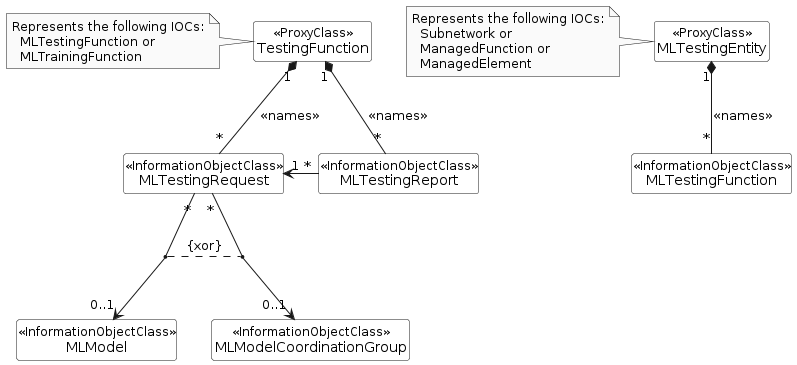
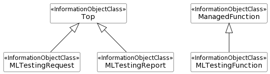

### 7.3a.1b Information model definitions for ML model testing

#### 7.3a.1b.1 Class diagram

##### 7.3a.1b.1.1 Relationships

This clause depicts the set of classes (e.g. IOCs) that encapsulates the information relevant to ML model testing. For the UML semantics, see TS 32.156 \[13\].

**Figure 7.3a.1b.1.1-1: NRM fragment for ML model testing**

##### 7.3a.1b.1.2 Inheritance

**Figure 7.3a.1b.1.2-1: Inheritance Hierarchy for ML model testing related NRMs**

#### 7.3a.1b.2 Class definitions

##### 7.3a.1b.2.1 MLTestingFunction

7.3a.1b.2.1.1 Definition

The ML model testing may be conducted by the ML training function, or by a separate function.

This MLTestingFunction instance is created by the system (MnS producer) or pre-installed, it can only be deleted by the system.

In case the ML model testing is conducted by a function separate from the ML training function, the IOC MLTestingFunction is instantiated and represents the logical function that undertakes ML model testing.

The model represented by MLTestingFunction MOI supports testing of one or more MLModel(s).

7.3a.1b.2.1.2 Attributes

The MLTestingFunction IOC includes attributes inherited from Top IOC (defined in TS 28.622 \[12\]) and the following attributes:

**Table 7.3a.1b.2.1.2-1**

|                               |                       |                |                |                 |                  |
|-------------------------------|-----------------------|----------------|----------------|-----------------|------------------|
| **Attribute name**            | **Support Qualifier** | **isReadable** | **isWritable** | **isInvariant** | **isNotifyable** |
| **Attribute related to role** |                       |                |                |                 |                  |
| mLModelRef                    | M                     | T              | F              | F               | F                |

7.3a.1b.2.1.3 Attribute constraints

None.

##### 7.3a.1b.2.1.4 Notifications

The common notifications defined in clause 7.6 are valid for this IOC, without exceptions or additions.

##### 7.3a.1b.2.2 MLTestingRequest

7.3a.1b.2.2.1 Definition

The IOC MLTestingRequest represents the ML model testing request that is triggered by the ML testing MnS consumer.

To trigger the ML model testing process, ML testing MnS consumer needs to create MLTrainingRequest.

The MLTestingRequest MOI is contained under one MLTestingFunction MOI or MLTrainingFunction MOI which represents the logical function that conducts the ML model testing. Each MLTestingRequest is associated to at least one MLModel.

In case the request is accepted, the ML testing MnS producer decides when to start the ML model testing. Once the MnS producer decides to start the testing based on the request, the ML testing MnS producer:

> \- collects (more) data for testing, if the testing data are not available or the data are available but not sufficient for the testing;
>
> \- prepares and selects the required testing data;
>
> \- tests the MLModel by performing inference using the selected testing data, and
>
> \- reports the performance of the MLModel when it performs on the selected testing data.

The MLTestingRequest may have a requestStatus field to represent the status of the request:

> \- The attribute values are "NOT_STARTED", "IN_PROGRESS", "SUSPENDED", "FINISHED", and "CANCELLED".

The ML testing MnS prodcuer shall delete the corresponding MLTestingRequest instance in case of the status value turns to "FINISHED" or "CANCELLED". The MnS producer may notify the status of the request to MnS consumer before deleting MLTestingRequest instance.

7.3a.1b.2.2.2 Attributes

The MLTestingRequest IOC includes attributes inherited from Top IOC (defined in TS 28.622 \[12\]) and the following attributes:**Table 7.3a.1b.2.2.2-1**

| **Attribute name**            | **Support Qualifier** | **isReadable** | **isWritable** | **isInvariant** | **isNotifyable** |
|-------------------------------|-----------------------|----------------|----------------|-----------------|------------------|
| requestStatus                 | M                     | T              | F              | F               | T                |
| cancelRequest                 | O                     | T              | T              | F               | T                |
| suspendRequest                | O                     | T              | T              | F               | T                |
| **Attribute related to role** |                       |                |                |                 |                  |
| mLModelRef                    | CM                    | T              | F              | F               | T                |
| mLModelCoordinationGroupRef   | CM                    | T              | F              | F               | T                |

7.3a.1b.2.2.3 Attribute constraints

**Table 7.3a.1b.2.2.3-1**

| **Name**                    | **Definition**                                        |
|-----------------------------|-------------------------------------------------------|
| mLModelRef                  | Condition: Testing of a single ML model is supported. |
| mLModelCoordinationGroupRef | Condition: Joint testing is supported.                |

##### 7.3a.1b.2.2.4 Notifications

The common notifications defined in clause 7.6 are valid for this IOC, without exceptions or additions.

##### 7.3a.1b.2.3 MLTestingReport

7.3a.1b.2.3.1 Definition

The IOC MLTestingReport represents the ML testing report that is provided by the ML testing MnS producer.

The MLTestingReport MOI is contained under one MLTestingFunction MOI or MLTrainingFunction MOI which represents the logical function that conducts the ML model testing.

For the joint testing of a group of ML models, the ML testing report contains the testing results for every ML model in the group.

The MLTestingReport instance is created by the ML testing MnS producer and notification is sent to ML testing Consumer who has subscribed to it.

7.3a.1b.2.3.2 Attributes

The MLTestingReport represents the report for the ML model testing that was requested by the MnS consumer (via MLTestingRequest MOI). The IOC includes attributes inherited from Top IOC (defined in TS 28.622 \[12\]) and the following attributes:

**Table 7.3a.1b.2.3.2-1**

| **Attribute name**            | **Support Qualifier** | **isReadable** | **isWritable** | **isInvariant** | **isNotifyable** |
|-------------------------------|-----------------------|----------------|----------------|-----------------|------------------|
| modelPerformanceTesting       | M                     | T              | F              | F               | T                |
| mLTestingResult               | M                     | T              | F              | F               | T                |
| **Attribute related to role** |                       |                |                |                 |                  |
| testingRequestRef             | CM                    | T              | F              | F               | T                |

7.3a.1b.2.3.3 Attribute constraints

**Table 7.3a.1b.2. 3.3-1**

| **Name**          | **Definition**                                                           |
|-------------------|--------------------------------------------------------------------------|
| testingRequestRef | Condition: Report on testing requested by the MnS consumer is supported. |

7.3a.1b.2.3.4 Notifications

The common notifications defined in clause 7.6 are valid for this IOC, without exceptions or additions.
