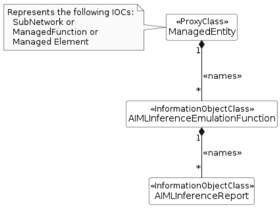
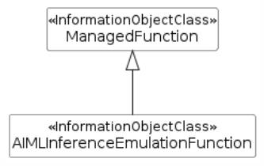

### 7.3a.2 Information model definitions for AI/ML inference emulation

#### 7.3a.2.1 Class diagram

##### 7.3a.2.1.1 Relationships

Figure 7.3a.2.1.1-1: NRM fragment for AI/ML inference emulation control

##### 7.3a.2.1.2 Inheritance

Figure 7.3a.2.1.2-1: AI/ML inference emulation Inheritance Relations

#### 7.3a.2.2 Class definitions

##### 7.3a.2.2.1 AIMLInferenceEmulationFunction

###### 7.3a.2.2.1.1 Definition

This IOC represents the properties of a function that undertakes AI/ML Inference Emulation.

This AIMLInferenceEmulationFunction instance is created by the system (AI/ML inference emulation MnS producer) or pre-installed, it can only be deleted by the system.

An AIMLInferenceEmulationFunction may be associated with one or more MLModel(s). AIMLInferenceFunction is name contained with AIMLInferenceEmulationReport(s) that delivers the outcomes of the emulation processes.

NOTE: The way of triggering of an AI/ML inference emulation and the instantiation of the related AI/ML inference emulation process is not in the scope of the present document.

###### 7.3a.2.2.1.2 Attributes

The AIMLInferenceEmulationFunction IOC inherited from ManagedFunction IOC (defined in TS 28.622 \[12\]).

###### 7.3a.2.2.1.3 Attribute constraints

None.

###### 7.3a.2.2.1.4 Notifications

The common notifications defined in clause 7.6 are valid for this IOC, without exceptions or additions.
