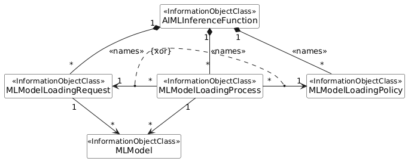
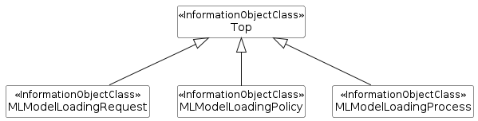

### 7.3a.3 Information model definitions for ML model deployment

#### 7.3a.3.1 Class diagram

##### 7.3a.3.1.1 Relationships

This clause depicts the set of classes (e.g. IOCs) that encapsulates the information relevant to ML model loading. For the UML semantics, see TS 32.156 \[13\].

Figure 7.3a.3.1.1-1: NRM fragment for ML model loading

##### 7.3a.3.1.2 Inheritance

Figure 7.3a.3.1.2-1: Inheritance Hierarchy for ML model loading related NRMs

#### 7.3a.3.2 Class definitions

##### 7.3a.3.2.1 MLModelLoadingRequest

###### 7.3a.3.2.1.1 Definition

This IOC represents the ML model loading request that is created by the MnS consumer. Using this IOC, the MnS consumer requests the MnS producer to load an ML model to the target inference function.

To trigger the ML model loading process, MnS consumer has to create MLModelLoadingRequest object instances on the MnS producer.

This IOC has a requestStatus field to represent the status of the request:

\- The attribute value is one of "NOT_STARTED", "IN_PROGRESS", "SUSPENDED", "FINISHED_SUCCESS ", FINISHED_FAILED" and "CANCELLED".

\- When value turns to "IN_PROGRESS", the MnS producer instantiates one or more MLModelLoadingProcess MOI(s) representing the loading process(es) being performed per the request and notifies the MnS consumer(s) who subscribed to the notification.

The MnS prodcuer shall delete the corresponding MLModelLoadingRequest instance in case of the status value turns to "FINISHED" or "CANCELLED".

###### 7.3a.3.2.1.2 Attributes

The MLModelLoadingRequest IOC includes attributes inherited from Top IOC (defined in TS 28.622 \[12\]) and the following attributes:

Table 7.3a.3.2.1.2-1

| Attribute name                | Support Qualifier | isReadable | isWritable | isInvariant | isNotifyable |
|-------------------------------|-------------------|------------|------------|-------------|--------------|
| requestStatus                 | M                 | T          | F          | F           | T            |
| cancelRequest                 | O                 | T          | T          | F           | T            |
| suspendRequest                | O                 | T          | T          | F           | T            |
| **Attribute related to role** |                   |            |            |             |              |
| mLModelToLoadRef              | M                 | T          | F          | F           | T            |

###### 7.3a.3.2.1.3 Attribute constraints

None.

###### 7.3a.3.2.1.4 Notifications

The common notifications defined in clause 7.6 are valid for this IOC, without exceptions or additions.

##### 7.3a.3.2.2 MLModelLoadingPolicy

###### 7.3a.3.2.2.1 Definition

This IOC represents the ML model loading policy set by the MnS consumer to the producer for loading an ML model to the target inference function(s).

To specify ML model loading policy for one or muiltiply ML models, MnS consumer needs to create MLModelLoadingPolicy object instances.

To remove ML model loading policy for one or muiltiply ML models, MnS consumer needs to delete MLModelLoadingPolicy object instances.

This IOC is used for the MnS consumer to set the conditions for the producer-initated ML model loading. The MnS producer is only allowed to load the ML model when all of the conditions are met.

###### 7.3a.3.2.2.2 Attributes

The MLModelLoadingPolicy IOC includes attributes inherited from Top IOC (defined in TS 28.622 \[12\]) and the following attributes:

Table 7.3a.3.2.2.2-1

| Attribute name                | Support Qualifier | isReadable | isWritable | isInvariant | isNotifyable |
|-------------------------------|-------------------|------------|------------|-------------|--------------|
| aIMLInferenceName             | CM                | T          | T          | F           | T            |
| policyForLoading              | M                 | T          | T          | F           | T            |
| **Attribute related to role** |                   |            |            |             |              |
| mLModelRef                    | CM                | T          | F          | F           | F            |

###### 7.3a.3.2.2.3 Attribute constraints

Table 7.3a.3.2.2.3-1

| Name              | Definition                                                                          |
|-------------------|-------------------------------------------------------------------------------------|
| aIMLInferenceName | Condition: The ML model loading policy is related to an initially trained ML model. |
| mLModelRef        | Condition: The ML model loading policy is related to a re-trained ML model.         |

###### 7.3a.3.2.2.4 Notifications

The common notifications defined in clause 7.6 are valid for this IOC, without exceptions or additions.

##### 7.3a.3.2.3 MLModelLoadingProcess

###### 7.3a.3.2.3.1 Definition

This IOC represents the ML model loading process.

For the consumer requested ML model loading, one or more MLModelLoadingProcess MOI(s) may be instantiated for each ML model loading request presented by the MLModelLoadingRequest MOI.

For the producer-initiated ML model loading, one or more MLModelLoadingProcess MOI(s) may be instantiated and associated with each MLModelLoadingPolicy MOI.

One MLModelLoadingProcess MOI represent the ML model loading process(es) corresponding to one or more target inference function(s).

The "progressStatus" attribute represents the status of the ML model loading process and includes information the MnS consumer can use to monitor the progress and results. The data type of this attribute is "ProcessMonitor" (see 3GPP TS 28.622 \[12\]). The following specializations are provided for this data type for the ML model loading process:

\- The "status" attribute values are "RUNNING", "CANCELLING", "SUSPENDED", "FINISHED", and "CANCELLED". The other values are not used.

\- The "timer" attribute is not used.

\- When the "status" is equal to "RUNNING" the "progressStateInfo" attribute shall indicate one of the following state: "LOADING".

\- No specifications are provided for the "resultStateInfo" attribute. Vendor specific information may be provided though.

When the loading is completed with "status" equal to "FINISHED", the MnS producer creates the MOI(s) of loaded MLModel under each MOI of the target inference function(s).

When a ML model loading process starts, an instance of the MLModelLoadingProcess is created by the MnS Producer and notification is sent to MnS consumers who have subscribed to it. The MnS producer can delete the MLModelLoadingProcess instance whose attribute status equals to "FINISHED" or or "CANCELLED" automatically.

###### 7.3a.3.2.3.2 Attributes

The MLModelLoadingProcess IOC includes attributes inherited from Top IOC (defined in TS 28.622 \[12\]) and the following attributes:

Table 7.3a.3.2.3.2-1

| Attribute name                | Support Qualifier | isReadable | isWritable | isInvariant | isNotifyable |
|-------------------------------|-------------------|------------|------------|-------------|--------------|
| progressStatus                | M                 | T          | F          | F           | T            |
| cancelProcess                 | O                 | T          | T          | F           | T            |
| suspendProcess                | O                 | T          | T          | F           | T            |
| **Attribute related to role** |                   |            |            |             |              |
| mLModelLoadingRequestRef      | CM                | T          | F          | F           | T            |
| mLModelLoadingPolicyRef       | CM                | T          | F          | F           | T            |
| loadedMLModelRef              | M                 | T          | F          | F           | T            |

###### 7.3a.3.2.3.3 Attribute constraints

Table 7.3a.3.2.3.3-1

| Name                     | Definition                                                                                                       |
|--------------------------|------------------------------------------------------------------------------------------------------------------|
| mLModelLoadingRequestRef | Condition: The MLModelLoadingProcess MOI is corresponding to the ML model loading requested by the MnS consumer. |
| mLModelLoadingPolicyRef  | Condition: The MLModelLoadingProcess MOI is corresponding to the ML model loading initiated by the MnS producer. |

###### 7.3a.3.2.3.4 Notifications

The common notifications defined in clause 7.6 are valid for this IOC, without exceptions or additions.
