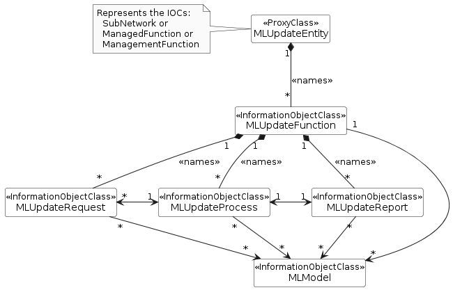
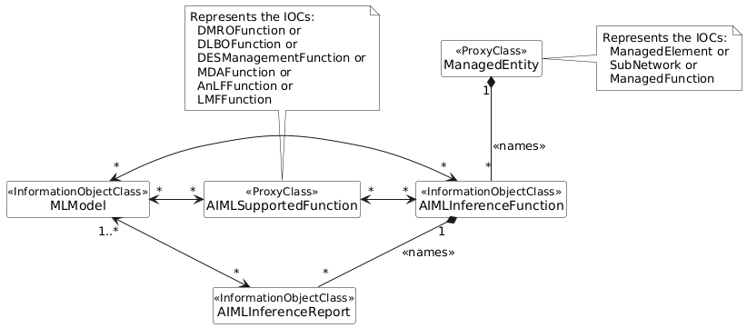
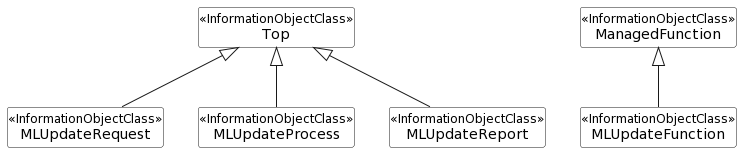
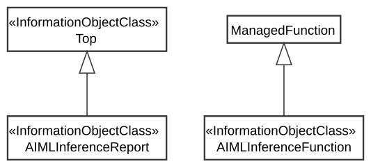

### 7.3a.4 Information model definitions for AI/ML inference 

#### 7.3a.4.1 Class diagram

##### 7.3a.4.1.1 Relationships

Figure 7.3a.4.1.1-1: NRM fragment for ML update

NOTE 1: The ManagedEntity and AIMLSupportedFunction shall not represent the same MOI.

NOTE 2: For AnLFFunction, DMROFunction, DLBOFunction, and DESManagementFunction see \[18\] and for MDAFunction see \[2\].

Figure 7.3a.4.1.1-2: NRM fragment for AI/ML inference function

##### 7.3a.4.1.2 Inheritance

Figure 7.3a.4.1.2-1: Inheritance Hierarchy for ML update related NRMs

Figure 7.3a.4.1.2-2: Inheritance Hierarchy for AI/ML inference function

#### 7.3a.4.2 Class definitions

##### 7.3a.4.2.1 MLUpdateFunction

###### 7.3a.4.2.1.1 Definition

This IOC represents the function responsible for ML update.

This MLUpdateFunction instance can be created by the system or pre-installed.

The MOI of MLUpdateFunction is name-contained in an MOI of either a subnetwork, a managedFunction or a managementFunction.

The MLUpdateFunction is be associated with one or more ML models.

The MLUpdateFunction contains one or more MLUpdateRequest(s)as well as one or more MLUpdateProcess(s), where an MLUpdateProcess is instantiated corresponding to one received MLUpdateRequest.

###### 7.3a.4.2.1.2 Attributes

The MLUpdateFunction IOC includes attributes inherited from ManagedFunction IOC (defined in TS 28.622 \[12\]) and the following attributes:

Table 7.3a.4.2.1.2-1

|                                |                   |            |            |             |              |
|--------------------------------|-------------------|------------|------------|-------------|--------------|
| Attribute name                 | Support Qualifier | isReadable | isWritable | isInvariant | isNotifyable |
| availMLCapabilityReport        | M                 | T          | F          | F           | F            |
| **Attributes related to Role** |                   |            |            |             |              |
| mLModelRef                     | M                 | T          | F          | F           | F            |

###### 7.3a.4.2.1.3 Attribute constraints

None.

###### 7.3a.4.2.1.4 Notifications

The common notifications defined in clause 7.6 are valid for this IOC, without exceptions or additions.

##### 7.3a.4.2.2 MLUpdateRequest 

###### 7.3a.4.2.2.1 Definition

This IOC represents the properties of MLUpdateRequest.

For each request to update the ML capabilities, a consumer creates a new MOI of MLUpdateRequest on the MLUpdateFunction, i.e., MLUpdateRequest is instantiated for each request for updating ML capabilities:

> \- Each MLUpdateRequest is associated to at least one MLModel
>
> \- Each MLUpdateRequest may have a RequestStatus field that is used to track the status of the specific MLUpdateRequest or the associated MLUpdateProcess. The RequestStatus is updated by MnS producer when there is a change in status of the update progress. The RequestStatus is an enumeration with the values: NOT_STARTED, IN_PROGRESS, CANCELLING, SUSPENDED, FINISHED, and CANCELLED
>
> \- Each MLUpdateRequest may contain specific reporting requirements including an mLUpdateReportingPeriod that defines the time duration upon which the MnS consumer expects the ML update is reported. The reporting requirements contained in the MLUpdateRequest are mapped to an existing MLUpdateProcess instance.
>
> \- The MLUpdateRequest may specify a performanceGainThreshold which defines the minimum performance gain that shall be achieved with the capability update. This implies that the difference in the performances between the existing capabilities and the new capabilities needs to be at least performanceGainThreshold, otherwise the new capabilities shall not be applied. A threshold of performanceGainThreshold=0% implies that the capabilities should be applied even if there is no noticeable performance gain.
>
> \- The MLUpdateRequest may indicates the maximum time that should be taken to complete the update.

To trigger the ML update process, MnS consumer needs to create MLUpdateRequest instances on the MnS producer.

The MnS prodcuer shall delete the corresponding MLUpdateRequest instance in case of the status value turns to "FINISHED" or "CANCELLED".

###### 7.3a.4.2.2.2 Attributes

The MLUpdateRequest IOC includes attributes inherited from Top IOC (defined in TS 28.622 \[12\]) and the following attributes:

Table 7.3a.4.2.2.2-1

|                                |                   |            |            |             |              |
|--------------------------------|-------------------|------------|------------|-------------|--------------|
| Attribute name                 | Support Qualifier | isReadable | isWritable | isInvariant | isNotifyable |
| performanceGainThreshold       | O                 | T          | T          | T           | F            |
| newCapabilityVersionId         | O                 | T          | T          | T           | F            |
| updateTimeDeadline             | O                 | T          | T          | T           | F            |
| requestStatus                  | M                 | T          | F          | F           | T            |
| mLUpdateReportingPeriod        | O                 | T          | T          | F           | T            |
| cancelRequest                  | O                 | T          | T          | F           | T            |
| suspendRequest                 | O                 | T          | T          | F           | T            |
| **Attributes related to Role** |                   |            |            |             |              |
| mLUpdateProcessRef             | M                 | T          | F          | F           | F            |
| mLModelRefList                 | M                 | T          | F          | F           | F            |

###### 7.3a.4.2.2.3 Attribute constraints

None.

###### 7.3a.4.2.2.4 Notifications

The common notifications defined in clause 7.6 are valid for this IOC, without exceptions or additions.

##### 7.3a.4.2.3 MLUpdateProcess

###### 7.3a.4.2.3.1 Definition

This IOC represents the ML update process.

For each MLUpdateRequest to update the ML capabilities, the MLUpdateProcess is instantiated for the MLUpdateRequest unless the MLUpdateRequest is associated with an ongoing MLUpdateProcess if the MLUpdateProcess is updating the same MLModel(s) as stated in the MLUpdateRequest i.e., the MLUpdateProcess is associated with at least one MLUpdateRequest. Relatedly, the MLUpdateProcess is associated with at least one MLModel.

> \- Each MLUpdateProcess may have a status attribute (i.e., progressStatus) used to indicate progress status of theupdate process.
>
> \- The MLUpdateProcess has the capability of compiling and delivering reports and notifications relating to the ML update request or process.

When a ML update process starts, an instance of the MLUpdateProcess is created by the MnS Producer and informed to MnS consumer who has subscribed to it. The MnS producer can delete the MLUpdateProcess instance whose attribute status equals to "FINISHED" or or "CANCELLED".

###### 7.3a.4.2.3.2 Attributes

The MLUpdateProcess IOC includes attributes inherited from Top IOC (defined in TS 28.622 \[12\]) and the following attributes:

Table 7.3a.4.2.3.2-1

|                                |                   |            |            |             |              |
|--------------------------------|-------------------|------------|------------|-------------|--------------|
| Attribute name                 | Support Qualifier | isReadable | isWritable | isInvariant | isNotifyable |
| cancelProcess                  | O                 | T          | T          | F           | T            |
| suspendProcess                 | O                 | T          | T          | F           | T            |
| progressStatus                 | M                 | T          | F          | F           | T            |
| **Attributes related to Role** |                   |            |            |             |              |
| mLModelRefList                 | M                 | T          | F          | F           | T            |
| mLUpdateRequestRefList         | M                 | T          | F          | F           | T            |
| mLUpdateReportRef              | M                 | T          | F          | F           | T            |

###### 7.3a.4.2.3.3 Attribute constraints

None.

###### 7.3a.4.2.3.4 Notifications

The common notifications defined in clause 7.6 are valid for this IOC, without exceptions or additions.

##### 7.3a.4.2.4 MLUpdateReport

###### 7.3a.4.2.4.1 Definition

This IOC represents the properties of MLUpdateReport.

> \- The ML update process may generate one or more MLUpdateReport(s).
>
> \- Each MLUpdateReport is associated to one or more MLModel (s) to indicate ML models that have been updated.
>
> \- The MLUpdateReport may indicate the achieved performance gain for the specific ML capability update, which is the gain in performance of the new capabilities compared with the original capabilities.
>
> \- MLUpdateReport provides reports about MLModel (s) or MLUpdateProcess(s) that themselves are associated with MLModel (s) for which update is requested and/or executed. Correspondingly, both the MLUpdateRequest(s) and the MLUpdateProcess(s) are conditionally mandatory in that at least one of them must be associated with an instance of MLUpdateReport.

The MLUpdateReport instance can be created by the MnS producer when creating an MLUpdateRequest instance.

When the MnS producer delete a MLUpdateRequest instance, the corresponding MLUpdateReport instance is also deleted by MnS producer.

###### 7.3a.4.2.4.2 Attributes

The MLUpdateReport IOC includes attributes inherited from Top IOC (defined in TS 28.622 \[12\]) and the following attributes:

Table 7.3a.4.2.4.2-1

|                                |                   |            |            |             |              |
|--------------------------------|-------------------|------------|------------|-------------|--------------|
| Attribute name                 | Support Qualifier | isReadable | isWritable | isInvariant | isNotifyable |
| updatedMLCapability            | M                 | T          | F          | F           | F            |
| **Attributes related to Role** |                   |            |            |             |              |
| mLModelRefList                 | M                 | T          | F          | F           | F            |
| mLUpdateProcessRef             | M                 | T          | F          | F           | F            |

###### 7.3a.4.2.4.3 Attribute constraints

None.

###### 7.3a.4.2.4.4 Notifications

The notifications specified for the IOC using this \<\<datatype\>\> for its attribute(s), shall be applicable.

##### 7.3a.4.2.5 AIMLInferenceFunction

###### 7.3a.4.2.5.1 Definition

This IOC represents the common properties of the AI/ML inference function.

This AIMLInferenceFunction instance can be created by the system or pre-installed.

The AIMLInferenceFunction MOI may be associated with one or more MOIs that represent the functions/functionalities (Note) provided by the subject AIMLInferenceFunction MOI.

The AIMLInferenceFunction MOI can be only created by the MnS producer but not MnS consumer.

The MOI of AIMLInferenceFunction or the MOI of the IOC inheriting from the AIMLInferenceFunction IOC contains one or more MOI(s) of MLModel.

NOTE: The IOCs representing the functions/functionalities (Note) that use the AI/ML inference function include MDAFunction, AnLFFunction, DMROFunction, DLBOFunction, LMFFunction, and DESManagementFunction.

The AIMLInferenceFunction MOI may be contained by either a SubNetwork MOI, a ManagedElement MOI, or an MOI of ManagedFunction’s subclass, and it is allowed for an MnS producer to support multiple AIMLInferenceFunction MOIs contained in different superordinated MOIs among SubNetwork, ManagedElement and the ManagedFunction’s subclass.

The generation of inference outputs is based on the configuration of inference, e.g., to start a stated time, or to be executed at all times. The observations of the inference function and information on derived Outputs is registered in the inference report.

###### 7.3a.4.2.5.2 Attributes

The AIMLInferenceFunction IOC includes attributes inherited from ManagedFunction IOC (defined in TS 28.622 \[12\]) and the following attributes:

Table 7.3a.4.2.5.2-1

|                                |                   |            |            |             |              |
|--------------------------------|-------------------|------------|------------|-------------|--------------|
| Attribute name                 | Support Qualifier | isReadable | isWritable | isInvariant | isNotifyable |
| activationStatus               | M                 | T          | T          | F           | T            |
| managedActivationScope         | O                 | T          | T          | F           | T            |
| **Attributes related to role** |                   |            |            |             |              |
| usedByFunctionRefList          | M                 | T          | F          | F           | T            |
| mLModelRefList                 | M                 | T          | F          | T           | T            |

###### 7.3a.4.2.5.3 Attribute constraints

None.

###### 7.3a.4.2.5.4 Notifications

The common notifications defined in clause 7.6 are valid for this IOC, without exceptions or additions.

##### 7.3a.4.2.6 AIMLInferenceReport

###### 7.3a.4.2.6.1 Definition

This IOC represents a report from a AI/ML Inference.

An AIMLInferenceFunction may generate one or more AIMLInferenceReport(s).

Each AIMLInferenceReport provides information about inference outputs from one or more MLModel.

The AIMLInferenceReport also provides historical inference outputs for a series of time stamps.

The AIMLInferenceReport instance can be created by the MnS producer when creating an AIMLInferenceFunction instance.

The potentialImpactInfo includes impacted managed objects and network performance metrics, which can be utilized to manage the network performance to prevent network performance degradation.

###### 7.3a.4.2.6.2 Attributes

The AIMLInferenceReport includes inherited attributes from Top IOC (defined in TS 28.622 \[12\]) and the following attributes:

|                                |                   |            |            |             |              |
|--------------------------------|-------------------|------------|------------|-------------|--------------|
| Attribute name                 | Support Qualifier | isReadable | isWritable | isInvariant | isNotifyable |
| inferenceOutputs               | M                 | T          | F          | F           | T            |
| potentialImpactInfo            | O                 | T          | F          | F           | T            |
| **Attributes related to role** |                   |            |            |             |              |
| mLModelRef                     | M                 | T          | F          | F           | T            |

###### 7.3a.4.2.6.3 Attribute constraints

None.

###### 7.3a.4.2.6.4 Notifications

The common notifications defined in clause 7.6 are valid for this IOC, without exceptions or additions.
